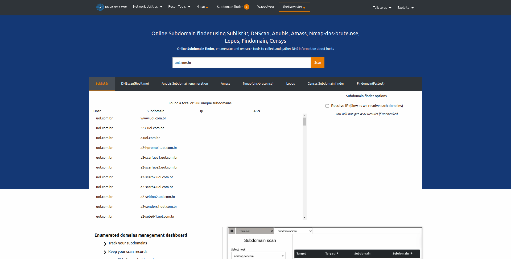

Finding all subdomains is an important task to verify the security of your applications and servers, misconfigured subdomains can lead to public exposure of services and crucial IPs of your company, something that can create a big security risk.

Thanks to some online tools the process of scanning a domain is very easy, in just a few minutes you can get a report of which subdomains are configured and which IP or record they point to.

## Tools to analyze your domain

1.  [DNS Dumpster](#DNSdumpster)
2.  [NMMAPPER](#NMMAPPER)
3.  [Spyse](#Spyse)
4.  [Pentest-Tools](#Pentest-Tools)
5.  [ImmuniWeb](#ImmuniWeb)

### 1\. [DNSdumpster](https://dnsdumpster.com/)

[DNSdumpster](https://dnsdumpster.com/)

[DNSDumpster](https://dnsdumpster.com/) is a domain scanning tool to find host-related information. It's the HackerTarget.com project.

Not just subdomain, but it provides information about DNS server, MX record, TXT record and a complete mapping of your domain.

## two. **[NMMAPPER](https://www.nmmapper.com/sys/tools/subdomainfinder/)**

**[NMMAPPER](https://www.nmmapper.com/sys/tools/subdomainfinder/)**

**[NMMAPPER](https://www.nmmapper.com/sys/tools/subdomainfinder/)** is an online tool to find subdomains using other services like Anubis, Amass, DNScan, Sublist3r, Lepus, Censys, etc.

## 3\. [Spyse](https://spyse.com/search/subdomain)

[Spyse](https://spyse.com/search/subdomain)

THE " *Subdomain Finder* " by Spyse is a handcrafted search engine that lets you discover subdomains of any domain. It is just one of several tools created by Spyse and is closely linked to all the other tools that allow you to get much more information about subdomains.

## 4\. **[Pentest-Tools](https://pentest-tools.com/information-gathering/find-subdomains-of-domain)**

Pentest tools search subdomains using various methods such as DNS zone transfer, wordlist based DNS enumeration and public search engine. It has two scanning options, one more intensive and one complete, both of which give you the possibility to export a report in PDF.

## 5\. **[ImmuniWeb](https://www.htbridge.com/ssl/)**

**[ImmuniWeb](https://www.htbridge.com/ssl/)**

Finding a subdomain is easy with SSLScan. You provide the URL for scanning and within seconds the results are shown with the discovered subdomain, with other SSL information.

## Conclusion

As you can see, it is very easy to analyze domains on the internet, in just a few minutes a complete report of your configuration is available. Therefore, be very careful with the information and services that are exposed when setting up a subdomain.
