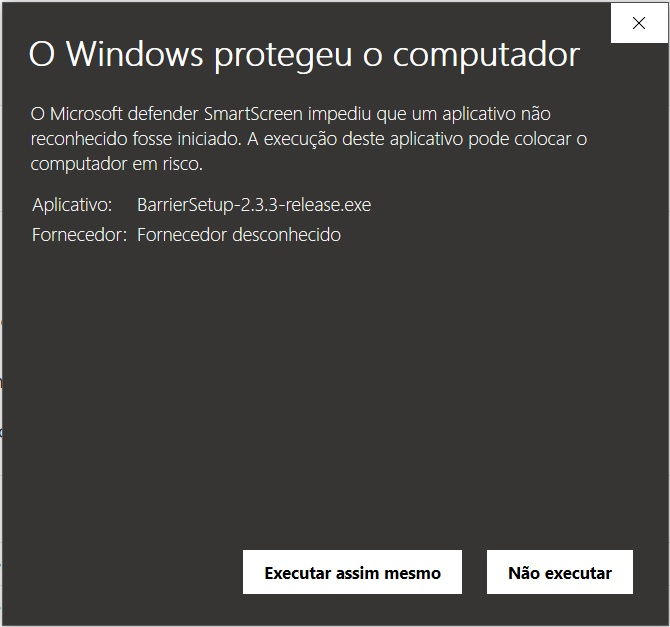
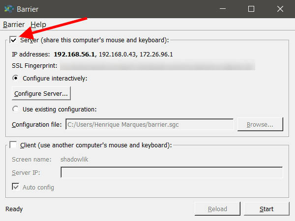
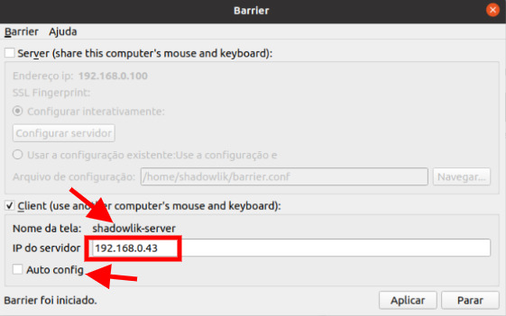
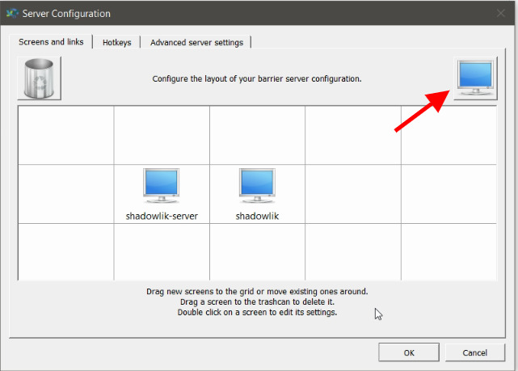
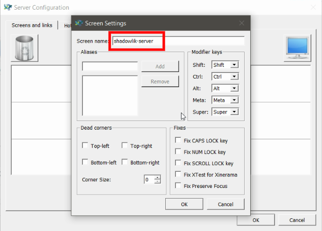

¿Tiene dos computadoras y solo un teclado y un ratón? ¿O simplemente quieres optimizar tu tiempo y usar un viejo ordenador como segunda pantalla? Y si te digo que es posible compartir el teclado y el ratón de tu ordenador y controlar más de un ordenador con ellos, y que no importa qué sistema operativo tienen tus máquinas, ¡sí es posible!

Aquí en mi configuración diaria siempre estoy con dos ordenadores, el principal que ejecuta Windows y uno antiguo con Ubuntu en ejecución, y para hacer que esta configuración sea lo más optimizada posible, utilizo un pequeño programa que me permite controlar ambos ordenadores desde el mismo ratón y teclado.

## El software: Barrier - KVM

Barrier es un software que imita la funcionalidad de un [keyer KVM](https://pt.wikipedia.org/wiki/Chaveador_KVM), que permite el uso de un solo teclado, ratón e incluso monitor para controlar varios ordenadores girando físicamente un selector en el dispositivo para cambiar qué máquina se está controlando en ese momento. La barrera hace esto sin la necesidad de un dispositivo físico, a través de software y la comunicación a través de la red interna, para trabajar todos los ordenadores necesitan estar conectados en la misma red. Le permite indicar qué máquina está controlando, por ejemplo, si estaba conectada a dos o más monitores, mover el ratón al borde de la pantalla o usar una tecla para cambiar el enfoque entre los equipos configurados.

Lo interesante es que además de ser gratuita, la barrera es el código abierto [github.com/debauchee/barrier](https://github.com/debauchee/barrier), lo que te permite descargar y modificar tu código fuente si lo necesitas.

## Sistemas operativos compatibles

Barrier es compatible con todos los sistemas operativos populares, encontrará las instrucciones para la instalación en cada uno de ellos en [github.com/debauchee/barrier](https://github.com/debauchee/barrier/) y versiones descargables en [github.com/debauchee/barrier/releases](https://github.com/debauchee/barrier/releases).

-   Windows 7, 8, 8.1 y 10
-   MacOS/OS X
-   Linux (Ubuntu, Debian, CentOS, Fedora, OpenSuse, ...)
-   Freebsd
-   Openbsd

## Instalación y configuración del equipo principal

El primer ordenador que vamos a configurar debe ser el que queremos usar el ratón y el teclado para controlar los demás también. En este tutorial voy a utilizar mi ordenador Windows como el principal, pero se puede elegir cualquiera de ellos como el principal e incluso cambiar más tarde, qué equipo configurado es el principal.

Descargue la última versión de Barrier `.exe` en [github.com/debauchee/barrier/releases](https://github.com/debauchee/barrier/releases) y haga doble clic en el archivo descargado. Windows probablemente mostrará un mensaje que tiene este aspecto:

Haga clic en *Más información* y *Ejecutar de todos modos*, luego acepte los términos y condiciones y continúe haciendo clic *junto* a completar la instalación.

Ahora busque su atajo Barrera en su computadora y ejecute el programa. Selecciona la primera opción *"Servidor"* para configurar como el equipo principal. Anote la IP de su ordenador dentro de su red, la utilizaremos para configurar el ordenador secundario, en nuestro caso es la IP al lado del número en negrita, vamos a utilizar el *192.168.0.43*.

## Instalación y configuración del equipo secundario

Ahora vamos a instalar y configurar nuestro ordenador secundario, que será controlado por el ratón y el teclado de nuestro ordenador principal, en mi caso voy a utilizar la distribución Ubuntu 20.04 linux como secundario.

La instalación es muy simple y rápida, con sólo dos comandos:

$sudo actualización apt-get
$sudo barrera apt-get install -y

Ahora abra la aplicación y siga el proceso de instalación. Cuando haya terminado, abra el programa, seleccione el modo *"Cliente"* y borre la selección *"Auto config".* En el campo *IP del SERVIDOR* agregue el número IP copiado del paso anterior. También anota el *Nombre de Pantalla*, lo usaremos para configurar la posición de la pantalla en nuestro ordenador principal.

## Configuración de la posición de la pantalla

Ahora que tenemos el programa ejecutándose en ambos equipos, necesitamos configurar y autorizar en el ordenador principal la posición del equipo secundario que queremos controlar. Abra el programa de nuevo y haga clic en el botón *Configurar servidor*, asegúrese de que la barrera no se está ejecutando, aparte de que no podrá editar la configuración.

Haga clic en el equipo para agregar un nuevo equipo secundario. Agregue el *nombre de la pantalla* el nombre que anotamos en el paso anterior y haga clic en Aceptar.

En este caso establecemos la posición de nuestro ordenador secundario a la izquierda de nuestro ordenador principal, esto significa que cuando arrastremos el ratón al extremo izquierdo del ordenador principal, cambiará el control al ordenador secundario. Vamos a probar nuestra configuración, haga clic en *Inicio* en el equipo principal y *Aplicar* en el secundario, si todo sucede como se esperaba, ya podrá controlar ambos equipos desde un solo ratón y teclado. Incluso puede agregar un tercer ordenador, por ejemplo, un ordenador Apple con MacOS, para configurar simplemente siga los mismos pasos y elegir su posición para su ordenador principal.

## Problemas comunes con la barrera

1.  **Ratón en el ordenador secundario lento:** Debido a que esta configuración depende de la red interna, si está sobrecargada pueden ocurrir oscilaciones y ralentizaciones, no es muy bueno, especialmente si está conectado a WiFi.
2.  **El equipo principal dejó de funcionar:** el equipo principal puede cambiar la dirección IP, normalmente cuando se reinicia, por lo que si deja de funcionar, eche un vistazo si la dirección IP no ha cambiado. Hay una manera de dejar la IP fija a su ordenador en la red, pero esto permanecerá para otro post.
3.  **El ordenador no se puede conectar:** Asegúrese de que la IP es correcta, si es así, asegúrese de que su firewall/anti-virus no esté bloqueando las conexiones.
