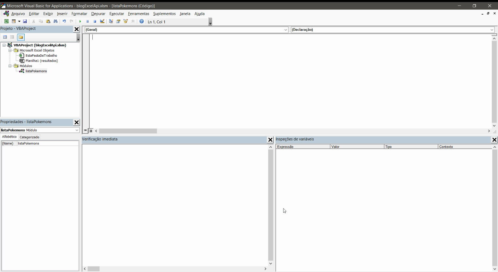
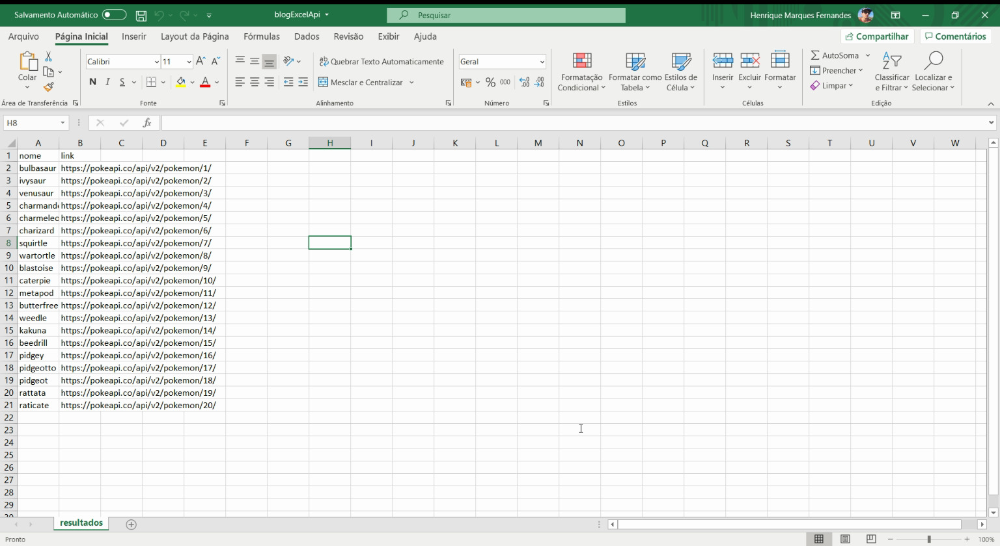

Excel é provavelmente uma das ferramentas mais utilizada neste mundo, logo, a demanda por integrações com planilhas extremamente complexas é um cenário recorrente. As APIs permitem uma facilidade de acesso a informações em sistemas, o que vem se tornando cada vez mais padrão no mercado, com isso em mente, algumas demandas de conexão com sistemas via API no Excel são necessárias e muito úteis, então resolvi compartilhar um pouco de como criei essa integração. Vamos aprender como consultar APIs Rest usando o VBA e converter o resultado em JSON para ser usado na planilha.

Esse artigo espera que você saiba conceitos básicos de Excel e VBA, bem como [o que é uma API e como funciona](http://marquesfernandes.com/o-que-e-uma-api-e-para-que-serve/). Nosso objetivo será consultar uma [API pública de Pokemons](https://pokeapi.co/) e listar o resultado na aba `resultados`.

## Criando uma planilha em branco

Primeiro vamos criar uma planilha em branco com macro habilitada, dentro dela criarei uma aba chamada `resultados`.

## Criando a macro para consultar a API

Pelo atalho `alt + f11` vamos abrir o editor de macros do Excel, e criar um módulo chamado `listaPokemons`.

### Importando a biblioteca VBA-JSON

Como a API que vamos consultar retorna um [JSON](http://marquesfernandes.com/o-que-e-json-e-para-que-serve/) como resposta, vamos precisar importar a biblioteca [VBA JSON](https://github.com/VBA-tools/VBA-JSON), ela cuidará de todo trabalho chato de traduzir o JSON e retornar como uma matriz e objeto. A instalação é bem simples, basta [baixar a última versão aqui](https://github.com/VBA-tools/VBA-JSON/releases) e no editor de macros ir em `Arquivo > Importar Arquivo > JsonConverter.bas`.

### Habilitando o Microsoft Scripting Runtime

Precisamos também habilitar o Microsoft Scripting Runtime, para isso basta navegar em `Ferramentas > Referências` e procurar e habilitar na lista o `Microsoft Scripting Runtime`.

## Criando a macro VBA para consultar a API REST

Abaixo temos o código completo da nossa requisição, ele pode parecer assustador, mas não se preocupe, explicarei o que cada parte está fazendo:

Sub listPokemons()
Dim json As String
Dim jsonObject As Object, item As Object
Dim i As Long
Dim ws As Worksheet
Dim objHTTP As Object

'Selecionamos nossa planilha resultados
Set ws = Worksheets("resultados")

'Criamos nosso objeto de requisção e enviamos
Set objHTTP = CreateObject("WinHttp.WinHttpRequest.5.1")
URL = "https://pokeapi.co/api/v2/pokemon"
objHTTP.Open "GET", URL, False
objHTTP.Send
strResult = objHTTP.responseText
json = strResult

Set objetoJson = JsonConverter.ParseJson(json)

'Criamos as células de cabeçalho
ws.Cells(1, 1) = "nome"
ws.Cells(1, 2) = "link"

'Fazemos um loop na propriedade results da resposta da API
i = 2 'Começaremos o contador na linha 2
For Each pokemon In objetoJson("results")
    ws.Cells(i, 1) = pokemon("name")
    ws.Cells(i, 2) = pokemon("url")
    i = i + 1
Next

End Sub

Primeiro definimos todas as variáveis que vamos utilizar em nosso scripts, incluindo a importação da biblioteca VBA JSON que importamos previamente em nosso projeto.

Dim json As String
Dim jsonObject As Object, item As Object
Dim i As Long
Dim ws As Worksheet
Dim xmlhttp As Object
Set xmlhttp = CreateObject("MSXML2.serverXMLHTTP")
Dim objHTTP As Object

Em seguida selecionamos a planilha que queremos exibir os resultados da consulta da API, no nosso caso `Worksheets("resultados")` e em seguida criamos um objeto que nos permitirá fazer a requisição para a API `https://pokeapi.co/api/v2/pokemon`. Pegaremos a resposta e colocaremos ela na variável `json`, por enquanto ela nada mais é que um texto.

'Selecionamos nossa planilha resultados
Set ws = Worksheets("resultados")

'Criamos nosso objeto de requisção e enviamos
Set objHTTP = CreateObject("WinHttp.WinHttpRequest.5.1")
URL = "https://pokeapi.co/api/v2/pokemon"
objHTTP.Open "GET", URL, False
objHTTP.Send
strResult = objHTTP.responseText
json = strResult

Aqui que a mágica acontece, a função `ParseJson` da biblioteca VBA JSON converte o texto da nossa variável `json` para um objeto acessível em nosso script. Agora conseguimos acessar todas as propriedades programaticamente em nosso código.

Set objetoJson = JsonConverter.ParseJson(json)

Agora que já temos o resultado da nossa API acessível, criamos na primeira linha da planilha o cabeçalho contendo as colunas **nome** e **link**.

'Criamos as células de cabeçalho
ws.Cells(1, 1) = "nome"
ws.Cells(1, 2) = "link"

Agora antes de analisar o script precisamos entender o resultado da API. Se você abrir o link [https://pokeapi.co/api/v2/pokemon](https://pokeapi.co/api/v2/pokemon) em seu navegador você verá o seguinte resultado:

{
  "count": 964,
  "next": "https://pokeapi.co/api/v2/pokemon?offset=20&limit=20",
  "previous": null,
  "results": \[
    {
      "name": "bulbasaur",
      "url": "https://pokeapi.co/api/v2/pokemon/1/"
    },
    {
      "name": "ivysaur",
      "url": "https://pokeapi.co/api/v2/pokemon/2/"
    },
    {
      "name": "venusaur",
      "url": "https://pokeapi.co/api/v2/pokemon/3/"
    },
    {
      "name": "charmander",
      "url": "https://pokeapi.co/api/v2/pokemon/4/"
    },
    {
      "name": "charmeleon",
      "url": "https://pokeapi.co/api/v2/pokemon/5/"
    },
    {
      "name": "charizard",
      "url": "https://pokeapi.co/api/v2/pokemon/6/"
    },
    {
      "name": "squirtle",
      "url": "https://pokeapi.co/api/v2/pokemon/7/"
    },
    {
      "name": "wartortle",
      "url": "https://pokeapi.co/api/v2/pokemon/8/"
    },
    {
      "name": "blastoise",
      "url": "https://pokeapi.co/api/v2/pokemon/9/"
    },
    {
      "name": "caterpie",
      "url": "https://pokeapi.co/api/v2/pokemon/10/"
    },
    {
      "name": "metapod",
      "url": "https://pokeapi.co/api/v2/pokemon/11/"
    },
    {
      "name": "butterfree",
      "url": "https://pokeapi.co/api/v2/pokemon/12/"
    },
    {
      "name": "weedle",
      "url": "https://pokeapi.co/api/v2/pokemon/13/"
    },
    {
      "name": "kakuna",
      "url": "https://pokeapi.co/api/v2/pokemon/14/"
    },
    {
      "name": "beedrill",
      "url": "https://pokeapi.co/api/v2/pokemon/15/"
    },
    {
      "name": "pidgey",
      "url": "https://pokeapi.co/api/v2/pokemon/16/"
    },
    {
      "name": "pidgeotto",
      "url": "https://pokeapi.co/api/v2/pokemon/17/"
    },
    {
      "name": "pidgeot",
      "url": "https://pokeapi.co/api/v2/pokemon/18/"
    },
    {
      "name": "rattata",
      "url": "https://pokeapi.co/api/v2/pokemon/19/"
    },
    {
      "name": "raticate",
      "url": "https://pokeapi.co/api/v2/pokemon/20/"
    }
  \]
}

Estamos interessados na propriedade`results`, uma matriz contendo uma lista de pokemons com seus respectivos nomes e links para mais detalhes. Acessaremos essa matriz em `objetoJson("results")` e faremos um loop para exibir cada resultado de pokemon em uma nova linha da nossa tabela.

'Fazemos um loop na propriedade results da resposta da API
i = 2 'Começaremos o contador na linha 2
For Each pokemon In objetoJson("results")
    ws.Cells(i, 1) = pokemon("name")
    ws.Cells(i, 2) = pokemon("url")
    i = i + 1
Next

Se tudo ocorrer conforme esperado, ao pressionar `f5` para rodar a nossa macro, na sua planilha você deverá ver o seguinte resultado:

## Conclusão

Esse foi um exemplo bem simples de consulta, com o objeto de [HT](http://marquesfernandes.com/o-que-e-http/)[TP](http://marquesfernandes.com/o-que-e-http/) é possível realizar todos os tipos de requisições, GET, POST, UPDATE, ... O interessante é entender como a requisição é feita e como você consegue exibir o resultado, graças a biblioteca VBA JSON, que já reduz drasticamente o trabalho necessário. Agora você só precisa adaptar esse fluxo e script para a sua necessidade.
