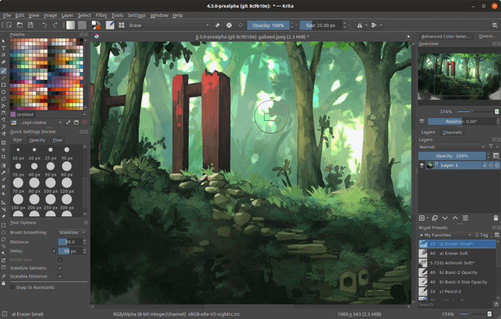

O Adobe Photoshop é um dos melhores programas disponíveis para design, seu preço porém pode ser desanimador para usuários ou freelances. Existem diversas ferramentas gratuitas que podem substituir o Photoshop, embora elas não tenham exatamente as mesmas funcionalidades, elas dão conta do recado.

1.  [Gimp](#gimp) - Disponível para Windows, Linux e Mac
2.  [Inkscape](#inkscape) - Disponível para Windows, Linux e Mac
3.  [Krita](#krita) - Windows, Linux e Mac
4.  [Pixlr x](#pixlr) - Versão Web
5.  [Sumopaint](#sumopaint)\- Versão Web, Windows, Linux e Mac

## 1\. [Gimp](https://www.gimp.org/downloads/)

[GIMP](https://www.gimp.org/downloads/), (abreviação de GNU Image Manipulation Program), é uma excelente alternativa para o Photoshop para quem precisam de recursos avançados de edição de imagens mas está com o orçamento apertado.

Ele pode ser usado desde um programa básico de pintura até um editor de fotos profissional. Ganhou popularidade por ser uma das primeiras alternativas para o photoshop no Linux, hoje ele está disponível também para Mac e Windows.

Como o GIMP também é possível conseguir suporte para importar PSD, embora nem todas as camadas e funcionalidades possam funcionar como esperado.

## 2\. [Inkscape](https://inkscape.org/release/inkscape-1.0/)

O [InkScape](https://inkscape.org/release/inkscape-1.0/) seria mais um substituto para o Illustrator do que para o Photoshop, ele é mais voltado para designers gráficos que queiram trabalhar com vetores. Mesmo assim, você pode usá-lo para fazer ajustes básicos de imagens igual faria no Photoshop, como recortar, colar, redimensionar e editar. Também é uma ótima ferramenta para converter fotografias em imagens vetoriais!

## 3\. [Krita](https://krita.org/en/download/krita-desktop/)

O Krita é uma alternativa gratuita perfeita do Photoshop, especialmente para fotógrafos que precisam de um pouco mais de flexibilidade em suas edições.

O projeto veio de artistas que buscam oferecer ferramentas de edição acessíveis para todos, por isso desenvolveram o [Krita](https://krita.org/en/download/krita-desktop/), focado em artistas conceituais, pintores de texturas e foscos, ilustradores e até criadores de histórias em quadrinhos.

Quando se trata de colorir suas fotos, você pode usar a paleta de cores pop-up exclusiva. Além disso, aproveite o sistema de marcação exclusivo da Krita para trocar os pincéis que estão sendo exibidos. Além disso, acesse as cores mais usadas e defina todas as configurações de cores com apenas alguns cliques.

Ele é altamente extensível, você pode importar facilmente pacotes de pincéis e texturas de outros artistas, existe uma comunidade muito ativa por trás do projeto. Se você precisar de qualquer ajuda, poderá recorrer ao fórum do Krita, onde outros artistas estão sempre dispostos em compartilhar seus melhores trabalhos, idéias e ajuda.

## 4\. [Pixlr x](https://pixlr.com/br/x/)

[Pixlr x](https://pixlr.com/x/) é a versão mais recente do editor Pixlr. Ele vem com recursos e melhorias muito mais avançadas e busca se tornar uma das melhores alternativas gratuitas do Photoshop do mercado.

Desenvolvido em HTML5, o Pixlr x funciona bem em qualquer navegador moderno (incluindo dispositivos mobile).

O Pixlr x é um editor de fotos totalmente on-line, o que significa que você pode usá-lo com qualquer sistema operacional. Ele vem com todos os ajustes básicos que você precisa para criar imagens bem editadas e alguns extras também, como as ferramentas de descongelamento e curvas.

## 5\. [Sumopaint](https://www.sumopaint.com/)

O [Sumopaint](https://www.sumopaint.com/home/) é uma excelente alternativa gratuita para o Photoshop, tanto em design (muito parecido) quando em funcionalidade.

Você pode abrir arquivos com extensões como GIF, JPEG e PNG e salvar projetos usando os mesmos formatos, bem como o formato SUMO nativo.
