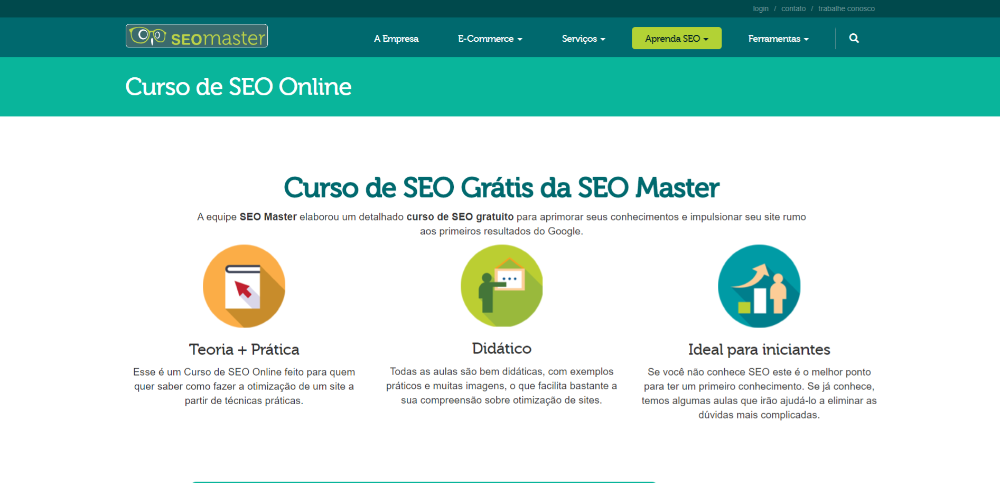
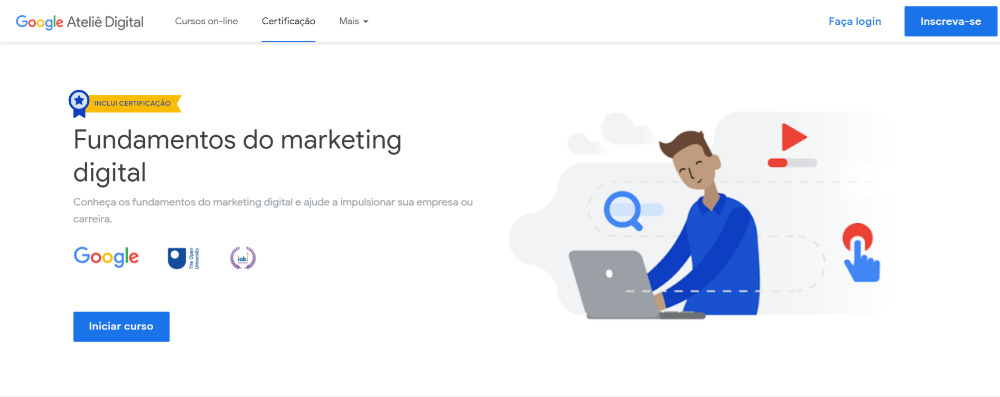
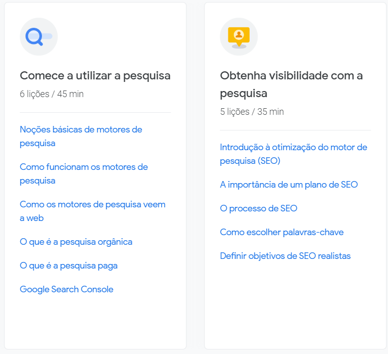

¿Seguro que conoces esa famosa herramienta, llamada Google? Y lo más probable es que llegó a este artículo por ella.

Cada vez que una página es pública en Internet, los motores de búsqueda (Google, Bing, Yahoo, ...) buscan estas páginas para indexar y poder mostrar en sus resultados de búsqueda.

Hay miles de páginas que se publican todos los días en Internet, ¿cómo saber y hacer que una página se ponga delante de otra?

Es en este momento que el SEO (*Search Engine Optimization*) entra en juego, como su traducción ya sugiere, SEO es una *optimización para los motores de búsqueda*, nada más que un conjunto de técnicas que influyen en los algoritmos de los motores de búsqueda para identificar y definir mejor la posición y la importancia de una página para una búsqueda dada.

Debido a que estos algoritmos de búsqueda están cerrados, no está claro qué métricas consideran al evaluar y clasificar una página, por lo que hay varias técnicas de SEO disponibles por ahí. Así que para realizar una optimización eficiente, se necesita mucho estudio, paciencia, mucho ensayo y error.

## Cursos para aprender SEO

## 1\. [Curso SEO completo - De básico a avanzado](https://click.linksynergy.com/link?id=FPuxaVz3TuY&offerid=507388.855368&type=2&murl=https%3A%2F%2Fwww.udemy.com%2Fcourse%2Fcurso-de-seo-completo-do-basico-ao-avancado%2F) (pagado)

**Este curso SEO está indicado para:**Qu  
ién quiere entender profundamente lo que es SEO y sus aplicaciones  
. Crea acciones SEO centradas en el RENDIMIEN  
TO. Comprender cómo administrar y cobrar a otros profesio  
nales. Saber evaluar el progreso del proyecto S  
EO. Comprender qué técnicas están permitidas, qué técnicas están prohibidas y qué técnicas no surten efecto.C  
ómo hacer SEO en la práctica.

**Con el aprendizaje del curso, usted:**  
Entenderá cómo las personas buscan productos o servicios y así entender el punto fundamental para el éxito de sus acciones SEO. Con  
la fluidez en las técnicas SEO, se reforzarán varios aspectos y conceptos de acciones digitales. La ló  
gica utilizada en el curso servirá para otras acciones de marketing. Para los análisis se basará en los conceptos fundamentales del marketing.

## 2\. [Curso SEO Master Free SEO](https://www.seomaster.com.br/curso-tutorial-seo-gratis.html) (Gratis)

El equipo de **SEO Master** ha desarrollado un **curso detallado de SEO gratuito** para mejorar sus conocimientos e impulsar su sitio hacia los primeros resultados de Google.

-   **Teoría + Práctica:** Este es un Curso SEO Online hecho para aquellos que quieren saber cómo optimizar un sitio web a partir de técnicas prácticas.
-   **Didáctica**: Todas las clases son bien didácticas, con ejemplos prácticos y muchas imágenes, lo que facilita enormemente su comprensión de la optimización del sitio web.
-   **Ideal para principiantes:** Si no conoces SEO este es el mejor punto para tener un primer conocimiento. Si ya lo sabes, tenemos algunas clases que te ayudarán a eliminar las preguntas más complicadas.

## 3\. [Optimización del motor de búsqueda del curso (SEO)](https://university.rockcontent.com/cursos/search-engine-optimization) (de pago)

Search Engine Optimization (SEO) es un conjunto de técnicas aplicadas interna y externamente a un sitio web para que se posicione mejor en los resultados de búsqueda y sea encontrado por el público adecuado en el momento adecuado, ofreciendo la mejor respuesta posible. En una estrategia de marketing digital, es importante preocuparse por el SEO para aumentar el tráfico orgánico a su sitio, generar clientes potenciales, aumentar la visibilidad de la marca y tener un mejor posicionamiento en el mercado. Las empresas que adoptan buenas prácticas SEO pueden obtener hasta 13 veces más visitantes y 5 veces más clientes en comparación con los competidores que no utilizan esta función.

### Este curso es para aquellos que quieren ser capaces de:

-   Comprender la lógica de funcionamiento y disposición de la información en los motores de búsqueda.
-   Identificar los principales factores de clasificación orgánica.
-   Analice el rendimiento orgánico en los blogs y cree planes de acción de mejora.
-   Anuncia tu blog en diferentes canales digitales.

## 4\. [CURSO BASICO SEO - GRATIS ONLINE](https://www.mirago.com.br/online/curso-seo-gratuito-online/) (Gratis)

**El curso Free Online SEO** está diseñado para todas las personas que quieran iniciarse en el mundo del [SEO (Search Engine Optimization)](https://www.mirago.com.br/aula/seo/). Este es un curso básico para principiantes.

En este curso aprenderás los conceptos básicos del SEO, así como entenderás cómo funciona el motor de búsqueda principal: Google. Además, verás cómo planificar tu contenido y tu sitio en función de los conceptos de SEO.

## 5\. [Fundamentos del marketing digital por Google](https://learndigital.withgoogle.com/ateliedigital/course/digital-marketing) (Gratis)

Curso no totalmente centrado en SEO pero tiene un módulo muy completo. Distribuida por la propia Google en su plataforma de cursos online Ateliá Digital, cuenta con módulos dedicados a la parte de SEO y visibilidad en Internet, sin duda vale la pena echar un vistazo.

