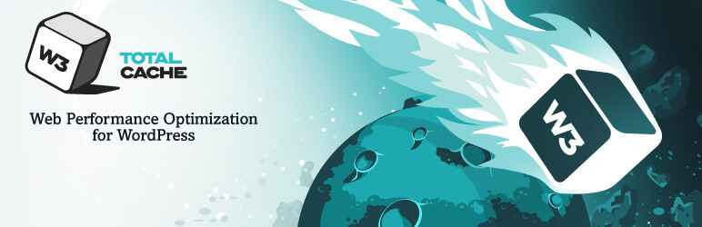

Looking to improve the speed of your WordPress site? Using a cache plugin can speed up loading, creating a better experience for your users.

Statistically, nearly half of your website's target audience expects your website to load in less than three seconds. So it's not surprising that Google continues to emphasize site speed in its search algorithm. The higher your page speed, the better your search rankings and the more organic traffic you can attract.

## What is Cache?

Simply put, caching is basically a simple solution to a complex problem: WordPress pages are dynamically generated, when a user enters a website and accesses, for example, an article, a request to the server is made for that page to be processed and delivered , then the programming language [PHP](http://marquesfernandes.com/o-que-e-php-e-para-que-serve/) takes action and performs several database queries to build the requested page and returns it to the user.

As the amount of hits on your website increases, this ends up overloading the server and reducing the response time of the page for the user. That's where the cache comes into play, as most pages don't need to have necessarily dynamic content, it creates a static file of the page, and whenever the user requests it, it delivers that page already created, which drastically reduces processing and response time. The Cache normally works with an expiration time, for example, your homepage can have an expiration time of 24 hours, when the Cache expires, a new updated version of the page is generated and served to its users.

Working with caching in WordPress can be tricky, as many users use ready-made themes, optimization can become a complicated and boring task, but don't worry, most plugins manage to do an excellent job of optimization with little effort.

## Why You Use Cache

-   **Speeds up the website for users** : We've already covered this, but it's good to mention it again as it's the main advantage.
-   **Improves overall user experience** : As the site loads faster for users, they are now more likely to browse, which can lower the bounce rate for your site, many people don't want to wait 10 seconds to view a page.
-   **Your server uses less resources** : Puts less pressure on your server, reducing the processing and memory needed to withstand the stride of many users, and can even reduce hosting costs.
-   **Increase in Search Engine Optimization** : You show Google and other search engines that your site is worth indexing for a higher ranking, as this is a very important metric for your ranking.

## Top WordPress Cache Plugins

I've separated a list of the best and most popular cache plugins for WordPress, I'll bring a brief comparison of the advantages of each one.

1.  [WP-Optimize](#wpoptimize)
2.  [WP Super Cache](#WP-Super-Cache)
3.  [W3 Total Cache](#WP-Super-Cache)
4.  [WP Fastest Cache](#WP-Fastest-Cache)

### 1\. [WP](https://br.wordpress.org/plugins/wp-optimize/#description) [-](https://br.wordpress.org/plugins/wp-optimize/#description) [Optimize](https://br.wordpress.org/plugins/wp-optimize/#description)

> WP-Optimize is a revolutionary, all-in-one plugin that cleans your database, compresses your images, and caches your website. The caching feature is built around the world's fastest caching engine. This simple, popular and highly effective tool has everything you need to keep your website fast and completely optimized!

[WP-Optimize](https://br.wordpress.org/plugins/wp-optimize/#description) is the plugin I chose for my blog ( *I don't get anything for the recommendation* ), after testing several plugins, I chose this one for its simplicity and efficiency, easy to configure, it delivered a very significant performance and loading improvement. It attacks by optimizing different parts of your website:

1.  **Database:** It optimizes your database by removing unnecessary tables and compressing/defragmenting.
2.  **Image Compression:** It has a tool to compress your images, reducing their size and increasing page load time.
3.  **Cache:** It comes with all the essential features of any other caching plug-in with a very simple configuration.

### two. [WP Super Cache](https://br.wordpress.org/plugins/wp-super-cache/)

> This plugin generates static html files from your dynamic WordPress blog. Once an html file is generated, your server will serve that file instead of processing WordPress PHP scripts, which are comparatively heavier and more expensive.

[WP Super Cache](https://br.wordpress.org/plugins/wp-super-cache/) is a very popular caching plugin for WordPress, with over a million active installs. The plugin is maintained by Automattic, the same WordPress.com developer team.

WP Super Cache serves cached files in three ways:

-   **Simple** : This is the most recommended method of caching files, because you don't need to edit PHP files, and the file `.htaccess` does not need to be configured.
-   **Specialist** : This is the fastest and most efficient caching method but it requires file modification `.htaccess` and additional settings.

### 3\. [W3 Total Cache](https://br.wordpress.org/plugins/w3-total-cache/)

> W3 Total Cache (W3TC) improves your website's SEO and user experience by increasing website performance and reducing load times by leveraging features such as content delivery network (CDN) integration and more best practices recent.

[W3 Total Cache](https://www.isitwp.com/wordpress-plugins/w3-cache/) is one of the most popular WordPress cache plugins, with over 1 million active installs. It improves server performance by caching all tiers of the website.

Supports Google Accelerated Mobile Pages (AMP) and Secure Socket Layer (SSL).

The developers claim that the plugin can offer up to 80% bandwidth savings through its minification algorithm, the process reduces the size of your HTML, CSS, JavaScript without negatively impacting your website.

### 4\. [WP Fastest Cache](https://wordpress.org/plugins/wp-fastest-cache/)

> THE *WP Fastest Cache* - The fastest and easiest wordpress cache plugin.

[WP Fastest Cache](https://wordpress.org/plugins/wp-fastest-cache/) is one of the easiest WordPress cache plugins to configure. Just like any other cache plugin, it creates static HTML files on your dynamic WordPress website.

To reduce file size, the plugin reduces HTML and CSS files. It effectively implements browser caching to reduce page load time for repeat visitors and combines many CSS files into one to reduce the number of requests made to your server.
