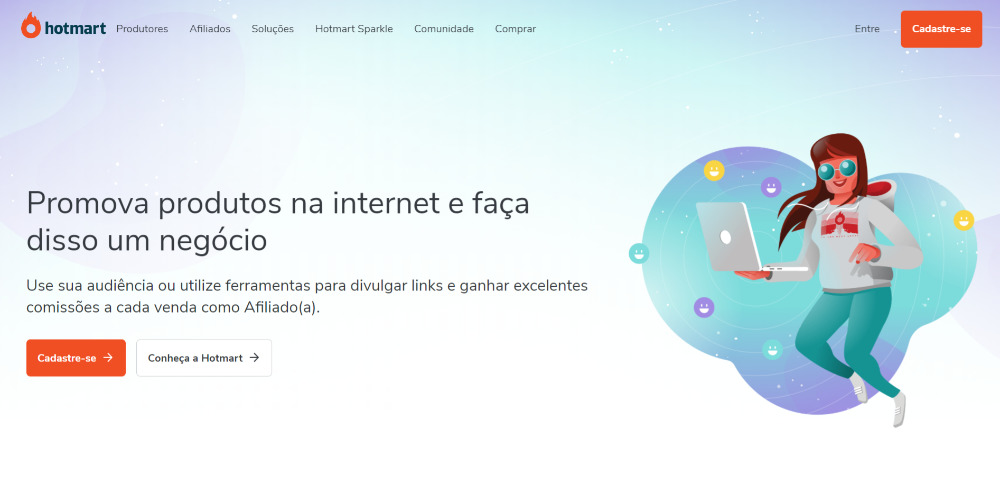
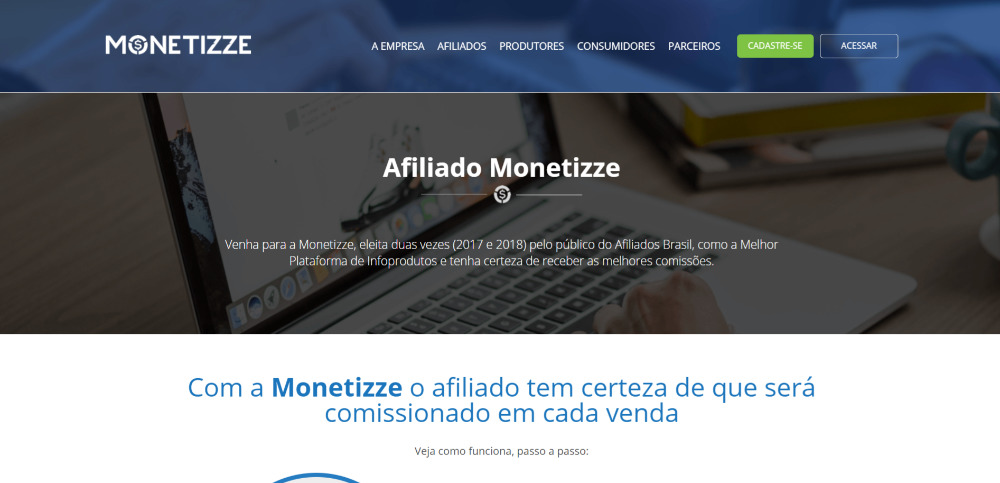
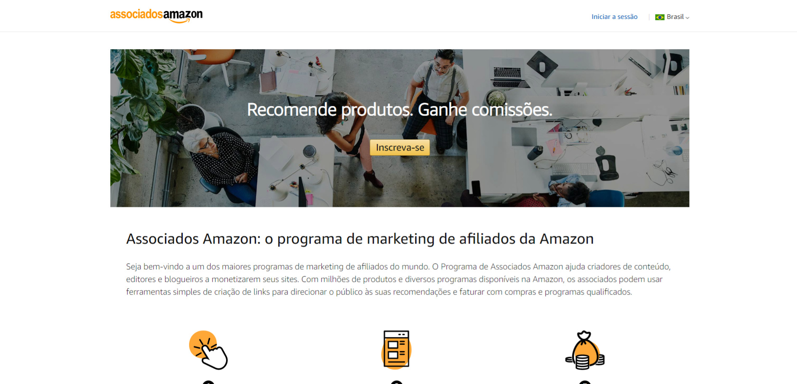
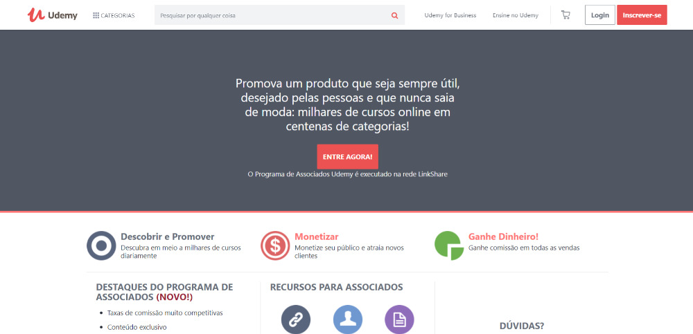

import YouTube from '@/components/YouTube.astro';

Você provavelmente já se perguntou se é possível ganhar dinheiro na internet? Sim, é possível, mas não é tão milagroso e fácil como muitas pessoas vendem por ai. Existem diversos meios de ganhar dinheiro na internet, mas vamos falar de um em específico: **Programa de afiliados**.

## O que é um Programa de Afiliados?

Um programa de afiliados permite que qualquer pessoa ganhe dinheiro ao recomendar e vender produtos e serviços. Basicamente você se cadastra como afiliado em uma plataforma especializada ou uma loja virtual, recebe links para produtos e serviços que você precisa divulgar, você ganha dinheiro através de uma comissão caso alguma venda seja realizada a partir da sua divulgação.

Grandes empresas adotam esse modelo com o intuito de pulverizar e ampliar o alance seu de marketing e a taxa de conversão de vendas.

## Melhores programas de afiliados

Existem diversos programas de afiliados pela internet, falaremos dos mais famosos e consolidados do mercado. Cada plataforma tem a sua maneira de comissionar, as mais comuns são baseados em algumas métricas, elas podem variar por plataforma e produto.

-   **CPA** **(Custo por Aquisição)**: O afiliado é remunerado quando um usuário concretiza uma compra através de um link promovido.
-   **CPC (Custo por Clique)**: O afiliado é remunerado por cada clique feito em um link ou banner.
-   **CPM** **(Custo por Mil)**: O afiliado é remunerado por cada mil visualizações de um anúncio.

### 1\. [Hotmart](https://www.hotmart.com/pt-BR/affiliates)

A Hotmart é a maior e mais completa plataforma de ensino à distância da América Latina. 

São mais de mais de 150 mil produtos cadastrados, 5 milhões de alunos e vendas realizadas para mais de 188 países

Mais que isso, a Hotmart oferece de forma simples e prática um espaço para quem deseja criar ou divulgar um produto digital. Possibilitando que qualquer um possa ensinar o que têm de melhor para o mundo inteiro. 

Uma plataforma totalmente integrada e com as melhores soluções para escalar qualquer negócio digital. Tudo isso, sem mensalidades e nem taxa de adesão, apenas uma porcentagem quando houver vendas. 

### 2\. [Monetizze](https://app.monetizze.com.br/r/AP/13283239)

Nascida em 2015 em Belo Horizonte, a Monetizze surgiu com a proposta de mudar o mercado digital, trazendo mais transparência, qualidade e atenção a afiliados e produtores na venda de produtos digitais e de produtos físicos.

Márcio Motta, fundador da plataforma, focado em sua missão, programava durante as madrugadas para que o sonho saísse do papel, enquanto mantinha o seu emprego para pagar as contas de casa.

### 3\. [Magazine Luiza](https://www.magazinevoce.com.br/)

A Magalu, loja virtual queridinha do brasileiro, possui um programa de afiliados bem legal. Com ele você cria sua própria loja, com um link exclusivo com todos os produtos do site oficial.

<YouTube id="sy8zPcg94Kc" />

### 4\. [Amazon](https://associados.amazon.com.br/)

O Programa de Associados Amazon ajuda criadores de conteúdo, editores e blogueiros a monetizarem seus sites. Com milhões de produtos e diversos programas disponíveis na Amazon, os associados podem usar ferramentas simples de criação de links para direcionar o público às suas recomendações e faturar com compras e programas qualificados.

### 5\. [Eduzz](https://www.eduzz.com/afiliados)

No caso de infoprodutos, a Eduzz oferece uma maneira segura, transparente, muito fácil e eficiente para que os afiliados encontrem, divulguem e vendam Conteúdos Digitais de alta demanda. É como ter uma equipe enorme de vendas trabalhando para gerar novos negócios.

Ser um Afiliado Eduzz é ter um verdadeiro arsenal de ferramentas de divulgação que ajudam a levar esses produtos a potenciais compradores, dividindo comissões com os infoprodutores.  
  
Os produtos disponíveis são avaliados previamente pela nossa equipe. Só são colocados em nossa vitrine produtos com alto potencial de vendas.

### 6\. [Udemy](https://www.udemy.com/affiliate/?locale=pt_BR)

Promova um produto que seja sempre útil, desejado pelas pessoas e que nunca saia de moda: milhares de cursos online em centenas de categorias! O programa de afiliados é gerenciado pela Rakuten, então sugiro que veja o próximo tópico.

### 7\. [Rakuten](https://rakutenadvertising.com/pt-br/afiliados/)

Quer seja blogger, influencer, desenvolvedor de aplicativos ou empresa, a principal rede global de afiliados da Rakuten Advertising ajuda você a ganhar dinheiro com seu conteúdo digital e a criar melhores experiências para seus visitantes. Faça parceria com as principais marcas de todos os setores, da moda aos serviços financeiros.

Eleita a Rede de Marketing de Afiliados nº 1 da indústria durante nove anos consecutivos, a Rakuten Advertising une os consumidores e as principais marcas de todo o mundo como nunca antes. 

* * *

Existem diversos programas de afiliados disponíveis, o que tornam sim possível ganhar dinheiro online sem nem precisar ter o produto, desenvolver o curso ou prestar o serviço. A capacidade de gerar renda vai depender dos produtos que você selecionar e da maneira e canais que você decidir divulgar, no começo pode não ser fácil mas, com um pouco de persistência e paciência é possível desenvolver uma fonte de renda extra, mas não existe solução milagrosa para isso, você precisa estudar o seu nicho, a melhor maneira para converter vendas com o seu público.
