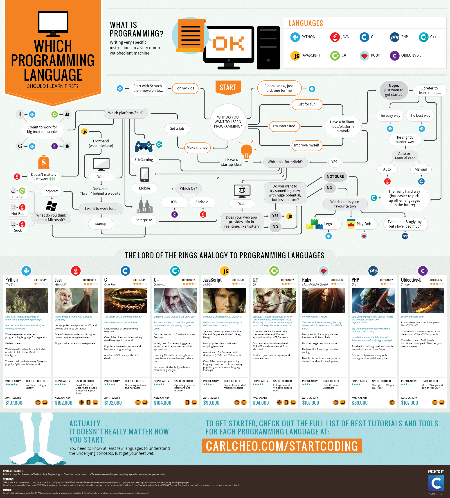
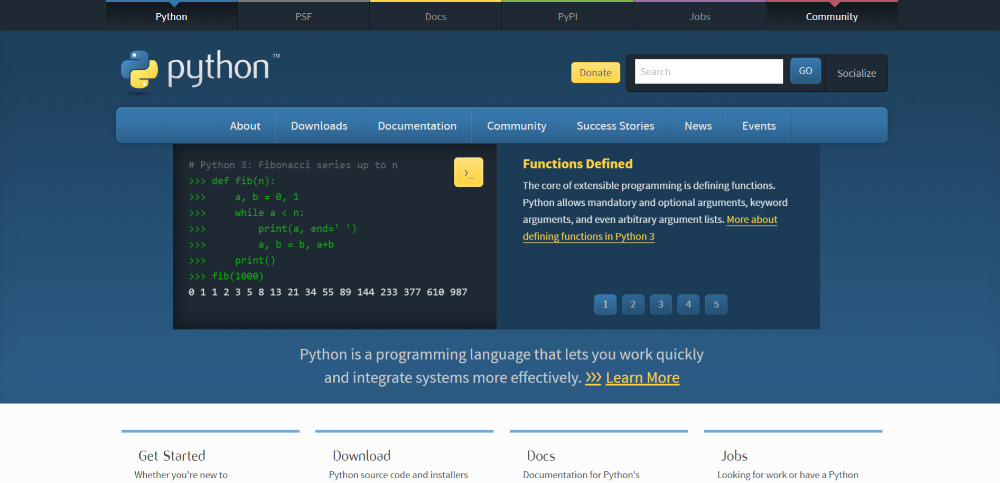
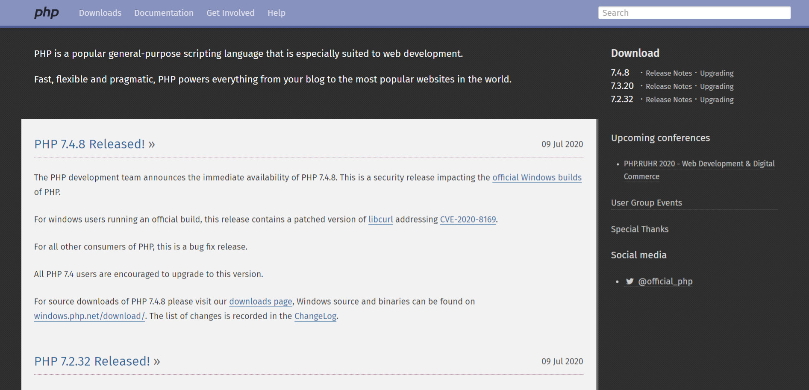

This is a question I get asked frequently by people just starting out or thinking about moving into the development world. This question is not easy to answer, there are several variables that can change the answer, I know this is not what you would like to be reading. Personal questions, both from the questioner and the answerer, can change the answer. I will assume that the majority of readers are people entering or moving into the technology market, specifically development. With this in mind, we know that the learning curve is probably one of the most important factors, followed by pay and the number of available seats. In the listing below, I will explain why I chose the languages and what personally makes me believe they are the ideas for you to start learning.

## Flowchart: Which language to learn first

During my search for other sources and opinions, I came across a very interesting flowchart that helps to decide which language to choose. It has starting points and questions based exactly on personal issues, which may interfere with your decision. Unfortunately it is in English, I will try to translate to Portuguese soon.

Credits: [Carlcheo](http://carlcheo.com/startcoding)

## Which Programming Languages to Learn First

Well, no more bullshit, let's go to the listing of the programming languages I think you should choose as your first language. As a reference I will use two language popularity polls, the [PYPL](http://pypl.github.io/PYPL.html) and [Stack Overflow Insights (OS)](https://insights.stackoverflow.com/survey/2019#most-popular-technologies) .

### 1\. [Javascript](http://marquesfernandes.com/javascript-o-que-e-como-funciona-e-para-que-serve/) , [HTML](http://marquesfernandes.com/o-que-e-html-e-para-que-serve/) and [CSS](http://marquesfernandes.com/o-que-e-css-e-para-que-serve/)

-   *Popularity (PYPL): **#3***
-   *Popularity (SO): **#1***
-   *Most beloved (SO): **#11***
-   *[Median Salary: R$5500](https://neuvoo.com.br/salario/?job=Programador+Javascript#:~:text=O%20sal%C3%A1rio%20m%C3%A9dio%20de%20Programador%20Javascript%20em%20Brasil%20%C3%A9%20de,a%20ganhar%20R%2499.006%20anuais.)*

I particularly like to learn new things that have practical visual feedback, so my recommendation would always be to start with Frontend, learning HTML, CSS and JavaScript. As it is a language that develops visual aspects more common to a beginner (webpages), I believe that this visual feedback encourages and motivates more who are starting in this world. JavaScript, or JS for intimates, is a language that initially started to be used in browsers, to give dynamism to web pages, and nowadays, it is used to create web apps, mobile apps and much more.

The job market is also very hot for this language, as it is a language with diversified applications, whether in the frontend, backend, mobile development and even IoT, its field of action becomes quite comprehensive and with more opportunities.

http://marquesfernandes.com/como-e-onde-aprender-a-programar-javascript-cursos-e-tutórios-gratuitos/

### two. [Python](https://www.python.org/)

-   *Popularity (PYPL): **#** 1*
-   *Popularity (SO): **#** 4*
-   *Most beloved (SO): **#** two*
-   *[Median Salary: R$3500](https://neuvoo.com.br/salario/?job=Programador+Python)*

Python is a language that has become popular again in recent years thanks to the evolution and spread of the field of data science and artificial intelligence.

Python is a versatile, powerful, and general-purpose language. You can use it for just about anything, from web development to games, which is why many people choose it as their first language.  
If you're just curious about development, you can start with Python. It's very easy to learn. Its packages and libraries make it easy to work with large amounts of data. You can create views with Matplotlib, analyze tabular data with Numpy and Pandas … and so on.  
Python has robust documentation. If there's something you need to look for, you can find the answer quickly. This is an important consideration for anyone learning independently.

It has a large job market, and with the growing demand for data scientists, the trend is for this language to grow.

### 3\. [Java](https://www.java.com/en/download/)

-   *Popularity (PYPL): **#** two*
-   *Popularity (SO): **#** 5*
-   *Most beloved (SO): **#** 18*
-   *[Median Salary: R$4500](https://neuvoo.com.br/salario/?job=Programador+java)*

If you want to build Android apps, Java is your language. You can also use it for web, desktop and even gaming applications. Java used to be one of the most taught languages in computer science colleges, but Python has been outperforming in recent years. Java is still quite popular, but Python and Javascript are definitely easier to learn.

In Brazil there is an insane demand for Java developers, more consolidated and older companies usually have legacy applications that need maintenance.

### 4\. [PHP](http://marquesfernandes.com/o-que-e-php-e-para-que-serve/)

-   *Popularity (PYPL): **#** 6*
-   *Popularity (SO): **#** 8*
-   *Most beloved (SO): **#** 24*
-   *[Median Salary: BRL 3000](https://neuvoo.com.br/salario/?job=Programador+Php)*

PHP is a scripting language and is a bit underrated (for good reason), but considering the fact that 80% of the web is powered by PHP, including this blog.

You can do a lot with PHP. It seems a strange language to recommend as the first one, because it probably won't be enough to meet all your programming needs. PHP has its limitations, but it's actually pretty easy for a beginner to learn and will likely at some point cross paths with Javascript, HTML, and CSS.

http://marquesfernandes.com/como-e-onde-aprender-a-programar-php-cursos-e-tutórios-gratuitos/

### 5\. [Swift](https://swift.org/)

-   *Popularity (PYPL): **#** 9*
-   *Popularity (SO): **#** 16*
-   *Most beloved (SO): **#** 6*
-   *[Median Salary: R$6500](https://neuvoo.com.br/salario/?job=Programador+ios)*

If you want to be an iOS developer, you will have to learn the Swift language. Swift is a relatively new language, but it is extremely easy to learn, it teaches even for children, it was literally created for iOS application development. And as expected, as everything from Apple is expensive, it is one of the languages with the highest average salary on the market.

* * *

**References:  
**[https://medium.com/coding-in-simple-english/which-programming-language-should-i-learn-dddee919edb6](https://medium.com/coding-in-simple-english/which-programming-language-should-i-learn-dddee919edb6)  
[https://www.freecodecamp.org/news/what-programming-language-should-i-learn-first-19a33b0a467d/](https://www.freecodecamp.org/news/what-programming-language-should-i-learn-first-19a33b0a467d/)  
[https://towardsdatascience.com/top-10-in-demand-programming-languages-to-learn-in-2020-4462eb7d8d3e](https://towardsdatascience.com/top-10-in-demand-programming-languages-to-learn-in-2020-4462eb7d8d3e)  
[https://www.fullstackacademy.com/blog/nine-best-programming-languages-to-learn](https://www.fullstackacademy.com/blog/nine-best-programming-languages-to-learn)  
[https://insights.stackoverflow.com/survey/2019#most-popular-technologies](https://insights.stackoverflow.com/survey/2019#most-popular-technologies)  
[http://pypl.github.io/PYPL.html](http://pypl.github.io/PYPL.html)
