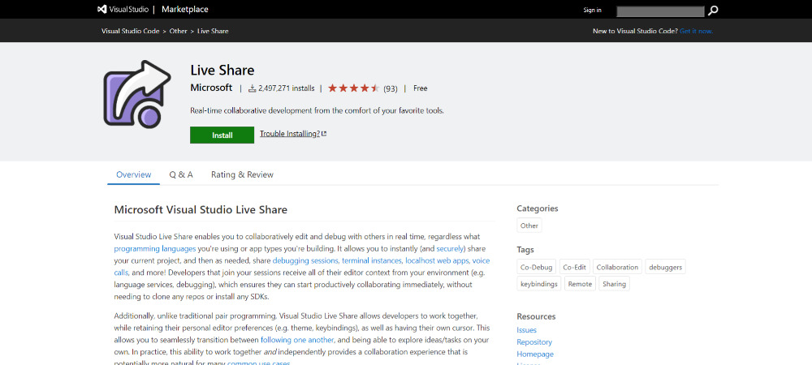
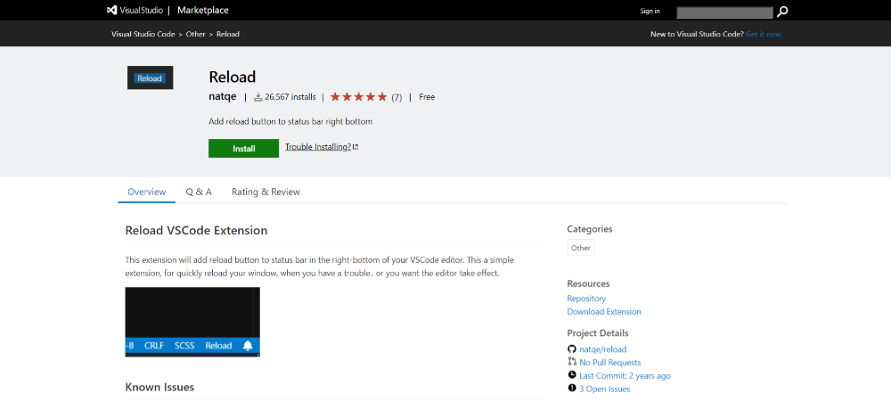
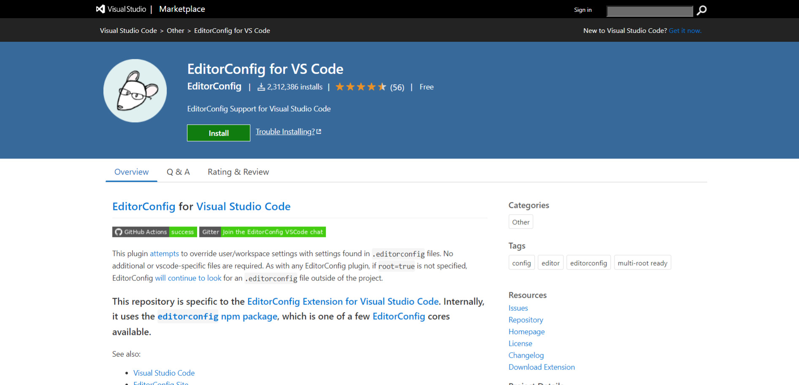

That VSCode became the [IDE](http://marquesfernandes.com/melhores-editores-de-texto-ides-para-desenvolvimento-web-em-2020/) Community favorite is nothing new, it makes life easier for many developers on a daily basis. We can further streamline our development process by using some super useful extensions. I have separated a list of the extensions that I use and recommend to improve your productivity.

## 1. [GitLens](https://marketplace.visualstudio.com/items?itemName=eamodio.gitlens)

GitLens extends the Git features of Visual Studio Code. It helps you quickly view the author of code through Git "blame notes", seamlessly browse and explore Git repositories, gain valuable insights with powerful compare commands, and much more.

This extension is great for you to discover that the code you are cursing was actually made by yourself.

## two. [prettier](https://marketplace.visualstudio.com/items?itemName=esbenp.prettier-vscode)

Prettier is an opinionated code formatter. It enforces a consistent style when analyzing your code and reprinting it with its own rules that take into account the maximum line length, wrapping the code when necessary. Very useful for formatting that giant JSON you copied from the internet and are trying to understand.

## 3. [Live Share](https://marketplace.visualstudio.com/items?itemName=MS-vsliveshare.vsliveshare)

Visual Studio Live Share lets you collaboratively edit and debug with others in real time, regardless of the programming languages you're using or the types of apps you're building. It lets you instantly (and securely) share your current project and, as needed, share debug sessions, terminal instances, local web apps, voice calls and more! Developers joining your sessions are given all the editor context of their environment (eg language services, debugging), which ensures they can start productively collaborating right away, without the need to clone any repositories or install SDKs.

## 4. [Remote - SSH](https://marketplace.visualstudio.com/items?itemName=ms-vscode-remote.remote-ssh)

The Remote - SSH extension allows you to use any remote machine with an SSH server as your development environment. This can greatly simplify development and troubleshooting in a wide variety of situations.

-   Build on the same operating system you deploy or use a larger, faster, or more specialized infrastructure than your local machine.
-   Quickly switch between different remote development environments and safely upgrade without worrying about impacting your local machine.
-   Access an existing development environment from multiple machines or locations.
-   Debug an application running elsewhere, such as a customer site or in the cloud.

## 5. [Settings Sync](https://marketplace.visualstudio.com/items?itemName=Shan.code-settings-sync)

If you find yourself constantly having new installs of VSCode and are tired of having to remember and install your extensions, settings and themes every time, your problems are over. Settings Sync allows you to synchronize your VSCode state between multiple instances.

## 6\. [Reload](https://marketplace.visualstudio.com/items?itemName=natqe.reload)

This extension I would very much like to not need to use, but I constantly see the need to restart VSCode to get some lint or autocomplete. It will add a VSCode reload button to the status bar at the bottom right. This is a simple extension, to quickly reload your window when you have problems.. or want the editor to take effect.

## 7\. [Bracket Pair Colorize](https://marketplace.visualstudio.com/items?itemName=CoenraadS.bracket-pair-colorizer)

This extension allows the corresponding square brackets to be color-coded. The user can define which characters to match and which colors to use.

## 8\. [Code Spell Checker](https://marketplace.visualstudio.com/items?itemName=streetsidesoftware.code-spell-checker)

If you, like me, don't have English as your first language and find yourself constantly wondering if something went wrong in your comments or documentation, this extension is for you!

A basic spell checker that works well with camelCase code. The purpose of this spelling checker is to help detect common misspellings while keeping the number of false positives low.

## 9\. [EditorConfig](https://marketplace.visualstudio.com/items?itemName=EditorConfig.EditorConfig)

This plugin tries to replace the user/workspace settings with the settings found in the file. `.editorconfig` . Basically it allows you to crunch a file that can be versioned and shared with useful settings like spacing (tab or space) of the project, if you want it to render whitespaces, and much more.

* * *

These extensions help my productivity a lot, how about you? Do you have an extension that you use and find it useful? Leave it in the comments!
