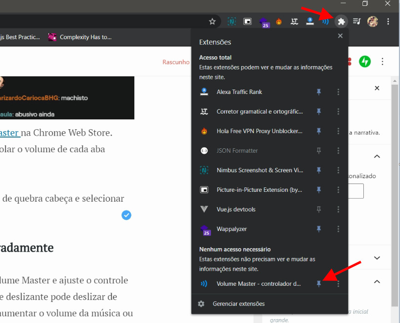

Have you ever had two or more tabs open with sound? Whether it's listening to music, watching a video, video conferencing or all together, you've probably thought it would be nice to be able to individually control the volume of each tab. If you've caught yourself in this scenario, don't worry, there is a Google Chrome extension that allows you to control the sound volume per tab, the *Master Volume* . This is useful when you want to focus and listen to one tab louder than the other. You can dim songs or sounds in different tabs easily and also create some other effects.

## Master Volume To Control Tab Volume in Google Chrome

You can easily and securely download the *Master Volume* on the Chrome Web Store. Once downloaded and installed, you can access and control the volume of each tab simply by clicking on the extension icon.

If the icon is not visible you need to click on the puzzle icon and select to make it visible in extension shortcuts:

### Adjust volume in Chrome tabs separately

To control the volume of a tab, click on the icon *Master Volume* and adjust the control bar to individually control the volume on that tab. You can choose between 100% up to 600%, the extension can even increase the volume of the music or videos you are playing in the tab, but with loss of quality.

You can change it from 10% to 10%, which gives you good control over the volume of each tab, almost 60 volume levels.

You can see below the list of guides that are playing some audio. Clicking on any item in the listing will take you to that open tab. All tabs now have independent volume control!

Volume Master is completely free and does not display ads. It's about 20 KB. Overall, it's a small, secure and very useful extension for your Google Chrome.

[Click here to download master volume](https://chrome.google.com/webstore/detail/volume-master/jghecgabfgfdldnmbfkhmffcabddioke?hl=en)
