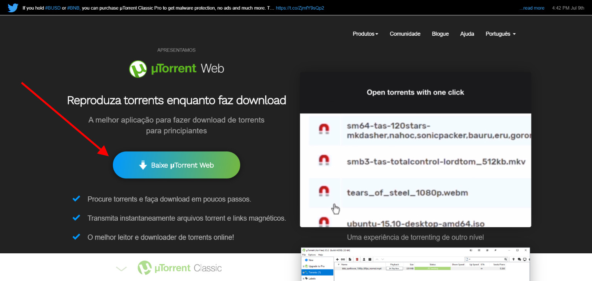
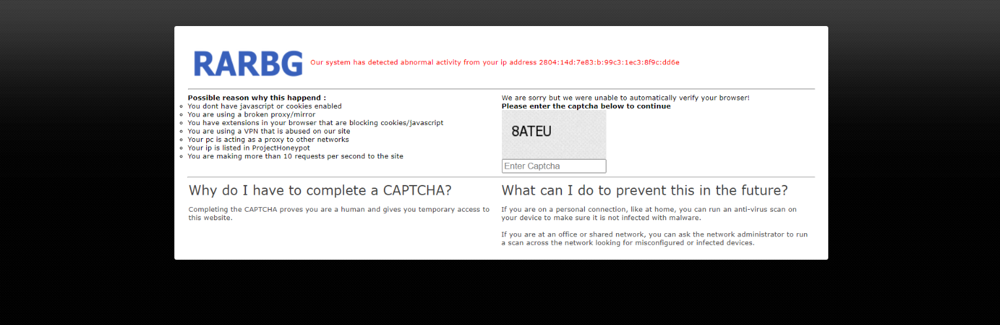
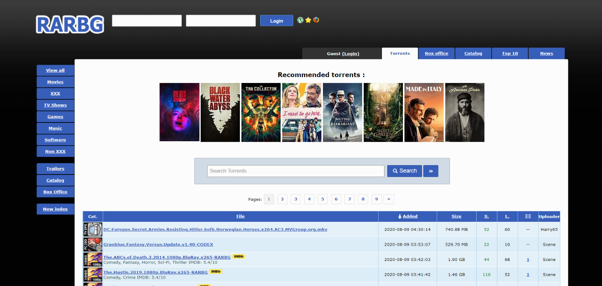
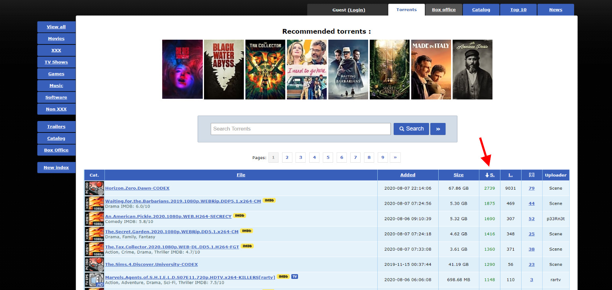
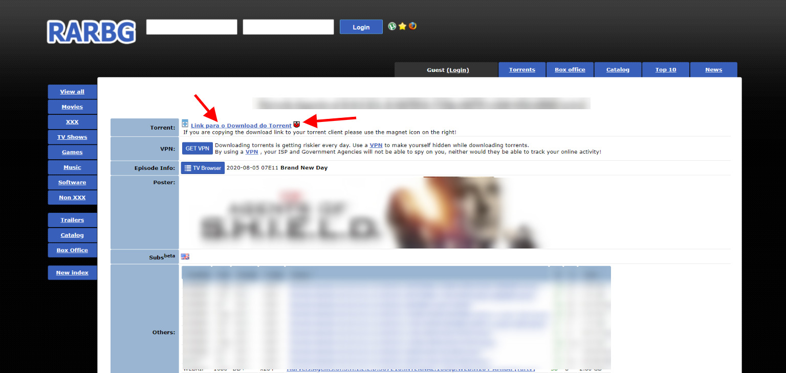
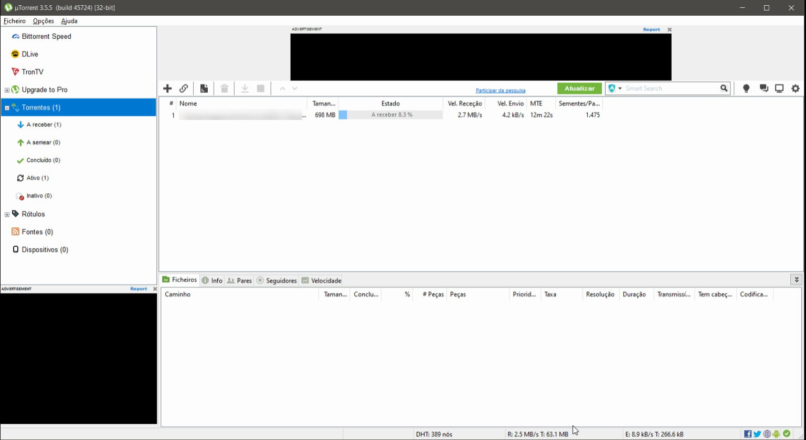

Muitas pessoas ficam assustadas quando eu falo que baixei tal coisa por torrent, muitas pessoas acreditam que seja algo extremamente complicado de se fazer, vim para desmitificar os Torrents. Nesse tutorial você irá aprender o que é um torrent e como fazer para baixar de forma segura Torrents de todos os tipos, filmes, seriados, programas e muito mais.

*Disclaimer: Esse artigo não incentiva o uso de pirataria e visa apenas ensinar como utilizar e baixar programas por Torrent*.

## O que é um Torrent?

Antes de sair baixando e instalando tudo, você precisa entender o que é o bendito do Torrent e porque ele é tão legal. Bom, a primeira coisa que você precisa entender é que um Torrent não é o arquivo em específico que você quer baixar, ele é um arquivo que contém informações da onde o arquivo que você quer baixar está. Essas informações serão então usadas por um software como o [uTorrent](https://www.utorrent.com/intl/pt/) para a distribuição “real” - o que essencialmente permite que os usuários baixem facilmente arquivos torrent para seus computadores pessoais.

O torrent trabalha com uma tecnologia peer to peer, basicamente é uma rede gigante onde todo mundo que baixa arquivos por ela, também envia esses arquivos, quanto mais pessoas baixando e enviando o arquivo melhor será a velocidade de download. Imagine que você quer baixar um programa e ele fornece o download por torrent, assim que você começa a baixar pedaços desse arquivo, o seu computador começa a enviar os pedaços que você já tem desse arquivo para outras pessoas que também desejam baixar esse arquivo. Não se preocupe, é um processo seguro, assim que você pausa o download ou fecha o computador ele para de enviar esses pedaços de arquivos.

O torrent em si é seguro, o que muitas pessoas não entendem é que ele é uma maneira como outra qualquer de baixar arquivos da internet, e esses arquivos sim, podem ser maliciosos, por isso você deve evitar baixar arquivos com baixa nota ou suspeitos em seu computador, seja pelo torrent ou por navegador. O melhor antivírus é o bom senso!

## Como baixar um Torrent

A primeira coisa que você precisa é instalar uma aplicação para baixar e gerenciar os torrents, eu recomendo e usaremos nesse tutorial o [uTorrent](https://www.utorrent.com/intl/pt/). Ele está disponível para todos os sistemas operacionais de computadores (Windows, Apple MacOS, Linux) e também existe uma versão mobile para o Android.

Não tem mistério, basta baixar o instalador para o sistema operacional do seu computador e seguir os passos para instalar e executar o programa. Após a instalação você deverá ver uma tela parecida com essa:

## Procurando Torrents

Agora precisamos encontrar os torrents que desejamos, existem diversos sites para isso, nesse tutorial utilizaremos o site [https://rarbgproxied.org/](https://rarbgproxied.org/), os portais de torrent normalmente são simples e contém MUITA propaganda, muitas vezes ao clicar em qualquer lugar da tela eles abrem uma nova aba com propaganda, não se preocupe, é normal.

Ao entrar no site provavelmente será pedido um desafio de segurança pra saber se você é um humano e não um robo.

Depois de superado essa etapa, daremos de cara com a home do site e uma campo de busca, utilizaremos ela para buscar o nosso torrent.

Depois que você realizar a busca pelo arquivo desejado, seja ele um filme, um seriado ou um programa, ordene os resultados pela coluna de `Seeders`.

Essas duas colunas são importantes, quanto mais Seeders um arquivo torrent tiver, significa que mais pessoas estão compartilhando esse arquivo, logo, sua velocidade de download será maior. A coluna ao lado, de Leechers, indica a quantidade de pessoas baixando esse arquivo.

Bom agora que você escolheu o arquivo adequado, clique no link para ir para a página de torrent. No exemplo acima eu camuflei as informações, novamente, não incentivo o uso de conteúdo piratas, esse artigo é apenas educacional hehehehe. Agora temos duas opções para download, podemos clicar no link de download do torrente e baixar o arquivo e abrir ele com o nosso gerenciador de torrent uTorrent ou podemos clicar no imã, esse link é chamado de Magnet Link, ele é um atalho que abrirá direto a sua aplicação de torrent e começara o download.

Escolha um método e baixe o arquivo `.torrent`, após abrir esse arquivo você verá uma janela contendo o nome do arquivo que você irá baixar, quais arquivos ele contém, normalmente vem um arquivo de texto com informações do autor do torrent e o arquivo desejado. Selecione o local que deseja salvar e clique em ok.

Pronto, agora você pode acompanhar o progresso do seu download, você poderá ver a velocidade que está recebendo os arquivos e também a velocidade que você está enviando esse arquivo para outras pessoas. Quando o torrent acabar de baixar, você precisa explicitamente clicar no torrent e clicar em parar, caso contrário, ele continuará enviando o arquivo para outras pessoas, consumindo e deixando a sua internet lenta.

