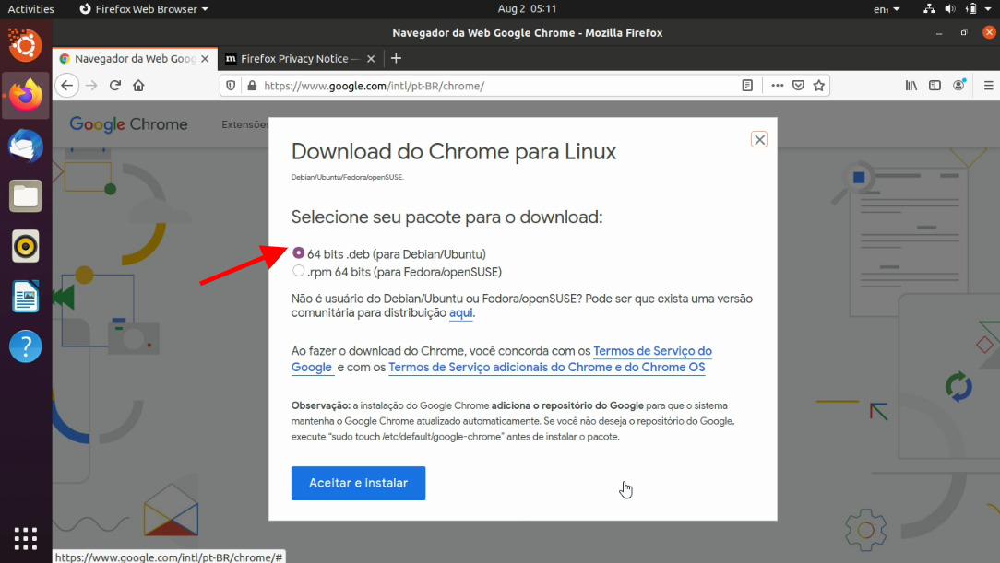
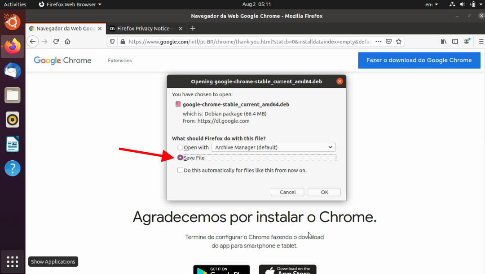

Google Chrome is the most popular web browser in the world. It is fast, secure, and packed with features to deliver the best browsing experience. When you log into a fresh Ubuntu installation, the default browser installed is Firefox, which has improved a lot in recent years, but Chrome is still the default choice for most users. If you go to the Ubuntu Store, you probably won't find Google Chrome to install, but rather its open-source version, Chromium. Although they are similar (Chromium is the open-source project), they are not the same.

So, how do you install Google Chrome on Ubuntu? There are two ways to install it: more advanced users can do it directly from the command line, or by downloading the installer just like on Windows.

-   [Installing Google Chrome from a file](#metodo1)
-   [Install Google Chrome from the command line](#metodo2)

## 1\. Installing Google Chrome on Ubuntu from a file

If you are new to the Linux world, installing from the command line may seem extremely complicated, but don't worry: Ubuntu knows this and tries to bring you a more straightforward experience.

First, go to [https://www.google.com/chrome/](https://www.google.com/chrome/) to access the Google Chrome download page.

Click download, and make sure the installed Ubuntu is 64-bit. If it is the latest version of Ubuntu, it is certainly 64-bit.

Choose the DEB option for Ubuntu/Debian.

Save the file locally; opening it directly with the Ubuntu Store may not work.

Open the file and follow the installation steps! Just like that! Now you already have Google Chrome installed on your Ubuntu.

## 2\. Installing Google Chrome on Ubuntu from the Terminal

If you are a user already accustomed to the Linux world, you probably prefer to do things from the command line. Although it is not as simple as installing other applications, using just apt-get install chrome will not work.

To install Google Chrome from the terminal, we need to download the *DEB* file using the `wget` command:

$ wget https://dl.google.com/linux/direct/google-chrome-stable\_current\_amd64.deb

Now we can use `dpkg` to install Chrome from the downloaded DEB file:

$ sudo dpkg -i google-chrome-stable\_current\_amd64.deb

Now just look for Google Chrome in your application list and launch it.

## How to optimize Google Chrome

Now that you have Google Chrome installed and running, check out [this article](http://marquesfernandes.com/como-otimizar-a-velocidade-e-desempenho-do-seu-google-chrome/) on how to optimize the browser and keep its performance always up to date.
