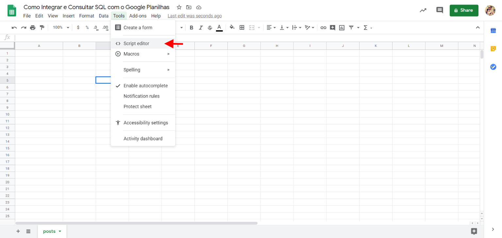
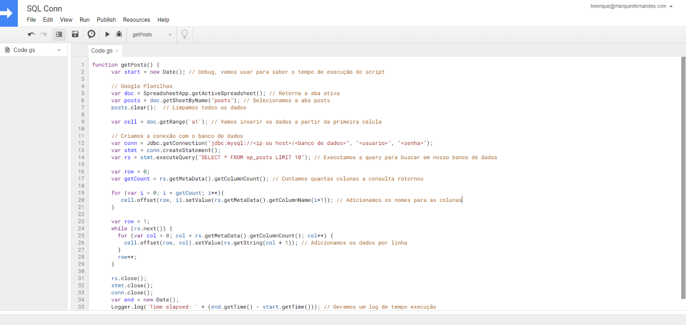
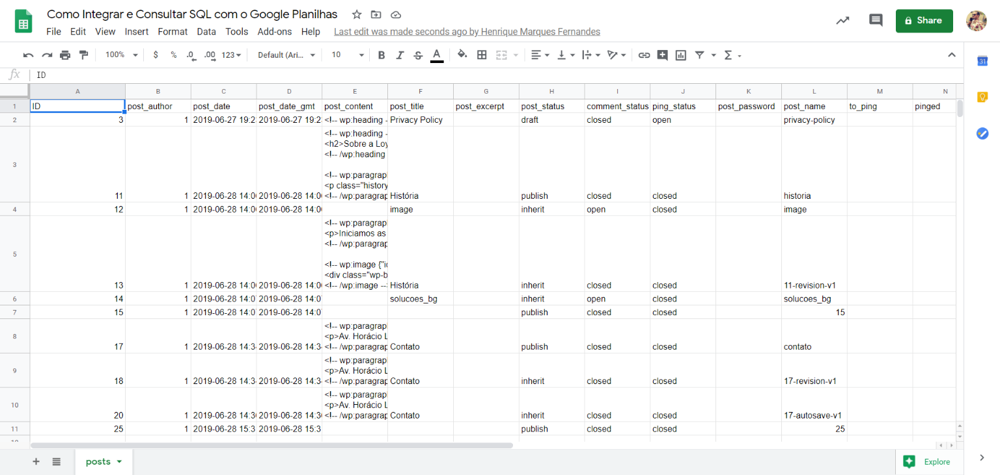

import Gist from '@/components/Gist.astro';

Empecé a trabajar en una hoja de cálculo de Google para rastrear mis entradas de blog y algunas otras métricas de seguimiento, ya que odio el trabajo repetitivo, así que me cansé de copiar, pegar y actualizar toda la información manualmente. Fue cuando descubrí que hay una manera de conectar directamente mi hoja de cálculo a la base de datos de mi instalación de WordPress y hacer algunas consultas para extraer automáticamente los datos que necesito. Todo esto es posible a través de Google App Scripts, una plataforma de scripting desarrollada por Google para el desarrollo de aplicaciones ligeras utilizando el lenguaje de desarrollo Javascript.

*\* Si está familiarizado con Excel, Apps Scripts es el VBA de Hojas de cálculo de Google.*

Google App Scripts permite el acceso al conector [JDBC](https://developers.google.com/apps-script/guides/jdbc), lo que nos permite conectar nuestra hoja de cálculo de Google a una base de datos MySQL (Hasta la versión 5.7), Microsoft SQL Server, Oracle o Google Cloud SQL.

Aprenderemos a conectarnos en nuestra base de datos, realizar consultas y mostrarlas en una amplia gama de celdas en nuestra hoja de cálculo. Si no conoces JavaScript o tienes poca familiaridad con el código, no te preocupes, siguiendo los pasos de este artículo podrás tener una función fácil y genérica para realizar consultas SQL sin tener que modificar casi nada.

## Creación de la hoja de cálculo

Bueno, lo primero que tenemos que hacer es crear una nueva hoja de cálculo y abrir el editor de código de Google Apps Scripts:

Entonces vamos a tener un editor de código similar al siguiente:

## Creación de scripts de aplicaciones para conectarse a la base de datos

Ahora vamos a copiar el [código de ejemplo](https://gist.github.com/shadowlik/0ead7e8ace5a5ba9062bb00a368811f5) a nuestro archivo:

<Gist user="shadowlik" id="0ead7e8ace5a5ba9062bb00a368811f5" />

Cambiar todas las variables indicadas al principio del script a la configuración de su conexión, recomiendo que en la var`iable` HOST utilice la IP, porque Google App Script tiene algunos problemas con la resolución DNS que pueden dar un error de conexión falso en la base de datos.

Este script básicamente hace una conexión a la base de datos, en el ejemplo utilicé una base de datos de una instalación de WordPress, donde hago una simple selec`ción, SELET * DESDE wp_posts LIMI`T 10 , donde me devuelve 10 mensajes (filas) de la tabla `wp_post`s. Con el resultado hacemos un bucle para crear los encabezados y popular las líneas en la pestaña de men`sajes,` vea el resultado a continuación:

## Conclusión

Este fue un ejemplo sencillo de cómo conectarse a la base de datos y ejecutar una consulta SQL, puede cambiar ese script y realizar cualquier consulta SQL. Esta integración le permite crear una herramienta poderosa, podemos extraer y actualizar automáticamente los datos de nuestros sistemas para el análisis, la generación de informes y mucho más!
