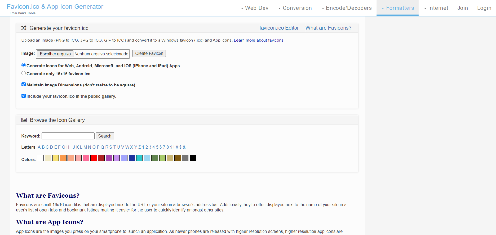

[**Favicon**,](http://marquesfernandes.com/tudo-sobre-favicons-e-touch-icons/) **["Favourite Icon"](http://marquesfernandes.com/tudo-sobre-favicons-e-touch-icons/)**, is an image used by browsers to graphically represent a web page. Today browsers accept several different types and sizes of favicons, each optimized for a device. Generating and resizing these icons can be a tedious task but, don't worry, there are tools that make the whole process easier. I put together a list of the best tools to help you generate every possible icon, and also configure options like the background color on mobile devices.

## 1\. [Favicon.io](https://favicon.io/)

[https://favicon.io/](https://favicon.io/)

[Favicon.io](https://favicon.io/) allows you to create favicons from images, text, and emojis, generating every possible format for the most diverse platforms.

## 2\. [Favicon Generator](https://www.favicon-generator.org/)

[https://www.favicon-generator.org/](https://www.favicon-generator.org/)

[Favicon Generator](https://www.favicon-generator.org/) has a very simple interface; it generates favicons for all platforms and allows customization of the mobile theme color. Simple and efficient.

## 3\. [Real Favicon Generator](https://realfavicongenerator.net/)

[https://realfavicongenerator.net/](https://realfavicongenerator.net/)

[Real Favicon](https://realfavicongenerator.net/) is a simple generator; it does not allow many customizations but it gets the job done. It also has offline versions, made in the popular programming languages.

## 4\. [Favic-o-matic](https://favicomatic.com/)

[https://favicomatic.com/](https://favicomatic.com/)

[Favic-o-matic](https://favicomatic.com/) allows extensive customization of the favicon generation.
