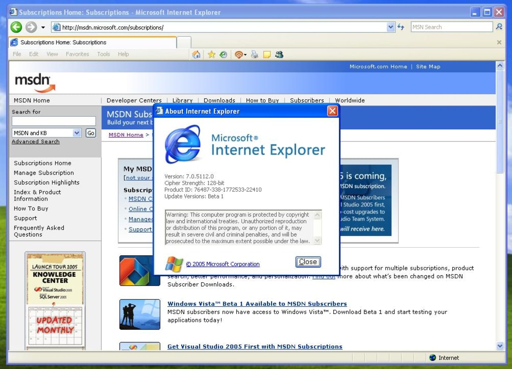
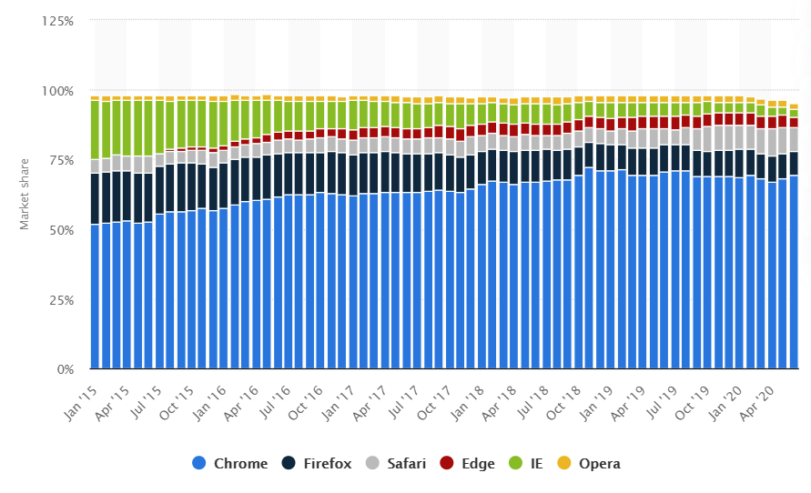

O Internet Explorer, navegador oficial da Microsoft completou 25 anos na semana passada. Sua história passou por altos e baixos, começando como um modesto navegador para internet, chegando a atingir o domínio global, pra finalmente terminar como uma "piada". 

No início dos anos 90, a Netscape governou o mundo com o [Navigator](https://pt.wikipedia.org/wiki/Netscape_Navigator), um navegador revolucionário para a época. A Microsoft viu a crescente popularidade do navegador como uma ameaça para a hegemonia, da até então empresa referência no mercado.

A Microsoft não pensou duas vezes e copiou o código da Netscape. Por mais que fosse uma cópia, o navegador da Microsoft não conseguiu atingir o mesmo desempenho e estabilidade, mas eles tinham uma vantagem: era gratuito e incorporado ao seu sistema operacional, o mais utilizado no mundo. 

## Ascensão do Internet Explorer

Em 1995, o Netscape Navigator supostamente tinha quase 80 por cento do mercado de navegadores nos Estados Unidos. Mas, em 1998, o Internet Explorer superou a Netscape com a sua oferta "gratuita" e embarcada de seu navegador, chamando atenção também do Departamento de Justiça, que lançou uma ação [antitruste](https://pt.wikipedia.org/wiki/Lei_Antitruste#:~:text=A%20legisla%C3%A7%C3%A3o%20antitruste%20foi%20criada,de%20mesma%20ordem%20no%20Brasil.), investigando se a Microsoft havia violado alguma lei. Uma batalha jurídica foi travada, com muita polêmica e decisões controversas. A Microsoft acabou fechando um acordo com o Departamento de Justiça, estabelecendo um comitê independente de três pessoas para examinar os negócios da Microsoft. A empresa teve que desenvolver uma política de conformidade antitruste interna para garantir que esse monopólio não acontecesse de novo. Mas o desenrolar dessa história toda foi demorada, fazendo com que a Netscape fosse comprada pela AOL assim que seu marketshare começou a cair. Em 2004, o Internet Explorer tinha cerca de 90 por cento do mercado enquanto o concorrente da Netscape não somava nem um dígito.

Internet Explorer 7

Novos concorrentes começavam a surgir, o Firefox estava lentamente ocupando espaços do mercado, e em 2008, o Chrome do Google apareceu. Os novos navegadores vinham com sede para dominar o mercado, explorando falhas de compatibilidade e performance deixadas pelo Internet Explorer. Talvez pela Microsoft achar que havia dominado o mercado e que não haveriam concorrentes capazes, ela relaxou e não evoluiu o produto como deveria. Em 2013, o Internet Explorer tinha menos de 30 por cento do mercado.

## Internet Explorer é aposentado e substituído pelo Microsoft Edge

[Participação de Mercado por Navegador - 2015 ~ 2020](https://www.statista.com/statistics/544400/market-share-of-internet-browsers-desktop/#:~:text=Global%20desktop%20internet%20browsers%20market%20share%202015%2D2020&text=As%20of%20June%202020%2C%20Google,points%20in%20just%20three%20years.)

A Microsoft se uniu ao mercado e também deu risada do seu navegador, usando isso como um movimento de marketing, decidiu então substituir o Internet Explorer pelo Edge, um novo navegador que foi desenvolvido em cima da base do Chrome e corrige diversos erros das versões do Internet Explorer anteriores.

Embora o Edge tenha ficado realmente bom, muitas pessoas não se convenceram e o Google Chrome continua dominando o mercado.

**Fontes:  
**[https://www.statista.com/statistics/544400/market-share-of-internet-browsers-desktop](https://www.statista.com/statistics/544400/market-share-of-internet-browsers-desktop/#:~:text=Global%20desktop%20internet%20browsers%20market%20share%202015%2D2020&text=As%20of%20June%202020%2C%20Google,points%20in%20just%20three%20years.)  
[https://www.engadget.com/internet-explorer-25-133058478.html](https://www.engadget.com/internet-explorer-25-133058478.html)  
[https://canaltech.com.br/navegadores/internet-explorer-25-anos-169995/](https://canaltech.com.br/navegadores/internet-explorer-25-anos-169995/)
