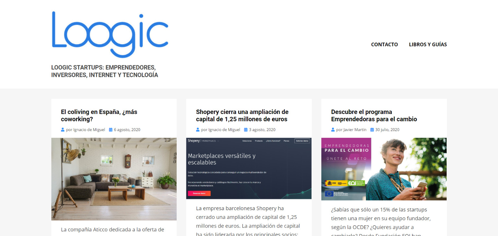
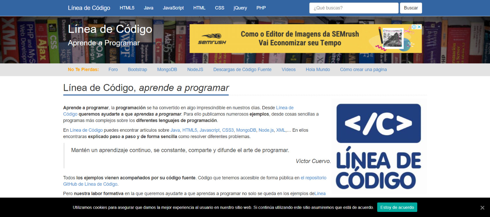

I recently decided to publish my articles in Spanish in addition to Portuguese. It was a strategic decision, just like when I decided this blog would be in Portuguese. I noticed that Spanish, although it has more content than Portuguese, also suffers from a content deficit. I lived in Mexico for a year, so I have a special fondness for the language, and I saw that many friends there were interested in reading and learning about technology.

Now you can find a little flag in the menu to access the Spanish version of the blog. For now, the translation was done automatically and some articles have already been reviewed, but most have not, so if you find any errors, please let me know!

To kick off this new front here on the blog, I started by researching other writers to see how they work with information in their language. I put together a list of the Spanish tech blogs I found interesting during this research.

## [Xataka](https://www.xataka.com/)

Xataka is a complete portal about technology and gadgets. It is very reminiscent of the Brazilian portals [Canaltech](https://canaltech.com.br/) and [TechTudo](https://www.techtudo.com.br/). They cover a lot of news about the tech world and are also present on many other content portals, and they have other interesting projects like [3djuegos.com](https://www.3djuegos.com/) and [sensacine.com.mx](https://sensacine.com.mx).

## [Picando codigo](https://picandocodigo.net/)

**[Picando código](https://picandocodigo.net/)** is a personal blog by [**Fernando Briano**](http://fernandobriano.com/), where he writes about programming languages, software development tools and methodologies, and information about free software. He has been a GNU/Linux user for some years and documents all his experiences with Debian and ArchLinux on his blog. You will also find articles about video games, science fiction, comics, and much more.

> I once read that constant learning is part of a programmer's job, and through that, I share what I am learning. The exchange generated in technical posts leads me to affirm my knowledge by trying to explain it, as well as to learn new things thanks to readers' contributions.
>
> [**Fernando Briano**](http://fernandobriano.com/)

## [Enrique Dans](https://www.enriquedans.com/)

**[Enrique Dans](https://www.enriquedans.com/)** shares on his personal page all of his professional and personal activity related to the many facets of technology, its dissemination, and its effects on people, companies, or society in general.

> It is a purely personal page that I write alone, and which I use for two main purposes: keeping an orderly repository of all my activities and receiving very valuable ongoing feedback on topics that, in many cases, I end up incorporating later on.
>
> **Enrique Dans**

## [Wwwhatsnew](https://wwwhatsnew.com/)

[WWwhatsnew.com](https://wwwhatsnew.com/) was created in 2005 by Juan Diego Polo. The site discusses a variety of web applications every day, technology news, and tips for those who work with online marketing.

The main idea is to show that there is nothing that cannot be done online. The so-called web 2.0 offers resources that allow us to leverage the social knowledge of thousands of people to create increasingly rich services, generating an unlimited number of profits that can be used for personal and professional growth.

You will also see news published on the Internet, with the evolution of well-known services and events that are transforming the web, plus a lot related to Social Media Marketing, online courses, and technological innovation.

## [Loogic](https://loogic.com/)

Since its founding in 2003, **[Loogic](https://loogic.com/)** has become the reference information outlet for **entrepreneurs** and **startups** in the world of technology and innovation in Spain and Latin America. Its promoters are Javier Martín, Ignacio de Miguel, and Agustín Cuenca.

They also develop initiatives like [Loogic Ventures](https://loogic.com/ventures/) in collaboration with Mariano Torrecilla and [Smart Money](http://smartmoney.events/) in collaboration with Javier Esteban.

## [Linea de Código](http://lineadecodigo.com/)

**[Línea de Código](http://lineadecodigo.com/)** wants to help you learn to code. To do so, it offers simple, step-by-step explained examples in different programming languages. We accompany every example with its corresponding source code so you can test it directly.
