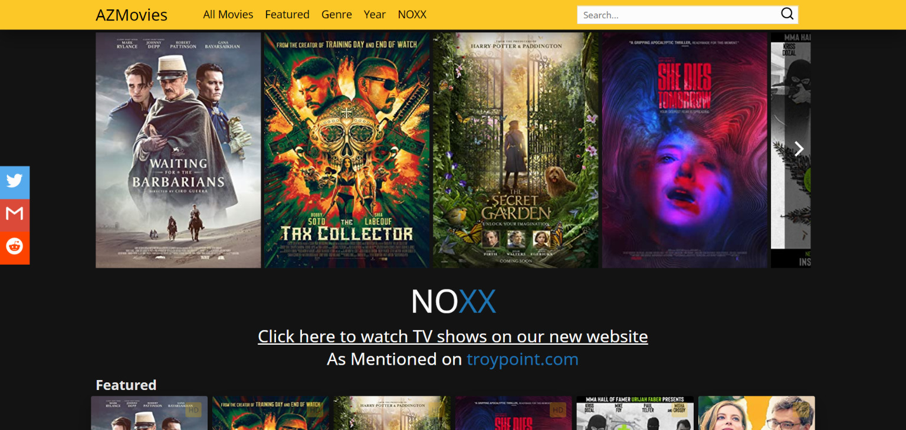
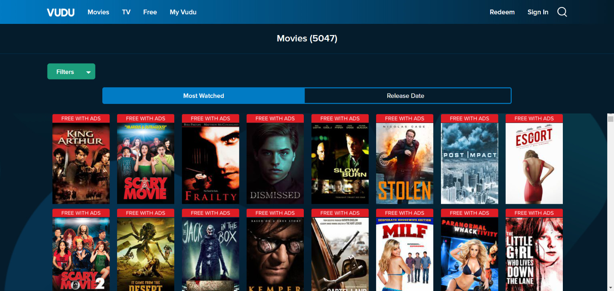
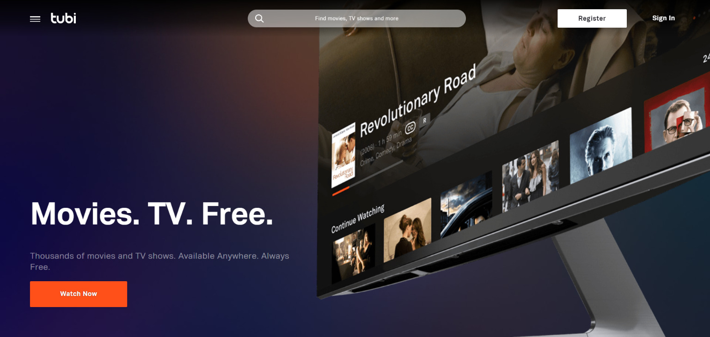
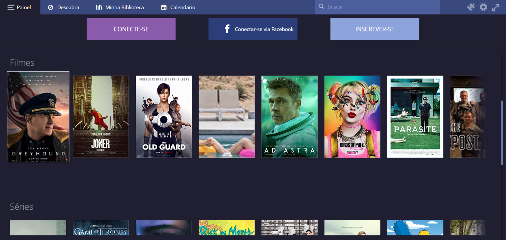

Existen diversas plataformas para ver películas online de forma gratuita, sin siquiera necesitar descargar ningún programa. Si buscas sitios con películas actualizadas e incluso alternativas, debes saber que con seguridad existe alguna plataforma que te interesará. Reuní algunas plataformas populares para ver películas, series e incluso documentales online.

Encontrar sitios para ver series y películas en HD puede no ser una tarea fácil; existen diversos sitios y muchos de ellos llegan a no ser seguros, pidiéndote que descargues e instales extensiones dudosas en tu computadora. Por eso, reuní una lista con los mejores sitios para que veas películas y series online en HD gratuitamente.

## [AZMovies](https://azm.to/)

AZMovies es otro sitio de streaming popular y de larga trayectoria de esta lista. Una excelente colección de películas está disponible en grandes calidades de streaming, incluyendo 1080p y 720p.

El eslogan del sitio dice "Mira aquí tus películas favoritas sin límites, ¡solo elige la película que te gusta y disfruta! Es libre y siempre lo será." ¡Echa un vistazo a AZMovies hoy!

## [Popcornflix](https://www.popcornflix.com/pages/discover/d/movies)

Popcornflix es otro gran lugar para ver películas online gratis. Actualizado constantemente con nuevas películas de Screen Media Ventures.

Popcornflix tiene más de 1500 películas que incluyen comedia, drama, terror, acción, romance, familia, documentales y películas extranjeras. También presentan originales de la web y de la escuela de cine.

No se necesita ninguna cuenta en Popcornflix; solo haz clic en **Play** en la película elegida y disfruta.

## [Vudu](https://www.vudu.com/content/movies/uxrow/Movies/5777)

Vudu puede no ser tu primera opción al buscar sitios gratuitos para streaming de películas, pero existen *miles* de películas aquí que puedes ver ahora. Todo lo que tienes que hacer es aguantar algunos comerciales. Algunas de las más nuevas adiciones de este sitio incluyen *Slow Burn, Facing Ali, King Arthur, Frailty, Gordy* y *Tamara.*

Una cosa excelente sobre las películas de Vudu es que algunas de ellas están en 1080p, así que no tienes que sacrificar la calidad solo para ver algunas películas gratis.

## [Tubi](https://tubitv.com/)

Tubi se ha convertido en un sitio muy popular para el streaming de películas y programas de TV gratuitos, sin necesidad de suscripción. Tubi ofrece miles de películas y series de TV gratuitas, pero, como muchos otros en esta lista, es compatible con anuncios.

Tubi también está disponible como una aplicación en la Amazon App Store, la lista de canales de Roku, la Apple App Store y la Google Play Store. Echa un vistazo a nuestro tutorial para más información sobre Tubi.

Tubi tiene miles de películas y programas de TV gratuitos que puedes transmitir ahora mismo. Algunos de ellos solo pueden alquilarse y no verse gratis, pero muchos de ellos *son totalmente gratuitos* para transmitir.

Existen decenas de géneros que puedes elegir en Tubi, incluyendo los habituales para romance, drama, documental, niños, comedia y películas de terror, así como géneros exclusivos como *Hogar y Jardín*, *Preescolar* y *Espada y Brujería.*

## [Stremio Web (Alpha)](https://app.strem.io/#/)

[Stremio](https://app.strem.io/#/) es una plataforma muy conocida para ver vídeos por [to](http://marquesfernandes.com/tecnologia/como-faco-para-baixar-um-torrent/)[rrent](http://marquesfernandes.com/tecnologia/como-faco-para-baixar-um-torrent/). Tiene una biblioteca extremadamente completa; si la película existe en formato torrent puedes verla allí. Actualmente están trabajando en una versión de navegador alfa; tiene diversos bugs para ver, pero con seguridad vale la pena echarle un vistazo.

## [SuperFlix](https://www.superflix.net/)

[SuperFlix](https://www.superflix.net/) llegó a mí a través de los comentarios; no conocía la plataforma y me sorprendí con la disponibilidad de películas. La cantidad de propagandas es algo que molesta bastante; de vez en cuando, los clics por el sitio abren un popup hacia otro sitio de propaganda, pero nada de novedad en sitios de ese tipo. Cuenta con bastantes opciones subtituladas y dobladas de películas y series. Con una interfaz agradable y su amplio catálogo, es una buena opción para quien busca ver series y películas gratuitamente online.

## [MegaFilmes](https://megafilmes.org/)

[MegaFilmes](https://megafilmes.org/) es un sitio simple, totalmente en portugués y funcional. Todo el contenido está disponible tanto subtitulado como doblado. Pero prepárate: la cantidad de propagandas es irritante; llegas a necesitar dar 5 clics para conseguir acceder a un enlace. Además de películas, el sitio cuenta también con programas de televisión y series.

**Ayuda a mejorar la lista**

¡Siempre estamos actualizando la lista! Si utilizas algún otro sitio o servicio para ver series o películas online y gratuitamente, deja tu recomendación en los comentarios.
