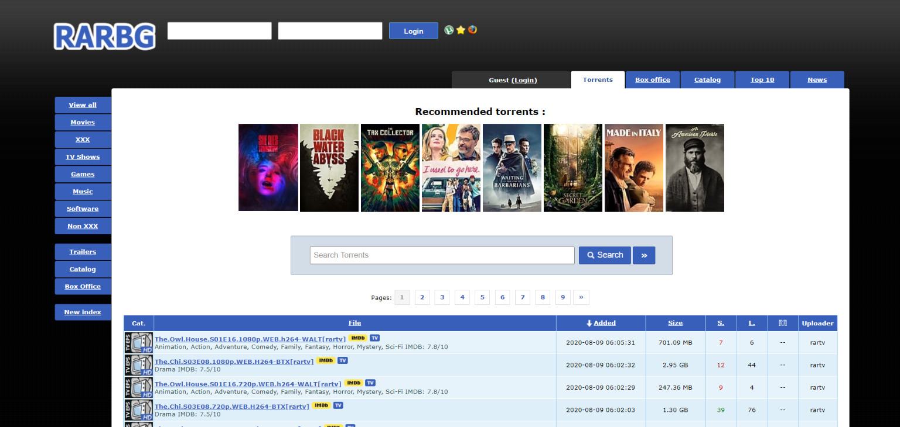
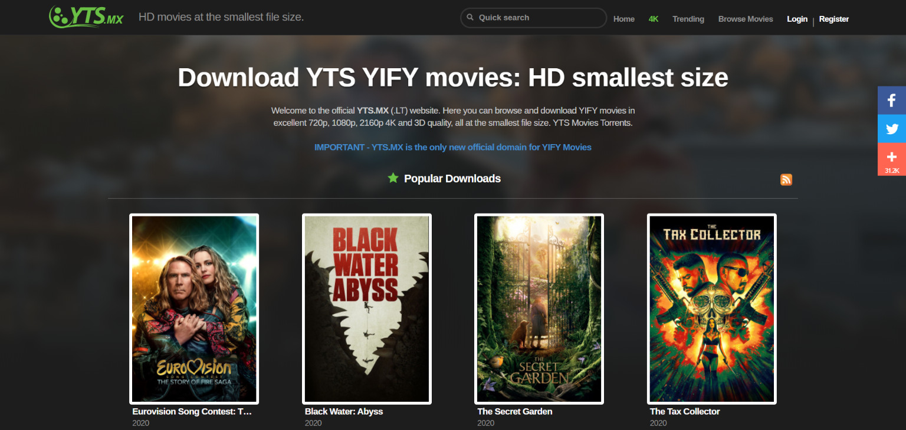
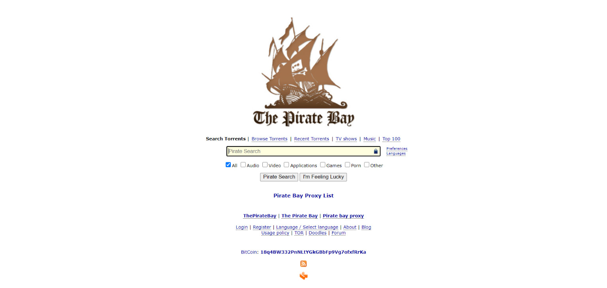
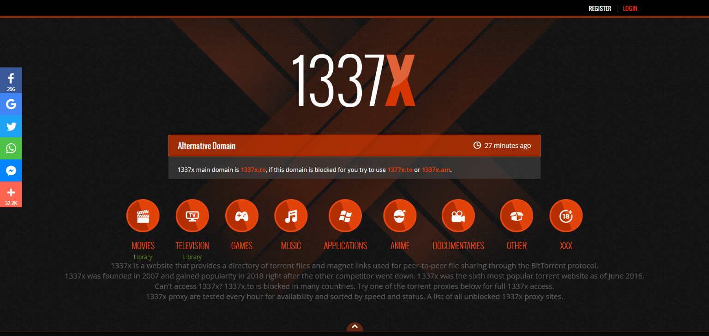
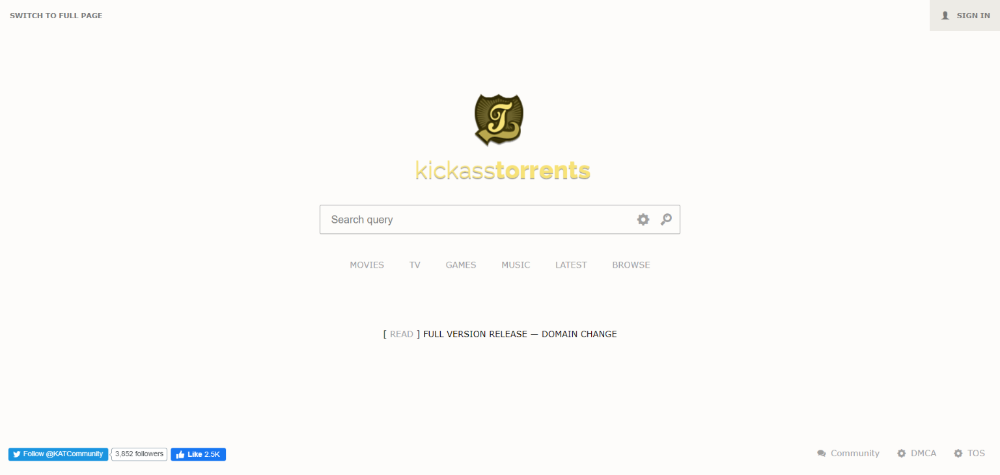

There are plenty of [Torrent](http://marquesfernandes.com/como-faco-para-baixar-um-torrent/) sites out there, but many don't work and the vast majority aren't safe. So how do you find sites that are safe, that work, and that have a good torrent listing? Don't worry, I'll help you out!

I've put together the top torrent sites that work and that have a wide selection of files to download. Check out the list:

## 1\. [RARBG](https://rarbgproxied.org/torrents.php) - Torrents in General

**[RARBG](https://rarbgproxied.org/torrents.php)** is my favorite site. It's been around since 2008 and has built a reputation for hosting high-quality torrents**,** being easy to use, and being one of, if not the, most up-to-date torrent portal available. Unlike other sites, the general public can't upload to it; instead, all uploaders are verified in advance by moderators.

Unfortunately, because it's so good, that means it's constantly on the authorities' radar. As a result, RARBG is blocked in many countries**,** including Bulgaria, Denmark, Portugal, and the United Kingdom.

The site has several strong points:

-   Its usability is very good; it's very easy to find what you need
-   Torrent quality: because there's moderation, the safety and quality of the torrents is far superior to other sites

## 2\. [YIFI](https://yts.mx/) - Movie Torrents

**YIFY Torrents** or **YTS** is a very famous group in the torrent community. They've provided high-quality movies for as long as I can remember using this way of downloading files. YIFY releases gained a lot of popularity for their video quality and distribution in a small file size, which attracted many users.

The original YIFY/YTS site was shut down by the [MPAA](https://pt.wikipedia.org/wiki/Motion_Picture_Association_of_America) in 2015; however, a site mimicking the YIFY/YTS brand still exists and easily provides all the torrent *releases*.

*The site only hosts movies, so you'll have to visit a different site if you're looking for TV shows, series, music, or games.*

## 3\. [The Pirate Bay](https://thepiratebay10.org/) - Torrents in General

[Pirate Bay](https://thepiratebay10.org/), TPB to those in the know, has a long and difficult history. There's even a documentary telling the whole saga that this site and its creators have been through: [TPB AFK](https://pt.wikipedia.org/wiki/TPB_AFK). It's currently still a public favorite and going stronger than ever, with millions of torrents available across various categories and an extremely simple interface that's great for beginners in this torrent world.

**Note:** *The Pirate Bay's domain changes fairly often (on the day of this post it's back on .org), and the site goes offline occasionally. If for some reason the site is unavailable, you can easily find a Pirate Bay proxy site on the Internet.*

TPB remains in the sights of government authorities and the site is banned in nearly 30 countries. If you live anywhere from Australia to Finland, from Russia to the United Kingdom, you won't be able to access TPB unless you use a VPN.

## 4\. **[1337x](https://www.1337x.tw/)**

[1337x](https://www.1337x.tw/) is currently one of the most popular torrent trackers in the world, to the point that Google hides its results in its search engine. It can help you find a torrent even if you don't know what you're looking for, thanks to its simple and organized interface**.** Along the same lines as RARBG, it has very effective and active moderation on its platform, filtering and ensuring the quality of the torrents available on it.

As the third most popular torrent site in the world and one of the oldest still in operation, 1337x is a reliable option, with plenty of high-quality torrents in every category. New content, provided by its loyal community of followers, is uploaded daily. You can find everything from old movies to the latest TV shows, music, and games.

## 5\. [Kickass Torrents](https://newkatcr.co/)

[Kickass Torrents](https://newkatcr.co/), also known as [KATCR.CO](https://newkatcr.co/), has a huge library of torrents and an equally large community**,** with a wide selection of movies and series. This means you'll probably be able to find all the content you want and download it from this portal quickly.

Kickass Torrents has some annoying ads and pop-ups that you'll have to spend a little time closing. Like ThePirateBay, KickassTorrents is blocked in many countries, including the USA, the United Kingdom, and Australia.
