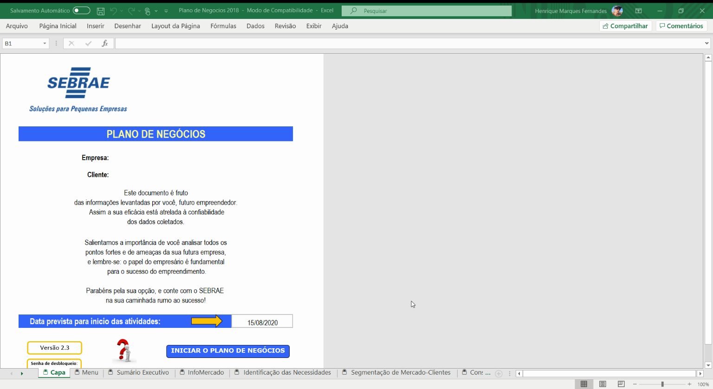
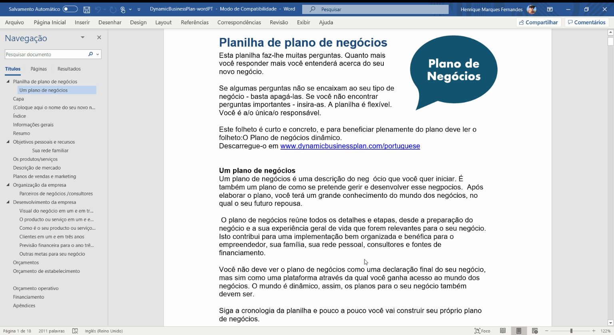
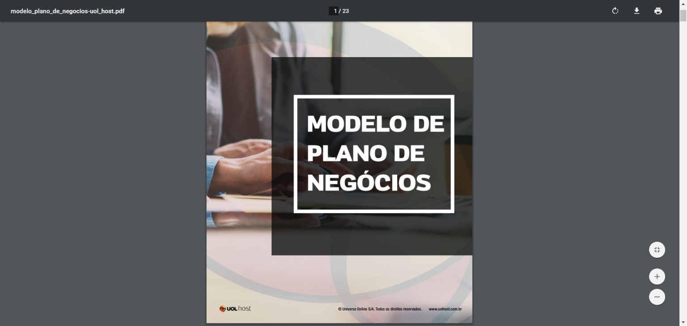
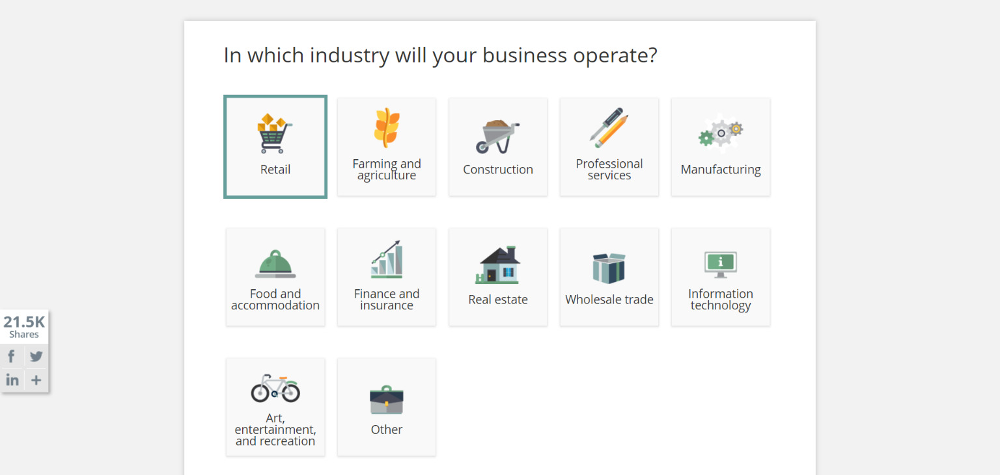

Crear un [plan de negocios](http://marquesfernandes.com/o-que-e-um-plano-de-negocios-business-plan/) definitivamente no es la parte más fácil ni más emocionante de empezar u organizar una empresa.

Crear tu plan de negocios es más que solo poner tus ideas en papel para que los posibles inversores las vean. Es un proceso exploratorio en el que puedes evaluar tus opciones, poner a prueba tus suposiciones sobre tu idea e incluso descubrir nuevas oportunidades. Incluso puede llevarte a eliminar aspectos y objetivos de tu negocio antes de invertir tiempo y dinero en ellos.

Esto no significa que tengas que romperte la cabeza y empezar un plan desde cero. ¡Existen plantillas de plan de negocios que te facilitan este proceso! Echa un vistazo a estas plantillas de planes de negocios que puedes descargar gratis para empezar.

## Plantillas de Plan de Negocios en Portugués

Seleccioné algunas de las plantillas de negocios que más me gustaron, todas en portugués para facilitar aún más esta importante etapa de planificación de tu negocio.

### Sebrae - Plantilla de Plan de Negocios (Excel)

¡Material objetivo y práctico, para que lo apliques de inmediato en tu negocio!

Creado en 1972, el Sebrae estimula el emprendimiento y promueve la competitividad y el desarrollo sostenible de los pequeños negocios en Brasil. Referencia en el sector empresarial de Brasil, el Sebrae puso a disposición una plantilla de plan de negocios muy completa e intuitiva. Para descargarla necesitas realizar un registro rápido.

[Haz clic aquí para descargar](https://www.sebraepr.com.br/gratuitos/plano-de-negocios-sebrae/).

### Dynamic Business Plan - Plantilla de Plan de Negocios (Word)

¡Este folleto es corto, concreto y objetivo!

Desde 1995, Mogens Thomsen, propietario de Thomsen Business Information, ha enseñado y asesorado a los empresarios de la península escandinava, principalmente de Dinamarca. Puso a disposición una plantilla de plan de negocios traducida al portugués.

[Haz clic aquí para descargar](https://www.dynamicbusinessplan.com/download-plano-de-negocios).

### Endeavor - Plantilla de Plan de Negocios (PDF)

MAT: Metas, Acciones, Tareas

Endeavor es una organización global sin fines de lucro con la misión de acelerar a emprendedores que aceleran el crecimiento del país. Apoyan a miles de emprendedores al frente de scale-ups, que son referencia en desempeño y compromiso con la sociedad, e impulsan cambios para facilitar el crecimiento de empresas en Brasil, bajo las banderas de Acceso al Capital, Simplificación Tributaria y Desburocratización.

[Haz clic aquí para descargar](https://endeavor.org.br/estrategia-e-gestao/mat-plano-de-negocios-simplificado/).

### UOL - Plantilla de Plan de Negocios (PDF)

UOL HOST es la unidad de alojamiento y servicios web del Grupo UOL y cuenta con la experiencia de más de 19 años de la marca que se consolidó como sinónimo de internet en Brasil. Cuentan con un sector llamado Meu Negócio, y a través de ese canal pusieron a disposición una plantilla de plan de negocios. Para descargar el archivo necesitarás dejar tu correo electrónico; puedes introducir un correo inexistente solo para poder acceder al archivo.

[Haz clic aquí para descargar.](https://meunegocio.uol.com.br/academia/downloads/e-books/modelo-de-plano-de-negocios.html)

## Plantillas de Plan de Negocios en Inglés

Si te sientes cómodo con el inglés, tomar algunas plantillas y traducirlas es sin duda una buena opción. Hay muchas más plantillas disponibles en inglés y seguro que alguna se adaptará a tu necesidad.

### [Score - Plantilla de plan de negocios (PDF)](https://www.score.org/resources/business-plan-template-startup-business)

Score es una organización estadounidense sin fines de lucro dedicada a ayudar a los emprendedores a lanzar sus empresas. Su plantilla, disponible para descargar en PDF o Word, hace 150 preguntas y es lo suficientemente genérica como para personalizarse para la mayoría de los tipos de negocios. El recurso Refining the Plan que la acompaña es útil, especialmente si esta es tu primera vez redactando un plan de negocios.

### [SBA - Administración de Pequeñas Empresas de EE. UU. (PDF)](https://www.sba.gov/tools/business-plan/1)

La plantilla de la SBA está disponible para completarse en línea y descargarse en PDF. Puedes volver y editarla según sea necesario, así que no te preocupes por tener todo listo la primera vez que te sientes a resolverla. Aunque está dividida en secciones, es un documento largo y un poco tedioso de leer, pero produce un plan de negocios útil y de aspecto profesional. Esto es particularmente útil si tu idea no está totalmente desarrollada y sabes que tienes tarea por hacer, ya que te solicita información.

### [100 Startup - Plan de negocios de una página (PDF)](http://100startup.com/#resources)

¿Quién dijo que un plan de negocios debe ser un documento largo y complicado? Algunos inversores querrán ver muchos detalles, pero puedes proporcionarlos en los apéndices. 100Startup, el sitio del best-seller del mismo nombre, tiene una tonelada de recursos simplificados para empresarios, incluida esta plantilla de plan de negocios súper simplificada.

### [LawDepot - Constructor de Plan de Negocios](http://www.lawdepot.com/contracts/business-plan/?ldcn=partnership-and-joint-venture)

Solo necesitas responder algunas preguntas simples y estarás "¡listo antes de que te des cuenta!" No te lo creas. Un plan de negocios debe llevar tiempo y mucha tarea, pero si ya la hiciste, la plantilla de LawDepot es una opción decente. Recorre los primeros pasos, marketing, producto, análisis competitivo, SWOT y mucho más, con una ventana debajo de los campos de entrada para mostrar el plan a medida que lo desarrollas. Puedes descargarlo gratis con una suscripción de prueba, pero debes recordar cancelarla dentro de una semana si no planeas seguir usándolo.
