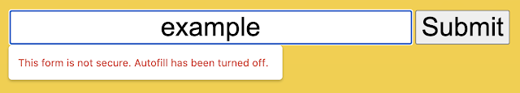

You've probably already noticed the little closed padlock icon in your browser next to the URL. This means that browsing safely through [HTTPS](http://marquesfernandes.com/tecnologia/o-que-e-http/) , the communication between your browser and the server is encrypted, so third parties cannot eavesdrop on most of the information you access. But sites even with this security feature, sites can still host insecure HTTP forms that allow you to type in your passwords and other personal data, but Google is already looking at that and plans to solve, or at least mitigate this risk in Chrome 86, in October.

The initial idea is that you get some big, flashy notices, according to [the official Google blog post](https://blog.chromium.org/2020/08/protecting-google-chrome-users-from.html) , it will look like this:

And if you still try to submit your personal information while ignoring Google's warning, it will try to give you one more chance to think hard about what you're doing:

:no_upscale\(\)/cdn.vox-cdn.com/uploads/chorus_asset/file/21765782/Screen_Shot_2020_08_13_at_4.37.25_PM.png)

Google will also disable the auto-completion functionality on these forms marked as risk, thus adding another layer of protection by preventing the auto-completion of passwords and users on these forms.

Google's first venture against these forms was to unmark the secure lock on sites containing risky forms, however, many users ended up going unnoticed and falling into these attacks. And really, when was the last time you looked at the padlock next to the website link?
