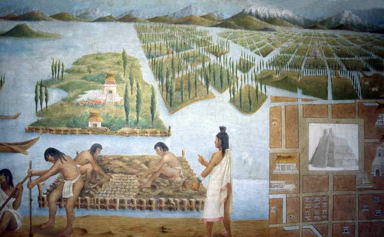
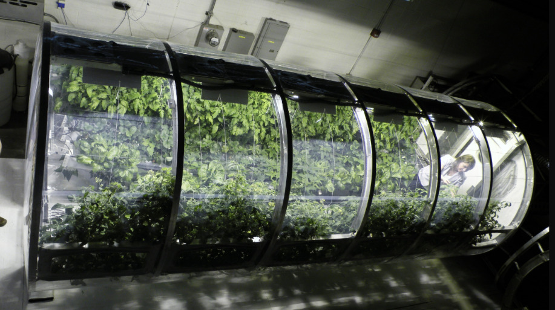
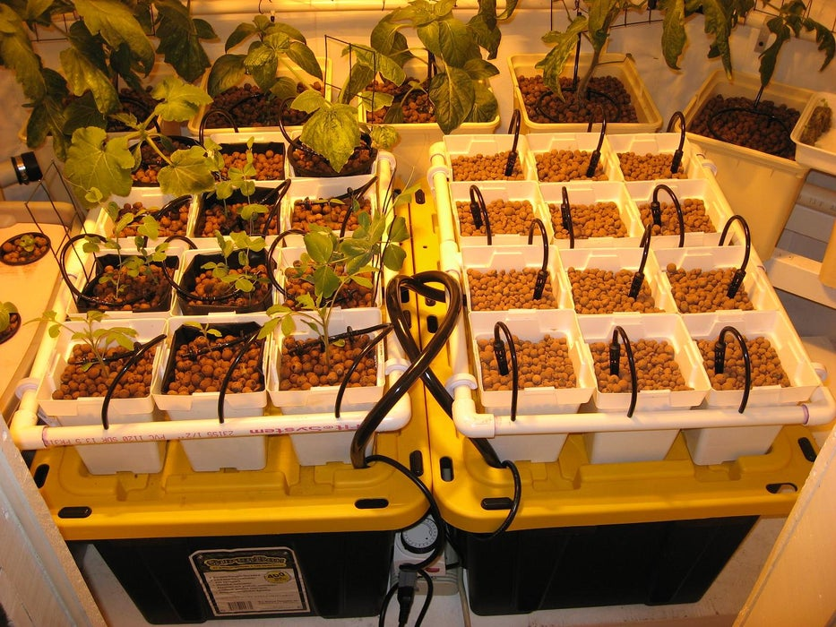
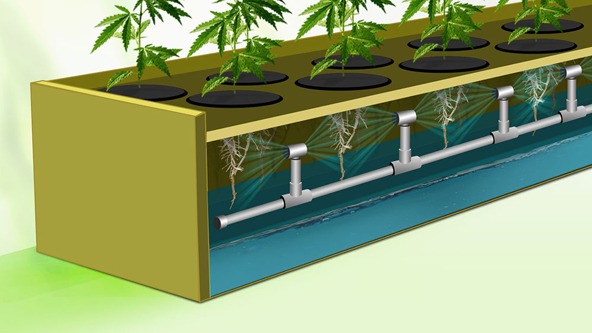
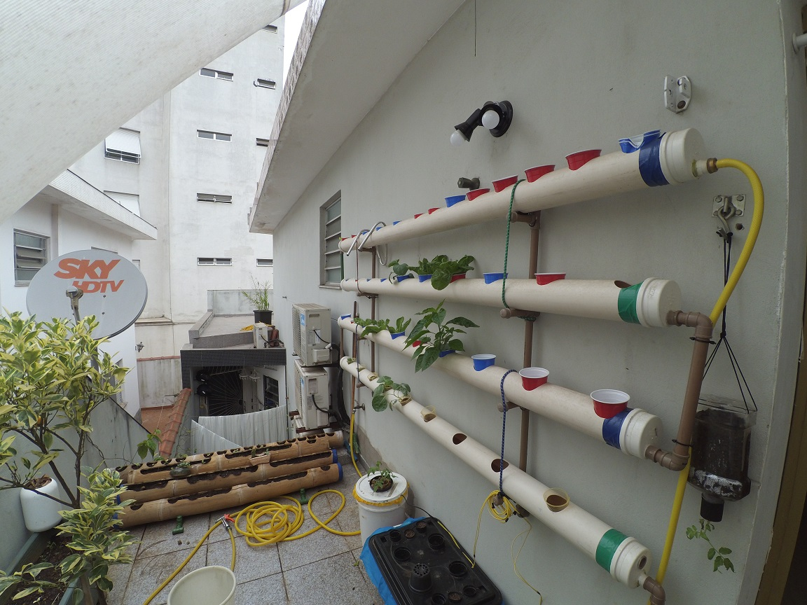
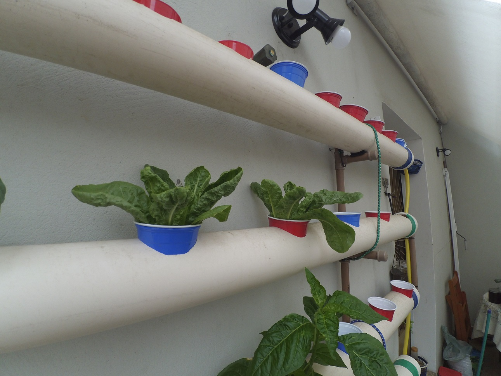

**Hidroponia**, do grego água (*hidro*) e trabalho (*ponos*), é o nome dado ao sistema de cultivo de plantas sem a necessidade de solo (terra) como meio de crescimento. As plantas ficam em contato direto com a água ou ar extremamente úmido, que contém o aditivo dos nutrientes necessários para o desenvolvimento da planta.

Mas é possível criar plantas sem terra? Não só é possível como, mas as plantas também crescem muito melhor e mais rápido dentro dessa metologia. Muitos dos alimentos que consumimos em nosso dia a dia já são cultivados de forma hidropônica.

## História do Cultivo Hidropônico

Muitas civilizações passadas utilizaram técnicas de cultivo hidropônico ao longo de sua história.  Os jardins suspensos da Babilônia, os jardins flutuantes dos astecas do México e os dos chineses são exemplos de sucesso do cultivo hidropônico. Registros hieroglíficos egípcios que datam de várias centenas de anos a.c. descrevem o crescimento de plantas na água. Como observado, a hidroponia é um método antigo para cultivo de plantas, mas só recentemente que avanços gigantescos foram dados nesta área "inovadora" da agricultura.

Jardins Suspensos da Babilônia

Uma das aplicações que impulsionou a adoção e pesquisa da hidroponia que impulsionou foi o cultivo de produtos frescos em lugares inóspitos ​​do mundo, com pouco ou nenhum solo fértil para cultivo. A hidroponia foi muito usada durante a Segunda Guerra Mundial para abastecer tropas alocadas em ilhas ​​no Pacífico, que possuem pouco ou nenhum terreno para plantio, então através de sistemas hidropônicos foi possível a cultivação de produtos frescos nesses locais.

Estufas lunares projetadas para imitar as plantações da Terra - NASA

A hidroponia também foi integrada ao programa espacial, durante a corrida espacial, a NASA viu na hidroponia um encaixe perfeito e fácil para seus planos de sustentabilidade da vida no espaço. Então já na década de 1970, não eram mais apenas cientistas e analistas que estavam envolvidos com a hidroponia, agricultores tradicionais e entusiastas por hobby começaram a ser atraídos pelas virtudes do cultivo hidropônico. 

Muitas pessoas quando escutam o tema hidroponia, rapidamente associam com o cultivo da Cannabis, porque foi isso que popularizou essa técnica nos tempos modernos. Por se tratar de uma planta ainda proibida em diversos lugares, a hidroponia era o meio perfeito, fácil e "escondido" de cultivar plantas dentro de casa e longe dos olhos das autoridades.

## Como Funciona a Hidroponia?

Antes de entender como funciona a hidroponia precisamos entender como as plantas crescem e se desenvolvem. As plantas crescem pelo processo chamado fotossíntese, no qual utilizam a luz do sol e uma clorofila (substância química presente nas folhas) para converter dióxido de carbono e água em glicose (fonte de energia) e oxigênio. Além disso ela precisa de nutrientes não minerais (hidrogênio, oxigênio, ...), macronutrientes (fósforo, cálcio, magnésio, enxofre, ...) e micronutrientes (cloro, manganês, ferro, ...).

Em um sistema de plantio em terra os macro e micronutrientes estão presentes no solo e chegam para a raiz das plantas, os não minerais estão presentes na água e no ar-atmosférico. Em um sistema hidropônico os macronutrientes são adicionados diretamente na água, que por sua vez está em contato com a raiz das plantas, servindo como meio para levar todos os não minerais e minerais necessários para a planta.

Com a hidroponia existe também a possibilidade de cultivar plantas sem a necessidade do sol, popularmente chamado de cultivo "indoor", através de lampas especiais a luz necessária é fornecida para as plantas.

Um sistema hidropônico precisa basicamente da fonte de luz, seja ela natural ou artificial, de nutrientes misturadas na água e de uma maneira de levar esses nutrientes até a raiz.

## Vantagens da Hidroponia

A hidroponia tem diversas vantagens em relação ao cultivo no solo, podemos listar algumas principais:

-   Reduz drasticamente o desperdício de água em relação a plantações no solo (**até 90% menos uso de água**).
-   Elimina a necessidade de uso massivo de pesticidas e fertilizantes (considerando que a maioria das pragas vive no solo), tornando o ar, a água, o solo e os alimentos mais limpos.
-   A capacidade de produzir com menos custos do que a agricultura tradicional no solo.
-   Capacidade de cultivo em áreas do mundo que não possuem espaço ou solo fértil.
-   O tempo de colheita, na maioria das vezes, é menor em sistemas hidropônicos por se tratar de um sistema de entrega de nutrientes otimizado e com menor resistência para as raízes/plantas.

## Tipos de Sistemas Hidropônicos

Existem diversos meios de cultivação hidropônica, falaremos de todos eles com mais detalhes em breve, por enquanto olharemos o sistema mais simples e popular:

Tipos de Sistemas de Hidroponia

### Sistema Fechado de Absorção (*Wicking Systems*)

Sistema Fechado de Absorção (Wicking Systems)

Um sistema de absorção é o tipo mais básico de sistema hidropônico que você pode construir. Esse é o sistema usado há milhares de anos, como os jardins da babilônia.

É conhecido como hidroponia passiva, o que significa que você não precisa de bombas de ar ou água para usá-lo. Os nutrientes e a água são movidos para a zona da raiz da planta por meio de um pavio, que geralmente é algo tão simples quanto uma corda ou pedaço de feltro.

A chave para o sucesso no sistema de absorção é usar um meio de cultivo que transporte bem a água e os nutrientes, como, por exemplo, coco, perlita ou vermiculita.

Esses sistemas são bons para plantas menores que não consomem muita água ou nutrientes. Plantas maiores podem ter dificuldade em obter o suficiente por meio desse sistema.

### Sistema NFT (*Nutrient Film Technique* - Técnica de Filme de Nutriente)

The Organic hydroponic vegetable garden

A técnica de filme de nutrientes é freqüentemente usada para cultivar plantas menores e de crescimento rápido, como diferentes tipos de alfaces. Além das alfaces, os produtores comerciais também usam esse sistema para cultivar ervas infantis e morangos.

Sistema NFT

Existem várias maneiras de projetar um sistema de técnica de filme de nutrientes; no entanto, todos eles seguem o projeto de uma solução nutritiva muito rasa que flui através do tubo. As raízes nuas das plantas absorvem os nutrientes das soluções quando entram em contato com a água. 

Esse sistema consiste em um reservatório com água e os nutrientes, uma bomba d'água responsável por fazer a circulação no sistema, um meio onde as plantas estarão suspensas, normalmente um cano ou uma bandeja, onde plantas suspensas com as raízes expostas entram em contato com esse pequeno o fluxo de água + nutrientes. As plantas absorvem o que precisam e depois existe uma queda de água de volta para o reservatório e que também é responsável pela oxigenação da água.

### **Sistema DWC (*Deep Water Culture* - Cultura em Águas Profundas**)

Sistema de Cultura em Águas Profundas

Em um sistema DWC, é utilizado um reservatório para conter a solução de água e nutrientes. As raízes das plantas ficam mergulhadas nessa solução para que recebam o suprimento constante de água, oxigênio e nutrientes.

Para oxigenar a água, é utilizado uma bomba de ar com uma pedra de ar que bombeia bolhas na solução nutritiva. As plantas são normalmente alojadas em vasos perfurados com algum meio para acomodar as plantas, normalmente pedras de argila, espuma fenólica ou casca de coco.

### Sistemas de Gotejamento

Sistemas de Gotejamento

Os sistemas de gotejamento são muito similares ao sistema NFT, a única diferença é que ao invés do fornecimento de água se dar através do fluxo constante de água, a solução de nutrientes e bombeada diretamente na base de cada planta do sistema.

## Aeroponia

Aeroponia

Um sistema aeropônico é semelhante a um sistema NFT em que as raízes estão suspensas no ar. A diferença é que em um sistema aeropônico a solução de nutrientes é levada para as plantas através de uma névoa, um sistema de borrifamento cria essa névoa umidificando as raízes com a solução nutritiva.

**Conclusão**

-   
    
    Horta NFT
    
-   
    
    Horta NFT
    
-   
    
    Horta DWC
    

Horta DIY

Bom, aprendemos um pouco mais sobre a hidroponia e suas vantagens, alguns podem estar se perguntando o que isso tem a ver com um blog de tecnologia? Bom, esse é o primeiro artigo de uma série que quero mostrar de uma horta hidropônica que eu construí na casa dos meus pais, além de toda a tecnologia por trás do cultivo, com ajuda de [automação](http://marquesfernandes.com/category/iot/) eu consegui criar uma horta praticamente 100% automatizada e resolvi compartilhar essa experiência com vocês.
