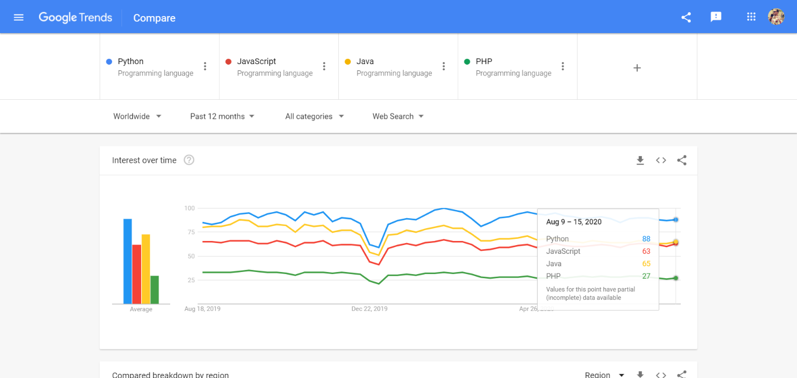

Python é uma [linguagem de programação](http://marquesfernandes.com/desenvolvimento/qual-linguagem-de-programacao-devo-aprender-primeiro/) interpretada de uso geral, muito popular e que pode ser usada para desenvolver uma ampla variedade de aplicativos. Possuí estruturas de dados de alto nível, módulos, exceções, tipagem dinâmica, vinculação dinâmica e muitos recursos.

A linguagem também pode ser estendida para fazer chamadas diretas de sistema para quase todos os sistemas operacionais e pode também executar códigos escritos em C ou C ++. Devido à sua onipresença e capacidade de execução em quase todas as arquiteturas de sistema, Python é uma linguagem universal encontrada em muitos programas populares.

Possuí milhares de módulos de terceiros disponíveis no *Python Package Index* ( [PyPI](https://pypi.org/) ). O PyPI fornece padrões populares para diferentes conhecimentos, como Django para desenvolvimento web e NumPy, Pandas e Mathplotlib para ciência de dados.

## Breve História do Python

Python foi criada no final dos anos 1980, e sua implementação foi iniciada em dezembro de 1989 por Guido van Rossum no CWI na Holanda.

A versão 2 de Python foi lançada em 16 de outubro de 2000, com muitos novos recursos importantes, incluindo um coletor de lixo com detecção de ciclo para gerenciamento eficiente de memória e suporte para Unicode. Porém, a mudança principal foi no próprio processo de desenvolvimento, adotando um processo mais transparente, mais colaborativo e apoiado pela comunidade.

A versão 3, foi lançado em 3 de dezembro de 2008 e é a versão principal atualmente ainda, ela trouxe grandes mudanças que a tornaram incompatível com as versões anteriores. Muitos de seus principais recursos também foram adaptados para o Python 2.6 e 2.7 compatível com versões anteriores para tentar minimizar o impacto em aplicações antigas.

Interesse de Busca no Google por Linguagem de Programação

Recentemente o Python voltou a ganhar popularidade pelo crescimento de setores como Ciência de Dados, Inteligência Artificial e Big Data. Por possuir diversas bibliotecas específicas para essas aplicações, então voltou a ficar em evidência se tornando uma das linguagens de programação mais populares da atualidade.

## O Python é código aberto?

Sim, todas as versões modernas do Python são protegidas por direito autorais sob uma licença compatível com GPL certificada pela [Open Source Initiative](https://opensource.org/). O código-fonte do Python está disponível em seu próprio [site](https://www.python.org/downloads/source/).

## Vantagens do Python

Python é uma linguagem de programação com uma leitura muito fácil, possuí uma sintaxe simples de aprender. Suas diretrizes de estilo de código fornecem um conjunto de regras para facilitar a formatação e manutenção do código.

Por ser uma linguagem interpretada e com uma curva de aprendizado baixa, ela se torna uma ferramenta ágil para o desenvolvimento de software, conseguindo produzir muito em pouco tempo. Conta também com uma comunidade enorme, existem diversos materiais disponíveis pela internet e muitos usuários dispostos a ajudar.

Veja abaixo um exemplo simples de código feito em python:

## Para que o Python é usado?

O Python pode ser utilizado para desenvolver diversos tipos de sistemas e aplicações. Abaixo veremos alguns dos usos mais populares para a linguagem.

### Desenvolvimento Web

Python é muito utilizado no backend de sites e sistemas Web, graças a popularidade de grandes [frameworks](http://marquesfernandes.com/tecnologia/framework-x-biblioteca-x-toolkit-o-que-sao-e-qual-a-diferenca/) como [Django](https://www.djangoproject.com/) e [Flesk](https://flask.palletsprojects.com/en/1.1.x/) hoje é possível criar sistemas web complexos e otimizados. Grandes sites como Instagram, Spotify e Reddit são exemplos de desenvolvimento web bem-sucedidos utilizando o python.

### Ciência de Dados

Python é muito usado para pesquisa científica e computação, por possuir diversas bibliotecas científicas e específicas para esse uso, incluindo:

-   [atropy](https://www.astropy.org/) para astronomia.
-   [biopython](https://biopython.org/) para biologia e bioinformática.

-   [numpy](http://www.numpy.org/) é um pacote fundamental para computação científica com Python.
-   [scipy](https://www.scipy.org/) complementa o popular módulo Numpy, focado para matemática, ciências e engenharia.
-   [pandas](http://pandas.pydata.org/) fornece estruturas de dados de alto desempenho e fáceis de usar e ferramentas de análise de dados.

E muito, muito mais... O papel do Python na análise de dados é definitivamente uma grande vantagem de aprendê-lo. Graças ao crescimento exponencial desse setor os desenvolvedores Python estão mais em alta do que nunca.

### Machine Learning

O Machine Learning é a nova moda no mundo da tecnologia. Sua popularidade tem crescido constantemente devido ao barateamento e às suas possibilidades de aplicação aparentemente ilimitadas

A ideia de que os computadores podem aprender ativamente em vez de operar apenas com o que foi codificado é encantador. Essa tecnologia oferece uma abordagem totalmente nova para a resolução de problemas e na vanguarda do aprendizado de máquina está o Python.

### Internet das Coisas (*Internet of Things - IoT*)

A [Internet das Coisas](http://marquesfernandes.com/iot/internet-das-coisas/) pode ter várias definições diferentes, aqui estamos falando sobre objetos físicos, uma geladeira, por exemplo, conectados a um sistema embarcado que os conecta à internet.

Os projetos de IoT geralmente envolvem análises e processos em tempo real, idealmente, sua linguagem de programação deve ser leve, performática e escalável, o uso ideal para o Python.

## Quem usa Python?

Diversos programas e empresas são adeptas do Python.

-   Instagram usa Python em seu backend.
-   Google usa o Python sempre que possível - *“Python onde podemos, C ++ onde devemos”*.
-   A Netflix [faz uso extensivo de Python](https://medium.com/netflix-techblog/python-at-netflix-bba45dae649e) em seus sistemas.
-   A Mozilla, mais conhecida pelo seu navegador Firefox, afirma ter mais de 230 mil linhas de código escritas em Python.
-   O Uber utiliza o Jupyter Notebook e o IPython para análise de dados.
-   O Dropbox tem sido um defensor público do Python 3 em sua infraestrutura.
-   Slack, Digital Ocean, Lyft, Sauce Labs e Fastly são empresas que divulgam amplamente o uso do Python.
-   Muitas empresas do mercado financeiro, como Bloomberg e JPMorgan.

Além disso, muitas tecnologias de infraestrutura de TI e programas de baixo nível do sistema operacional são escritas em Python. Presente também em diversos programas desktops. Python pode ser usado para praticamente tudo!

## Conclusão

O Python é uma linguagem muito potente e versátil, mas, ao mesmo tempo, fácil de aprender. Graças a sua ampla variedade de aplicações, ela se torna uma linguagem perfeita para quem busca ingressar no mundo do desenvolvimento.
