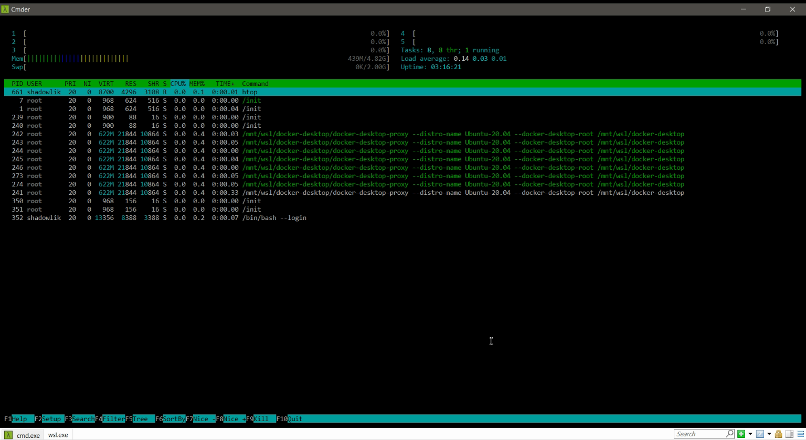

The concept of a server is very clear to those who come from the world of technology, but if that is not your case, don't worry. You have probably already heard someone talking about servers, that something is on a server in the cloud or that there was a problem with the server. But what exactly is a server? And what is it for?

## What is a server

A server can be defined as software and/or a computer that provides specific services to a client. Most likely, when you hear someone talk about a server, they are referring to a machine dedicated to running a system or application; basically a server is a machine connected to the internet that receives and responds to requests and is usually on 24 hours a day, 7 days a week.

## What is a server for

On servers you usually find the applications that provide data and services to the client. Let's imagine the Instagram service, for example. There are two ways to access this service, through the website or the mobile app; we can call them clients, and they make requests to the servers for photos, comments and other information.

## A server's operating system

Servers usually have specific operating systems, normally without a graphical interface, because they focus all of their computing power on running the application they host. They are accessed through the famous command line, well known to laypeople as the hackers' tool.

Most servers use Linux as their operating system, for example [Ubuntu Server](https://ubuntu.com/download/server) and [CentOS](https://www.centos.org/), but some applications need to be run on Microsoft's operating system, and that is why there is a Windows version dedicated to servers, [Windows Server](https://www.microsoft.com/pt-br/windows-server).

Basically any computer can be considered a server. For example, you can take an old computer and use it as a server, install the specific operating system and host some application. Home servers are widely used by software developers.

## How the Client Communicates with the Server

Communication between a client and the server is done through internet protocols. There are several protocols for specific uses; the best known is http://, the protocol we use to access a page on the internet.
