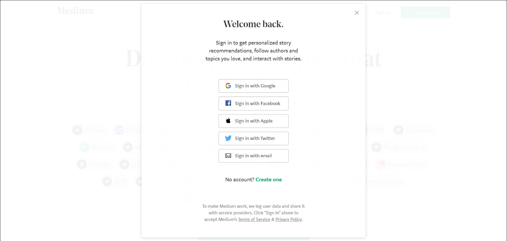
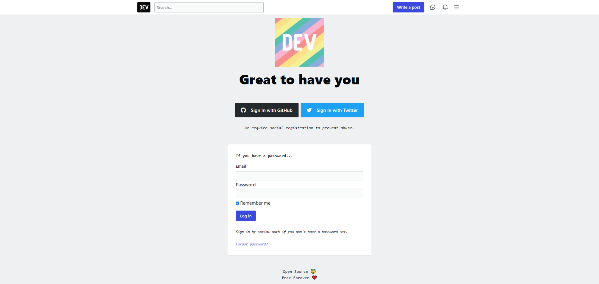
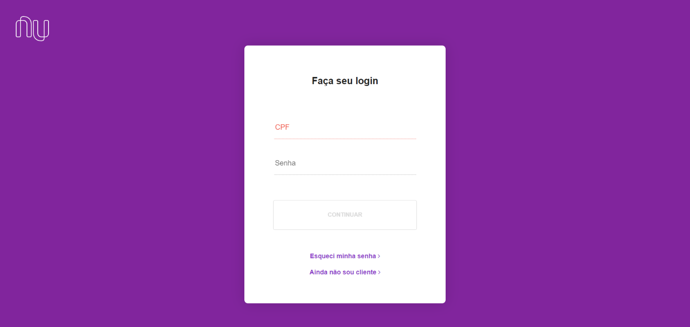
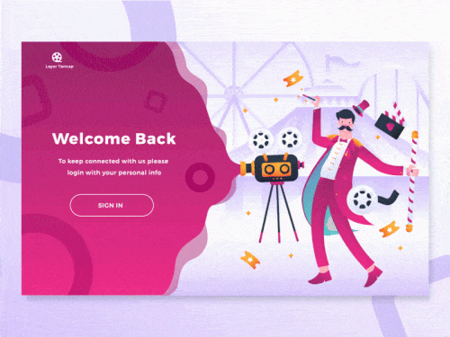
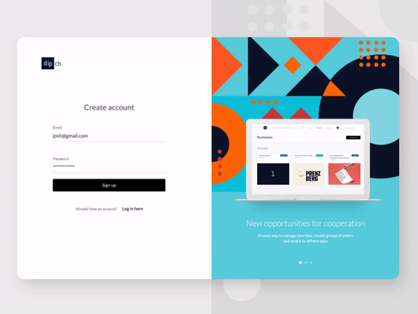
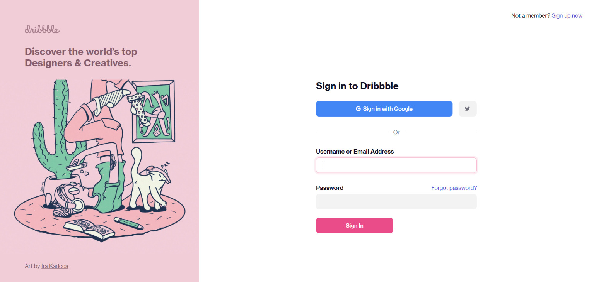
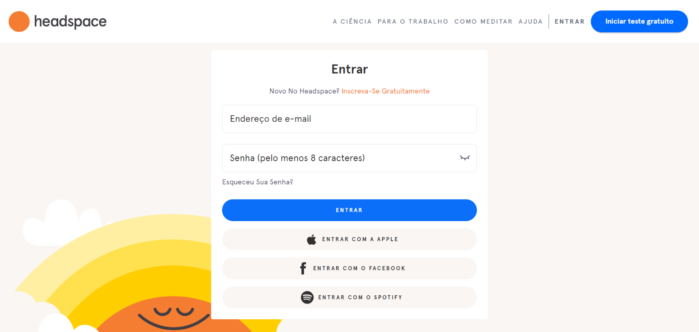
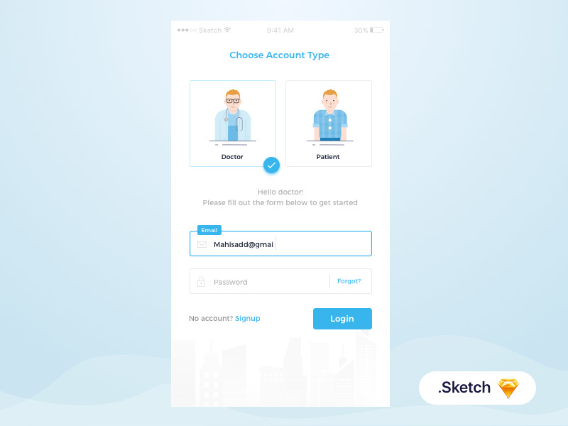
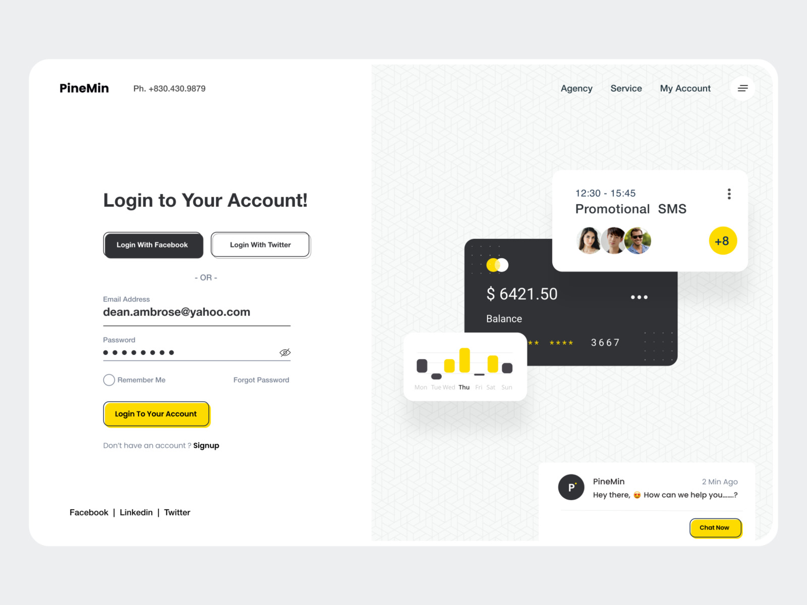

Finding design inspiration, especially for people without much taste like me, can be a challenge. A beautiful login page becomes inviting for your user to sign up, and it is the first contact they will have with any platform. As the old saying goes, "the first impression is the one that lasts", so paying special attention to this page is very important. I gathered some inspirations I found around the internet that help me when I need to start a project. I'm picky about layout and at the same time bad at it, so without a designer's help, ~copying~ getting inspired is what's left!

## Simple and Efficient Design

Login pages don't need to be extremely elaborate to be beautiful and efficient. Check out some simple and minimalist examples:

### Medium

[Medium](https://medium.com/)

Medium is a worldwide platform for publishing texts and articles, recognized for having a design extremely optimized for reading, with a login screen in the form of a clean popup.

### Dev.to

[Dev.to](http://dev.to/)

DEV Community is an article publishing platform focused on the tech world; they always work their design and communication with plenty of informality and good humor. Its login and sign-up screen is quite simple yet inviting.

### Nubank

[Nubank](https://app.nubank.com.br/#/login)

Nubank has become the darling account of Brazilians, known for always having beautiful design and usability work, focusing from its login screen on the strong brand of its visual identity, purple.

## Designs with Movement

Entertaining and delighting your users on the login and sign-up page will certainly leave a good first impression. Applying more elaborate designs with plenty of movement brings modernity to the layout.

### Login Page Illustration Exploration by Aliffajar

[Login Page Illustration Exploration by Aliffajar](https://dribbble.com/shots/5401591-Login-Page-Illustration-Exploration-for-Movie-Website)

A design made by Aliffajar, developed for a cinema/video platform, has a lot of graphic appeal, with many illustrations and transition movements.

### Dipnet login page by Roman Bystrytskyi

[Dipnet login page by Roman Bystrytskyi](https://dribbble.com/shots/3829284-Dipnet-login-page)

Optimizing all the screens of your app can be a good alternative; using the login screen to inform or train your users becomes a good use of the space. We can see how this design by Roman Bystrytski uses the side of the login area to display useful information for the user.

## Designs with Illustrations

The use of illustrations is very common when designing a login or sign-up page; they can bring an air of modernity or even something more formal.

### Dribbble

[Dribbble](https://dribbble.com/session/new)

Dribbble is a community for sharing artistic content, widely used by designers, photographers and illustrators. Because it works with an extremely artistic and critical audience, its design needs to be impeccable, which is why it has a simple but very beautiful login page, where the image on the left side changes as the page loads.

### Headspace

[Headspace](https://www.headspace.com/pt/login)

Headspace is an app for guided meditation; its entire visual identity is focused on bringing calm and harmony, just like the service it provides. With a cheerful and informal tone, using pastel colors, it offers a simple login and sign-up page with an illustration that conveys calm, exactly what the app proposes.

### Multiple Login Form by Mahisa Dyan Diptya

[Multiple Login Form by Mahisa Dyan Diptya](https://dribbble.com/shots/3330825-Multiple-Login-Form)

When you have a platform that serves different types of users, the login page ends up needing to serve many audiences. In this design by Mahisa, we see a clever option for handling access from different users of the platform through the same login form.

## Login UI by DStudio™

[Login UI](https://dribbble.com/shots/11015400-Login-UI/attachments/2609325?mode=media) [by DStudio™](https://dribbble.com/shots/11015400-Login-UI/attachments/2609325?mode=media)
