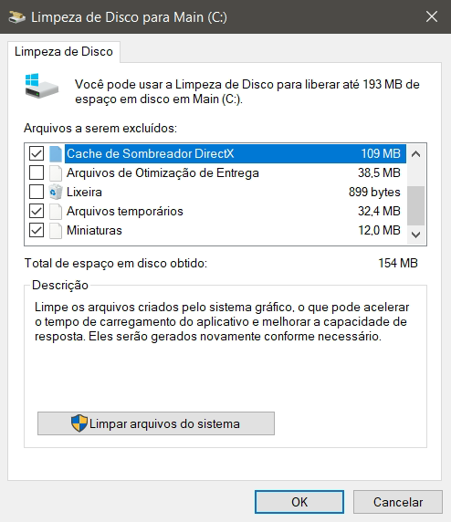
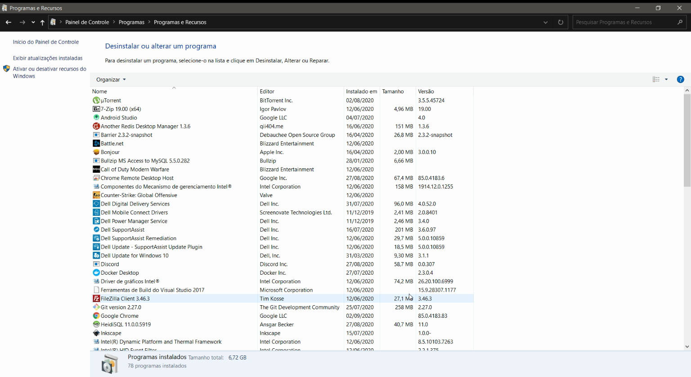
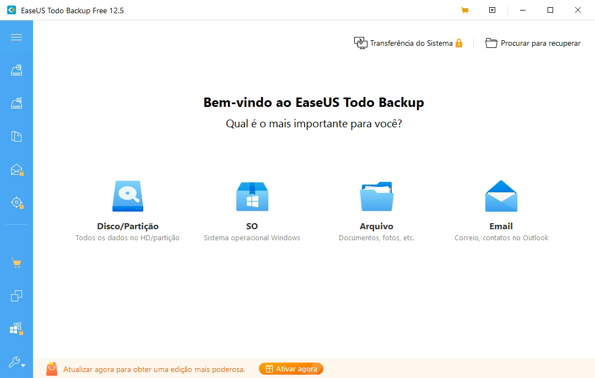
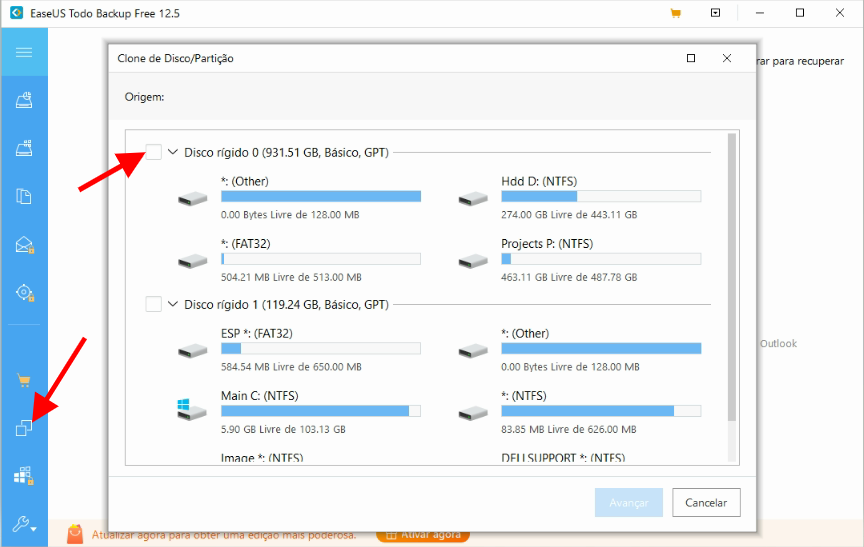
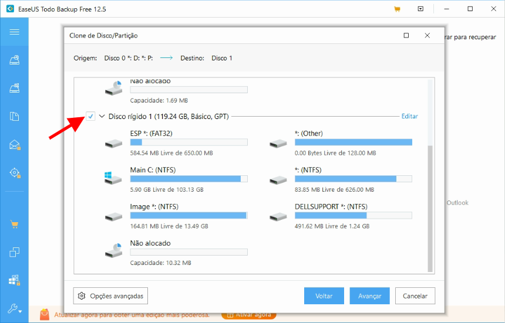
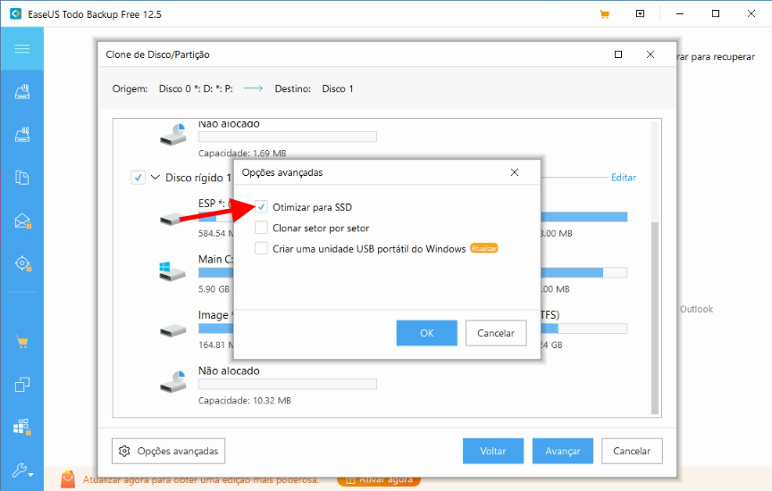

Compró una nueva SSD o HD para su computadora, o tal vez incluso para su computadora portátil, y se pregunta: ¿hay alguna manera fácil de migrar toda la instalación del sistema operativo Windows 10 al nuevo disco? ¡La respuesta es sí!

Hay algunas formas de clonar y migrar a un nuevo disco sin tener que reinstalar nada. En este tutorial realizaremos este proceso utilizando la versión gratuita de [EaseUS](https://www.easeus.com/disk-copy/clone-resource/clone-hard-drive.htm).

## 1\. Hacer una copia de seguridad

Este paso es importante siempre que realice cambios críticos en su computadora. Haga una copia de seguridad en un lugar seguro, ya sea en la nube o en un disco externo, de todos sus documentos, fotos y archivos importantes. Ningún método está 100% garantizado, por lo que es importante prevenir errores inesperados.

## 2\. Limpia tu computadora

El proceso de migración puede tardar unos buenos minutos, por lo que para facilitar y acelerar el proceso es importante limpiar su computadora de cualquier archivo o programa no utilizado, cuanto menor sea la cantidad de almacenamiento para la migración, más rápida será.

### 2.1. Limpieza de disco

El primer paso es hacer una limpieza del disco, puede acceder a este programa escribiendo "**Liberador de espacio en disco**" en el menú de inicio. Seleccione los archivos que desea eliminar y presione OK. Este paso puede tardar varios minutos dependiendo de la cantidad de archivos que se eliminarán.

### 2.2. Desinstalar programas no utilizados

Acceda al panel de control escribiendo **"Panel de control"** en su menú de inicio y busque la opción **"Desinstalar un programa"**.

En esta pantalla encontrarás todos los programas instalados en tu computadora, revisa la lista y desinstala los programas que ya no uses.

### 2.3. Limpieza manual

Navegue por sus carpetas, especialmente las carpetas *Documentos*, *Imágenes* y *Descargas* y elimine todos los archivos que ya no necesitará. Muchos usuarios olvidan limpiar la carpeta de *Descargas*, lo que puede llevar a que se descarguen varios archivos innecesariamente que sobrecarguen el almacenamiento de su computadora.

## 3\. Instalar el programa de migración

Windows 10 no ofrece una forma nativa y sencilla de clonar y cambiar su sistema operativo a un nuevo disco duro. Para eso necesitaremos descargar e instalar el programa [EaseUS](https://www.easeus.com/backup-software/tb-free.html).

## 4\. Seleccione el disco de origen

El primer paso es seleccionar el disco de origen, es decir, el disco en el que está instalado Windows 10. Recordando que el tamaño que ocupa el disco de origen debe ser menor o igual al tamaño disponible del nuevo disco. Haga clic en el menú lateral para ingresar a la herramienta de clonación y seleccione el disco completo que contiene la instalación de su sistema operativo, haga clic en siguiente.

## 5\. Seleccione el disco de destino

Ahora debemos seleccionar el disco de destino, el disco al que queremos mover la instalación de Windows 10.

### 5.1. Migrando a SSD

Si está migrando la instalación a un disco tipo SSD, se recomienda que haga clic en "Opciones avanzadas" y seleccione la opción "Optimizar para SSD".

Haga clic en siguiente e inicie el proceso de clonación del disco duro, recordando que esto eliminará todos los archivos del disco de destino. Este paso puede tardar unos minutos, todo dependerá de la velocidad de tu computadora y la cantidad de archivos a migrar al nuevo disco.

## 6\. Configura tu bota

Este paso puede ser el más molesto, si ya no vas a usar el antiguo HD, puedes simplemente desconectarte e intentar reiniciar la computadora, ya debería poder identificar el nuevo disco. Ahora, si tiene la intención de mantener los dos discos instalados para usar el anterior más adelante como más espacio de almacenamiento, deberá ingresar a su BIOS y configurar el orden de arranque, dejando el nuevo disco como el primero en el orden del cargador de arranque.
