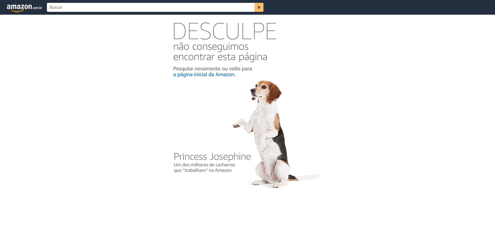
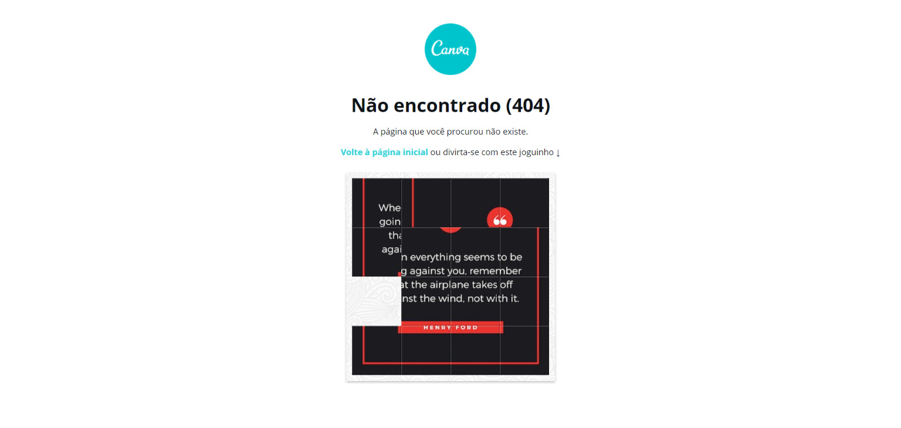
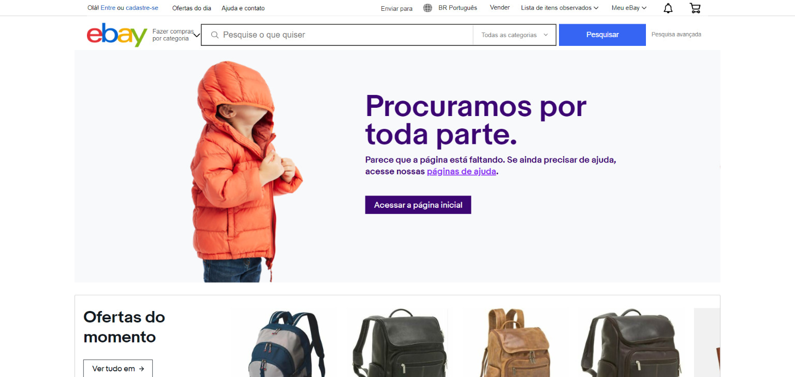
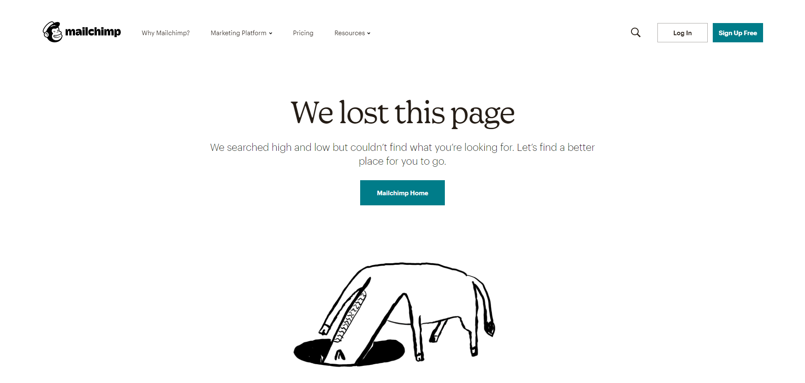

A fun and cute 404 error page shows that you care about your users and can be a smart way to showcase your brand's personality.

Few companies pay due attention to the not found page, but it is important to think of your user in all possible flows, even the unexpected ones.

A not found page can provide useful information for your customer, directing them and keeping them from leaving your site.

Below you will find some companies that have developed creative pages for the 404 error and have handled this unexpected error with excellence on their websites.

## 1\. [Workers Party](https://pt.org.br/error404)

Regardless of your political position, we cannot fail to recognize the excellent work of the Workers Party website designers. Using one of the most famous traits of the most famous politician in the [PT](https://pt.org.br/error404) , designers have found a creative and humorous way to present this error to their users.

## two. [Nubank](https://nubank.com.br/error404)

THE [Nubank](https://nubank.com.br/error404) developed an extremely simple yet efficient page. They took advantage of possible user error to link with other negative things that competitors have that they don't.

## 3\. [Amazon](http://amazon.com.br/error404)

-   
    
-   
    
-   
    

The page of [Amazon](http://amazon.com.br/error404) it's simple yet pleasant. Displaying the error in a readable way and inviting the user to return to your home page. Every time you go to a 404 error page a dog that works at different Amazon is displayed.

## 4\. [awwwards](https://www.awwwards.com/erro404/)

THE [awwwards](https://www.awwwards.com/erro404/) created a page also simple, displaying some information possibly useful to its user in the footer.

## 5\. [canvas](https://www.canva.com/error404)

The tool [canvas](http://amazon.com.br/error404) thought of a different way for your not found page. When entering a non-existent URL a puzzle game is displayed, along with a link to return to the home page.

## 6\. [ebay](https://www.ebay.com/n/error)

The page of [ebay](https://www.ebay.com/n/error) displays a relaxed image and message with a link to the support area. They also use the footer to display some offers from their website.

## 7\. [mailchimp](https://mailchimp.com/error404/)

The error page of [mailchimp](https://mailchimp.com/error404/) , although not translated into Portuguese yet, has a cartoon of what appears to be a horse looking for something in a hole and a button redirecting to the website's home page.

## 8\. [medium](https://medium.com/error404)

The 404 error message is loud and clear, but it also has no Portuguese translation. And in a funny way, the page recommends articles from its platform about "feeling lost".

## 9\. [Lego](https://www.lego.com/pt-br/error404)

A little emotion can rescue a bad situation, even if it's just the expression of a virtual plastic toy.

## 10\. [Disney](https://disney.com.br/error404)

The Disney page displays a simple message with a button for the home page with an amusing expression of one of its characters.
