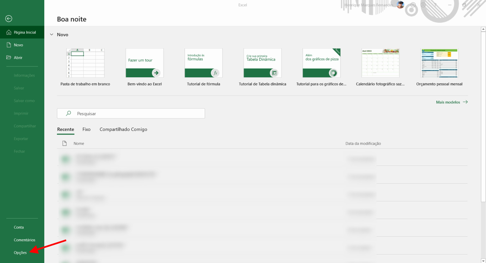
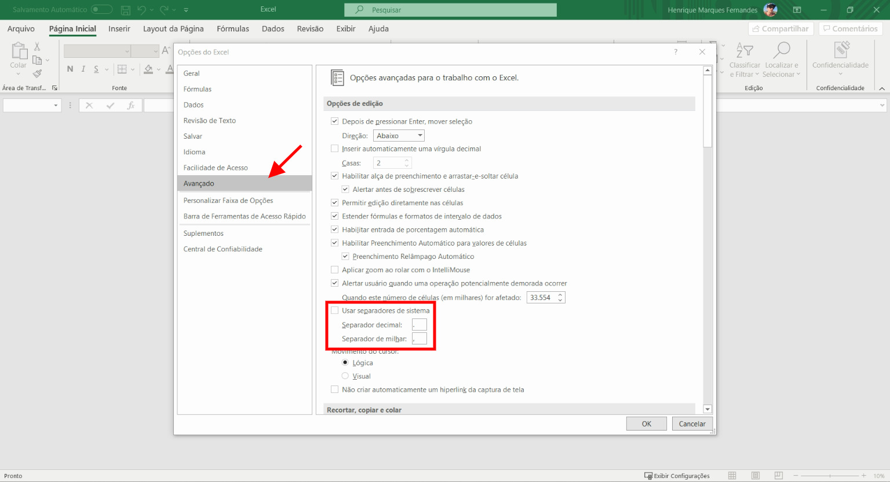

When working or importing data into Excel spreadsheets from web pages, systems or CSV files, Excel may recognize some numbers and convert them to standard text type.Changing even temporarily the Excel settings helps to reduce the amount of manual work and the number of errors in replacing comma by period, semicolon, semicolon by comma, etc. Working with international data in Excel configured in Portuguese can be a real nightmare.

Decimal separators for English-speaking countries such as the USA, UK and Australia are different from the decimal separators for European countries and some Latin American countries, for example Brazil.The former use dot as decimal separator (19.99) and comma as thousands delimiter (2,999.50).Others use the comma as the decimal separator (19.99) and the period as the thousands delimiter (2999.50).By default, Excel gets Windows language separator settings and changing these settings may cause unexpected errors in other applications, but don't worry, Excel allows you to make this change directly in your settings. Follow the tutorial below to change Excel's decimal separator options:

## 1.Enter Options

In the "File" tab, click the "Options" button, a new window will appear.

## two.Select Advanced Options

In the new window, look in the left side menu for "Advanced". In the right window, look for "Use system separators" and deselect it.In the appropriate fields, enter the desired symbols for **the decimal separator** and for the **thousands separator** . In our example, we are configuring our Excel to work with spreadsheets that have the decimal separator as a dot and the thousands separator as a comma, you can change it as needed. Remember that when changing from semicolon in the field **decimal separator** , you also need to change in the field. **thousands separator** , it is not allowed to use a comma or period for both fields at the same time. These settings of **decimal separator** are not specific to the spreadsheet in question, but for the entire Excel setup, any other spreadsheet you open, the number formats will change.
