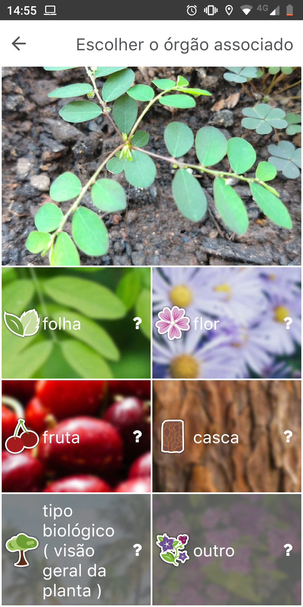
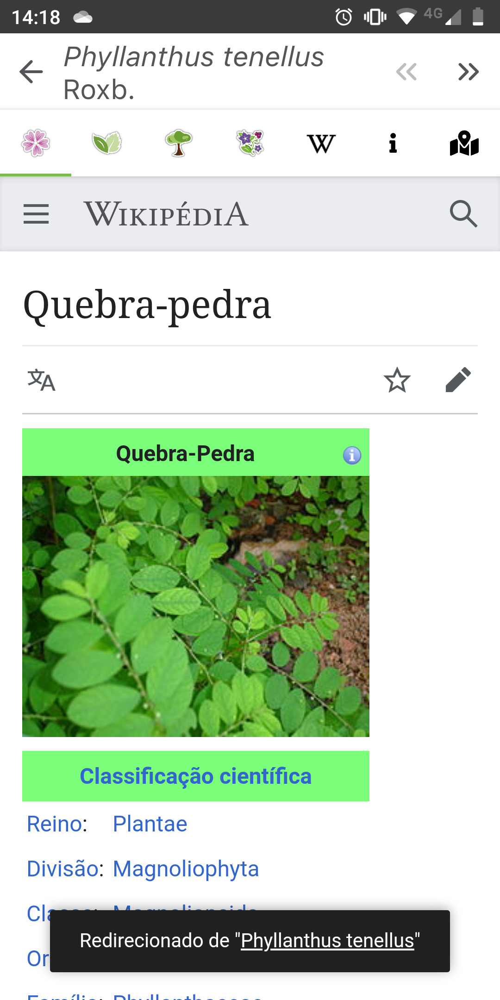

Você começou a criar uma horta na sua casa, ou uma planta misteriosa começou a crescer em um de seus vasos, e agora? Como saber que tipo de planta é essa?

Antigamente era necessário, ainda talvez seja em algumas situações, contar com a sabedoria de um parente mais velho, apelar para a vovó ou vovô que manja tudo de plantas. Mas não se preocupe, agora é possível identificar qual o tipo, espécie de planta apenas como uma foto, simples, fácil e rápido! Você pode identificar a planta através de imagem das folhas, flores, frutos e até mesmo da casca.

## Identificando a espécie da planta por foto com [PlantNet](https://plantnet.org/)

Como o avanço da tecnologia, hoje é possível cruzar imagens em questão de segundos para identificar e comparar características, e é exatamente isso que o [PlantNet](https://plantnet.org/) faz! Com ele é possível enviar imagens e identificar qual a espécie da planta em questão. O processo é muito simples.

PlantNet é uma aplicação de colecta, anotação e pesquisa de imagens para auxiliar a identificar plantas. Foi desenvolvida por um consórcio que envolve cientistas do CIRAD, INRA, INRIA, IRD e da rede Tela Botanica, num projeto financiado por Agropolis Fondation.

Integra um sistema de ajuda para a identificação automática de plantas a partir de fotos comparadas com as imagens de um banco de dados botânicos. Os resultados permitem encontrar o nome científico de uma planta.

Tanto o número de espécies processadas e analisadas, bem como o número de imagens utilizadas na comparação, evoluem a cada uso e contribuição pelos usuários neste projeto.

### 1\. Tire ou envie uma foto da planta em questão

A primeira coisa que você precisa fazer é enviar uma foto da planta, flor ou fruto que você deseja identificar. Você pode tirar uma foto diretamente pelo aplicativo ou enviar uma imagem de sua galeria.

## 2\. Selecione a qual parte da planta a foto corresponde

Agora você precisa informar qual parte da foto está em evidência na foto, isso ajuda o algoritmo a conseguir identificar e cruzar melhor com as fotos em seu banco de dados. Agora só aguardar, normalmente o processo de envio é bem rápido.

## 3\. Identificar qual a possível espécia de planta

Após identificado, serpa listado todas as possíveis correspondências para a sua planta, agora vamos precisar avaliar os resultados para identificar qual é a planta de fato.

O aplicativo facilita muito nessa tarefa, você consegue ver em cada possível espécie correspondente, fotos de outros usuários da flor, folha ou fruto. Na mesma aba é possível acessar a página da espécie em questão no Wikipedia, e ver um mapa com ocorrências de outros usuários, o que facilita identificar se é uma planta típica da sua região.

-   
    
-   
    
-   
    

## 4\. Validar o resultado encontrado

Agora você tem a opção de validar o resultado encontrado, se você tem certeza de que encontro a espécie da sua planta, basta clicar no botão validar. Isso ajuda a melhor o algoritmo do aplicativo e auxiliar outros usuários!

O PlantNet está disponível na versão web, iOS e Android:

