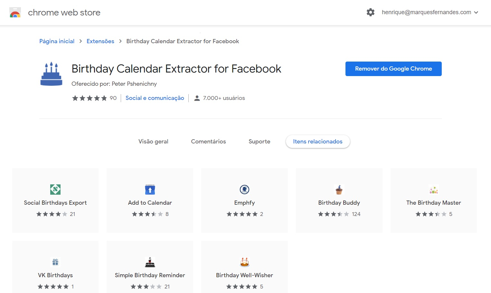
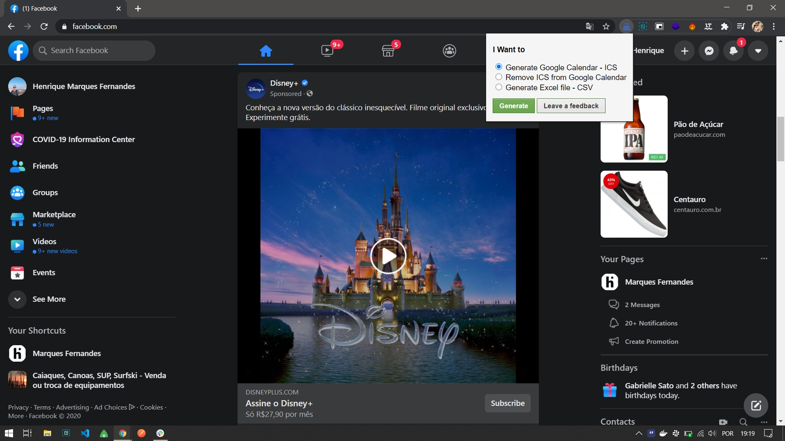

Facebook has been falling out of favor over the years and many of its users, like me, no longer access the social network as often, probably because they have migrated to other social platforms.However, one thing that is still very useful on Facebook is the built-in birthday notifications.I particularly use Facebook basically for this, and to log into other websites and apps.I recently found myself thinking, what if I had all these Facebook birthdays on my Google calendar? As I already use Google Calendar for my everyday stuff, it would be much more practical. So if you're in the same boat as me, be aware that it is possible to sync all your Facebook birthdays to the calendar and Google Calendar app.

With the use of a Chrome extension and a few clicks, you can sync your Facebook birthday calendar with Google's.In this way, Google Calendar, which becomes the default calendar service on most mobile phones out there, will help you not to forget the special day of your friends, family and colleagues.

So enough of the fuss and let's learn how to transfer the birthday schedule from Facebook to Google Calendar.

## 1\. Install Birthday Calendar Extractor Extension

Install the extension ' [Birthday Calendar Extractor for Facebook](https://chrome.google.com/webstore/detail/birthday-calendar-extract/imielmggcccenhgncmpjlehemlinhjjo/related?hl=pt) ' directly from the Chrome Webstore.

## two. Generate the ICS file

now visit [Facebook.com](https://facebook.com/) and when you're there, click the Birthday Calendar Extractor icon in the top right extension shortcuts. Importantly, if your facebook has the display language in Portuguese, it will be necessary to switch to one of the languages compatible with the extension, such as English.

Click on 'Generate Google Calendar - ICS' and the file will download in a few seconds.ICS is a universal calendar format used by Microsoft Outlook, Google Calendar and Apple Calendar.Important: Do not change anything in this file.

## 3\. Import birthday file to Google Calendar

Go to your Google Calendar page.Press the gear icon > settings > Import / Export and you will be on the page [import](https://calendar.google.com/calendar/u/0/r/settings/export?pli=1) from Google Calendar.

Choose the file from the download location (wherever it is on your PC) and click the import button. I recommend that you create a specific calendar for this, it will be easier to organize the dates, and whether or not you want to display birthdays later.

In an instant, the transfer will complete and you will be notified of the successful import.Now, if you want, you can remove the Facebook app from your phone, disable or stop using the platform altogether.You'll see the birthday data highlighted in the app and in the Google Calendar Widget.If you wish, you can also configure Google to send a daily summary email containing all the birthdays of the day.

Did you like the article? Leave your comment!
