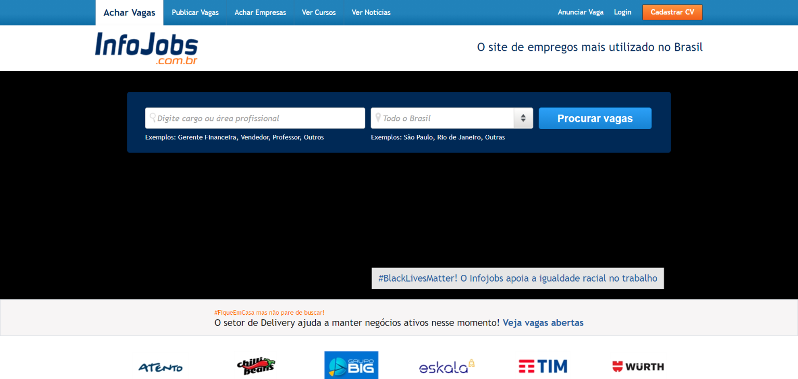

Buscar un empleo no es una tarea fácil, pero quedó atrás la época en que buscar trabajo significaba recorrer las calles o buscar en los clasificados de los periódicos. El mercado evolucionó y hoy internet se convirtió en el principal medio para encontrar vacantes de empleo.

Hoy tenemos grandes empresas que permiten registrar tu currículum, divulgan vacantes de empleo e incluso ofrecen un proceso más personalizado en tu recolocación profesional.

Con tantas herramientas disponibles, encontrar el empleo de tus sueños puede convertirse en una tarea fácil. Preparé una lista con los mejores sitios para buscar empleo en línea, gratuitos y de pago.

## [LinkedIn](https://www.linkedin.com/)

[LinkedIn](https://www.linkedin.com/) es probablemente la mayor plataforma para quien busca un empleo. Inicialmente creado con la intención de ser una red social profesional, hoy es mucho más que eso: consolida tu currículum y permite el acceso a diversas oportunidades de empleo en el mercado. Es una de las opciones más populares para quien quiere mantener un perfil profesional visible y ampliar su red de contactos. Ofrece un servicio de suscripción que amplía las posibilidades de contacto y le da mayor visibilidad a tu currículum ante los contratantes.

## [Glassdoor](https://www.glassdoor.com.br)

[Glassdoor](https://www.glassdoor.com.br) empezó como un portal para evaluar profesionalmente a las empresas, y recientemente adquirió a una de sus competidoras, Love Mondays. El sitio permite evaluaciones anónimas de empleados a las empresas, brindando un ambiente confiable para clasificar y rankear a las empresas listadas en diversos aspectos. Actualmente el portal también permite registrar un perfil con tu currículum profesional y la búsqueda de vacantes de empleo.

## [Vagas.com](https://www.vagas.com.br/)

[Vagas](http://www.vagas.com.br/) también es un sitio de empleo gratuito, donde empresas de todo el país pueden poner a disposición sus procesos de selección, sin que el candidato tenga que pagar nada por ello. La mayoría de las vacantes publican sus respectivas pruebas en el propio sitio, lo que facilita el proceso tanto para el candidato como para el reclutador.

Según el sitio, actualmente hay más de 3000 empresas registradas y diariamente se ofrecen diversas vacantes.

El registro es gratuito, y el candidato no tendrá que pagar para inscribirse o utilizar los recursos del portal, como los materiales de apoyo.

## [Revelo](https://www.revelo.com.br/)

[Revelo](https://www.revelo.com.br/) es una empresa que nació con mucha tecnología y también enfocada en ese mercado. Creada en 2014 con la intención de resolver el problema de las empresas para encontrar talentos con agilidad y eficiencia, afirma lograr procesos de selección 5 veces más rápidos. Siendo la mayor empresa de tecnología en el mercado de recursos humanos de América Latina, cuenta con un sistema 100% en línea y eficiente.  

## [Trampos](https://trampos.co/)

[Trampos](http://trampos.co/) tuvo su origen en Twitter, donde divulgaba los procesos de selección de empresas de comunicación y marketing. A medida que aumentó su popularidad, pudo desarrollar su propia plataforma, convirtiéndose actualmente en un sitio de empleo de referencia para quien desea encontrar una vacante en esas áreas.

Su sistema de búsqueda también es gratuito, pero ofrece a los usuarios suscriptores la ventaja de acceder a las vacantes con 24 horas de antelación.

## [Infojobs](https://www.infojobs.com.br/)

[InfoJobs](http://www.infojobs.com.br/) tiene un modelo de negocio gratuito y de pago, dando ventajas a los usuarios que pagan en su búsqueda de empleo. Con 250 mil vacantes y más de 220 mil empresas registradas, conforman uno de los mayores portales para quien está buscando empleo. Con diversas estadísticas por vacante, como la edad media de los candidatos, escolaridad, fluidez en idiomas y muchas otras características de quienes están concursando en el mismo proceso de selección.

## [Catho](https://www.catho.com.br/)

[Catho](https://www.catho.com.br/) es uno de los sitios de empleo más populares, aunque viene perdiendo espacio frente a sus competidores, tanto para muchas personas que están buscando empleo como para quienes están en busca de profesionales. La plataforma fue una de las pioneras en este ramo, funciona como un clasificado en el que diversas empresas pueden ofrecer sus vacantes de trabajo.

Un lado negativo es que Catho tiene un sistema de cobro del lado de quien está buscando empleo, y no del empleador como sus competidores, aunque durante los primeros 30 días el acceso al sitio es gratis, para que la persona pueda probar las funcionalidades.

## [Trabalha Brasil](https://www.trabalhabrasil.com.br/)

El sitio [Trabalha Brasil](https://www.trabalhabrasil.com.br/) (antiguo SINE - Site Nacional de Empregos) es una plataforma en línea de clasificados de empleos a nivel nacional, y totalmente gratuita. Trabalha Brasil es un clasificado en línea de vacantes que promueve el contacto directo entre quien está buscando empleo y quien está contratando.  
Desarrollado por Ponte Azul Inovação e Tecnologia, el sitio cuenta con especialistas en RR. HH. y Tecnología que garantizan un ambiente confiable y seguro.  
Y además de todo eso, es gratis, pues nuestro mayor objetivo es contribuir a un Brasil donde todo el mundo trabaje, sin complicaciones.
