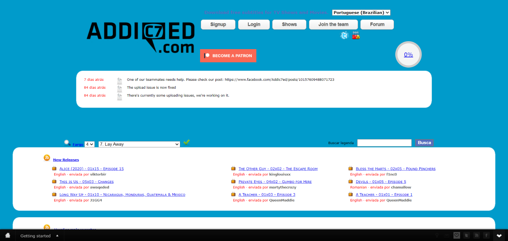
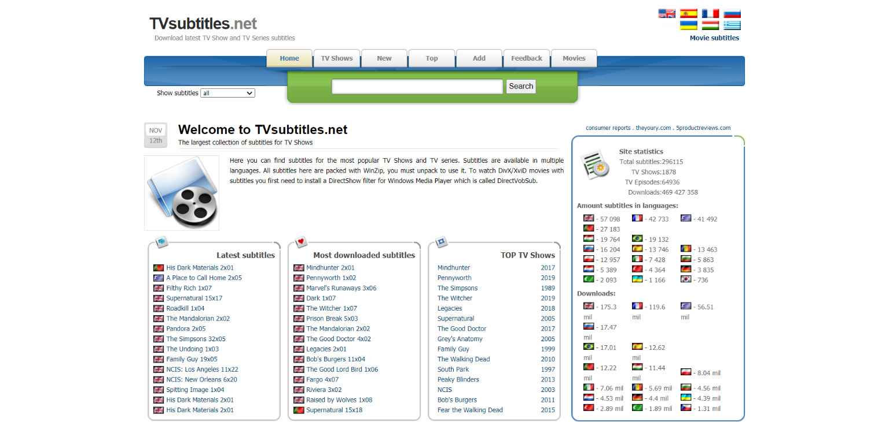

If you download a foreign movie, probably your second step will be to look for where to download the subtitle for free. Subtitles are not just for the hearing impaired, they help to understand new languages. 

Fortunately, there are several websites available online, where you can download free subtitle files for movies and series, from popular movies to more unknown ones.This makes it possible for you to experience movies in a language completely different from yours!

## **[OpenSubtitles](https://www.opensubtitles.org/pb/search/subs)**

With one of the largest collections of film and series subtitles on the internet (more than five million, according to the site itself), the [OpenSubtitles](https://www.opensubtitles.org/pb/search/subs) it's probably the first site you want to turn to if you're looking for quality subtitles.

The site is an international collection, with over 50 different language options to choose from, allowing you to search in languages from Aragonese to Vietnamese, and it is the site with the largest collection of subtitles in Brazilian Portuguese and, ultimately, Portuguese from Portugal if necessary.

Each upload comes with a movie name, upload date, comments, and an overall rating of the quality of the subtitles provided.Using the search bar highlighted at the top, you can search for subtitles that have been uploaded by other users.An advanced search bar lets you search by age, rating, format and more.

The site doesn't just include movie subtitles you can also join the community forum where users provide support and tips for finding the best subtitles.

## [Addicted](https://www.addic7ed.com/)

[Addicted](https://www.addic7ed.com/) (which means from English, addicted) is intended to be the catalog that provides subtitles for movie addicts. Like OpenSubtitles, it is one of the main sites to download subtitles for movies and TV shows, and it also has several languages on its platform.

You need to create an account on Addic7ed to be able to download the subtitles. Once logged in, you can search for movies using a search bar or scroll through a drop-down menu. New releases are prominently displayed in an RSS feed at the top of the page.

The site also offers a schedule showing upcoming releases of your favorite TV shows to stay organized (with relevant links to subtitles provided).It also offers a support forum to ask questions, and tutorial pages to explain how to use the downloaded subtitles.

## [Podnapisi](https://www.podnapisi.net/)

[Podnapisi](https://www.podnapisi.net/) is one of the cleanest and simplest to use!The site has over 2 million downloadable subtitles, with over 58,000 movies and over 6,000 TV series available.

Like other major subtitle sites, Podnapisi allows you to search using an advanced search tool, with options for keywords, years, language and more.If you're experiencing difficulties, a support forum allows you to ask questions and discuss the latest releases.

## [popcorn.tv](https://pipocas.tv/login)

[popcorn.tv](https://pipocas.tv/login) it was a pleasant surprise in my search, It has a very nice interface, but with lots of advertisements. You need to register on the site to access the subtitles. It has a very complete collection, a simple but effective search. You can see other users' ratings on the caption if you need to check the forum and even submit a request for a caption request.

## [YIFY subtitles](https://yts-subs.com/)

With the name of the well-known piracy group and their releases in mind, [*YIFY Subtitles*](https://yts-subs.com/) is another easy-to-use site for downloading subtitles.Unlike some of the other major sites, YIFY Subtitles only offers downloadable movie subtitles.

Don't let the link to the piracy group put you off - YIFY subtitles are safe and piracy-free, offering downloads in multiple languages.The home page offers a list of popular and recently released movies, along with categories that separate movies by language.

## [TVsubtitles.net](http://www.tvsubtitles.net/)

[TVsubtitles.net](http://www.tvsubtitles.net/) it is not a strong site for Portuguese subtitles, but it does have some, it can be an option as a last resort.
