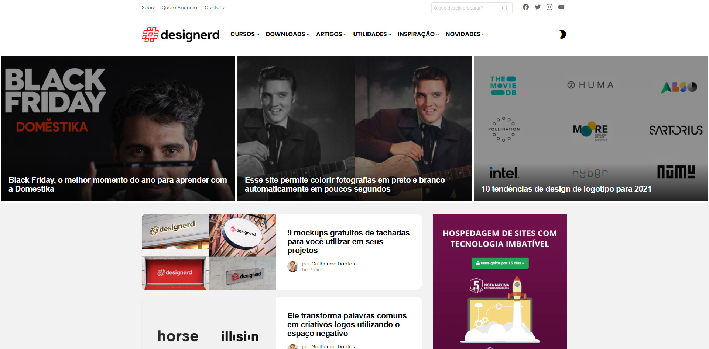
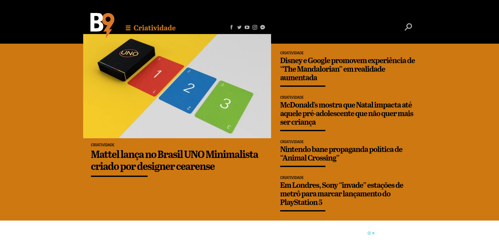
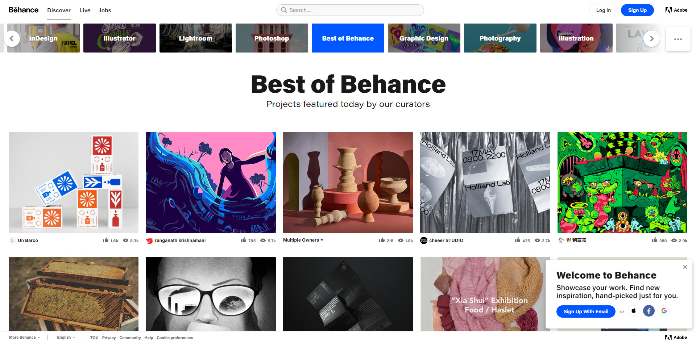
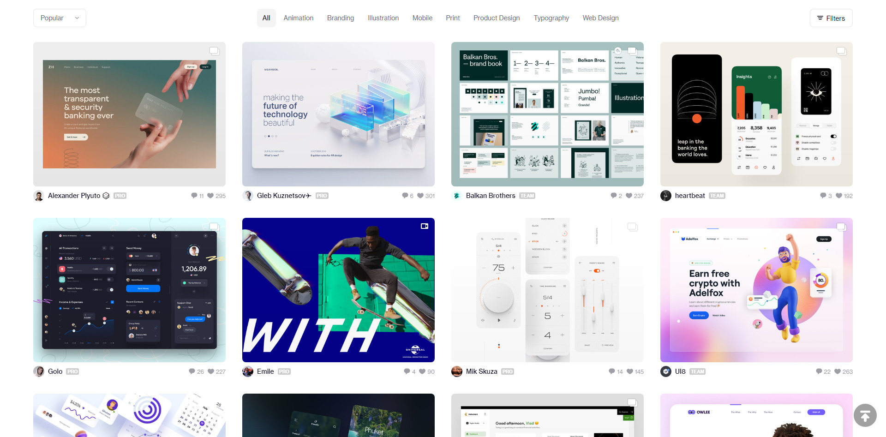
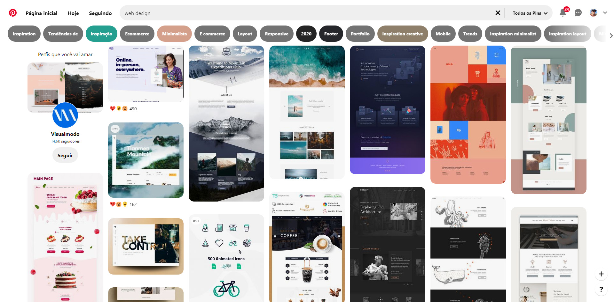
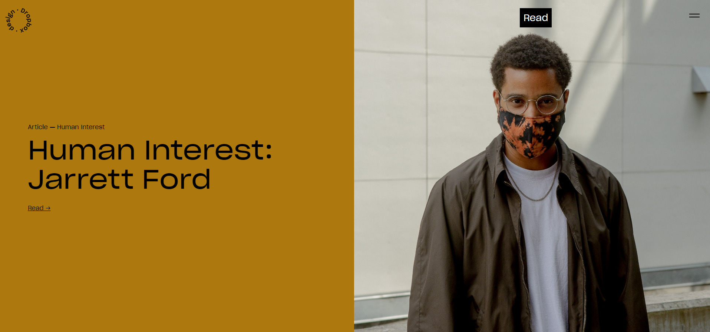
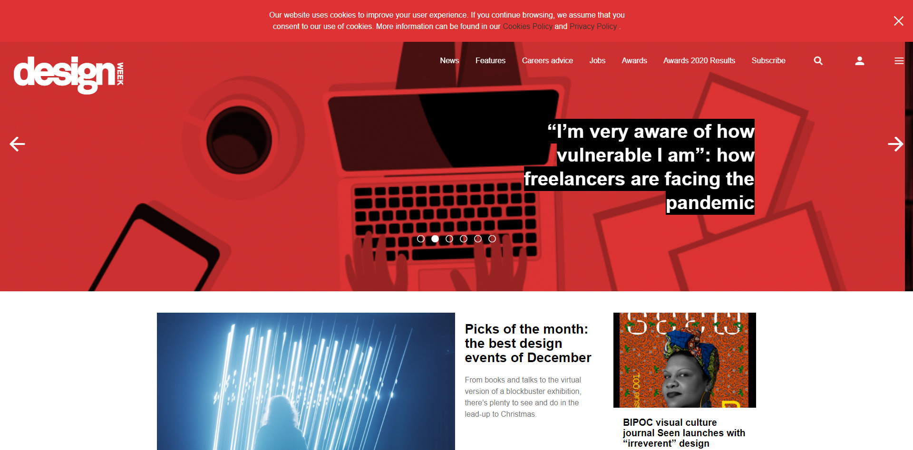
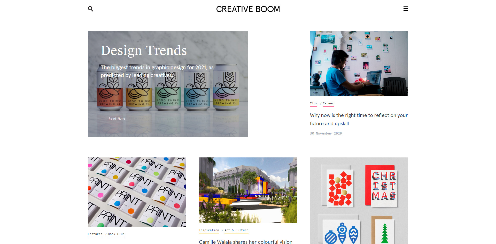
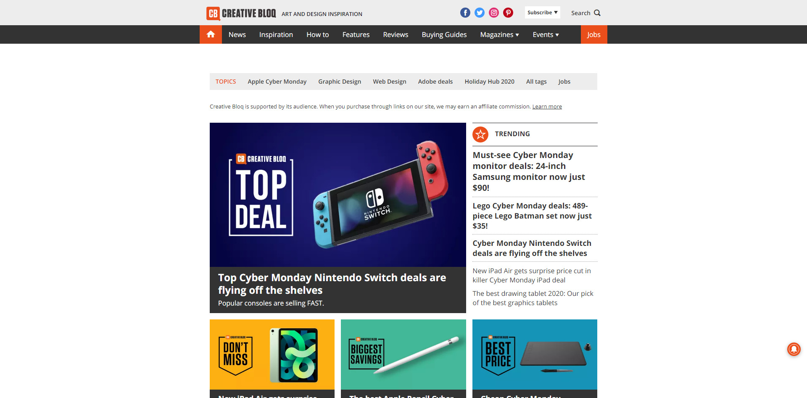
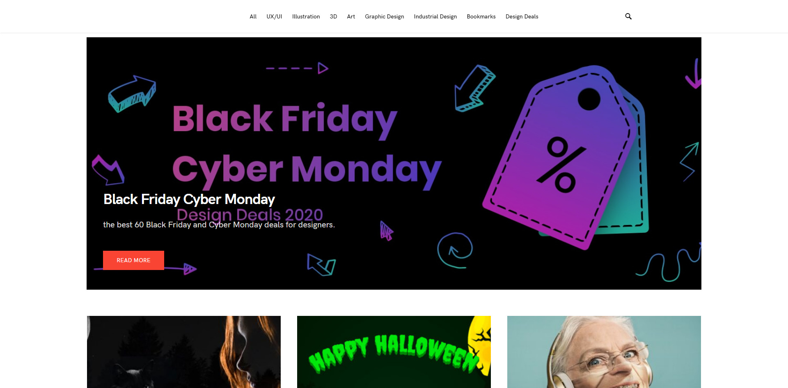

Encontrar inspiración y referencias a menudo no es un trabajo fácil, ni estar actualizado con las últimas noticias y tendencias. Por eso es importante estar siempre siguiendo sitios web y blogs en busca de referencias de diseño, esto ayuda a mantener nuestra mente alerta y actualizada. Como vengo de una historia más evolutiva, para mí siempre es una dificultad cuando necesito aventurarme en el mundo del diseño, así que decidí compartir contigo una lista de los mejores sitios de diseño para que sigas.

## Los mejores sitios web y blogs de diseño en portugués

Comenzaremos nuestra selección con blogs brasileños, después de todo, necesitamos exaltar la creatividad internacionalmente reconocida de nuestra gente.

### [Designerd](https://www.designerd.com.br/)

Designerd nació de un proyecto universitario y hoy es uno de los mejores blogs de diseño del país. El blog tiene en su historia varios premios en Brasil y en el exterior, lo que refuerza su importancia en el segmento.

El blog tiene sesiones de cursos, artículos, noticias e inspiraciones, definitivamente una enorme colección de excelente contenido sobre diseño que debes seguir.

### [Lluvia de ideas 9](https://www.b9.com.br/criatividade/)

Brainstorm 9 no es un blog exclusivo sobre diseño, básicamente cubre todos los segmentos del marketing, siendo importante para cualquier profesional que trabaje con la comunicación y la publicidad. En él puedes encontrar todo sobre juegos, cine, música, fotografía, redes sociales y negocios. B9 también se ha destacado por su contenido en forma de podcast, [siempre](https://www.b9.com.br/podcasts/) abordando el buen humor, las novedades y los retos de este mercado.

### [Creatividades](http://www.criatives.com.br/)

Criatives es un blog que, como su nombre lo dice, tiene que ver con la creatividad, ya sea arte, inspiración y creatividad, novedades, siempre con una perspectiva creativa, lenguaje sencillo y fácil de entender. Sin duda, un blog que los diseñadores no pueden dejar de seguir.

### **[Buenos tutoriales](https://bonstutoriais.com.br/)**

Bons Tutoriais comenzó como un blog personal para anotar artículos e inspiraciones personales. Hoy, hace 6 años, el blog comparte artículos sobre diseño para la comunidad.

### [Behance](https://www.behance.net/)

Behance no es exactamente un sitio web o un blog, es una red de sitios web y servicios especializados en la autopromoción, incluidos los sitios de consultoría y portafolios en línea. Es propiedad de Adobe. En él puedes encontrar inspiraciones de todo el mundo, incluso de diseñadores brasileños.

### [Regate](https://dribbble.com/)

Dribbble, en la misma línea que Behance, no es un sitio web o blog, sino una comunidad en línea para la exhibición de contenido artístico. Funciona como portafolio y plataforma de networking para diseño gráfico, diseño web, ilustración, fotografía y cualquier otra área creativa.

### [Pinterest](https://br.pinterest.com/)

Pinterest es una red social, principalmente para compartir fotos. Muchos lo utilizan como tablero de inspiración, donde podemos compartir y gestionar imágenes temáticas, como juegos, pasatiempos, ropa, perfumes. Aunque no es específico de un diseñador, es muy práctico y fácil de encontrar inspiraciones creativas.

## Los mejores blogs y sitios web de diseño en inglés

Como en prácticamente cualquier segmento, la mayor variedad de contenido está en inglés, por eso he separado una lista de los mejores sitios y blogs en inglés que también debes seguir.

### [Diseño de Dropbox](https://dropbox.design/)

Probablemente hayas usado, o al menos hayas oído hablar, del servicio de intercambio de archivos de Dropbox en algún momento de tu vida, pero ¿sabías que también tiene un blog?Y es muy bueno en eso, con una serie de artículos sobre el tema de UX, con temas que incluyen investigación de usuarios, gestión de proyectos y herramientas de diseño.

### [Abduzeedo](http://abduzeedo.com/)

Abduzeedo es un blog colectivo de escritores individuales que comparten artículos sobre arquitectura, diseño, fotografía y experiencia de usuario.Fundada por el diseñador brasileño Fabio Sasso en 2006.

### [Semana del Diseño](https://www.designweek.co.uk/)

Fundada en 1986, Design Week fue la revista de diseño líder en el Reino Unido hasta 2011, cuando abandonó el mundo fuera de línea y se convirtió en solo en línea.Ofrece noticias e inspiración de alta calidad y bien redactadas sobre gráficos, marcas, interiores, contenido digital, productos, muebles y más.

### [Boom creativo](http://www.creativeboom.com/)

El sitio web Creative Boom celebra, inspira y apoya a la comunidad creativa y tiene una gran sección sobre diseño gráfico para darle mucha inspiración.

### [Revisión creativa](https://www.creativereview.co.uk/category/cr-blog/)

Fundada en 1980, Creative Review es la revista mensual líder mundial en publicidad y diseño.Tiene el mismo periodismo de alta calidad en su sitio web, que presenta una serie de noticias, reseñas e informes del mundo creativo.

### [El Dieline](http://www.thedieline.com/)

Dieline es un sitio bien enfocado en el diseño de productos, un lugar donde la comunidad puede revisar, criticar y mantenerse informada sobre las últimas tendencias en el sector y ver los proyectos de diseño que se están creando en el área.

### [99U](https://99u.adobe.com/)

99U es un blog de Adobe que tiene como objetivo ayudar a cualquier persona en una profesión creativa a desarrollar sus carreras.Está lleno de artículos de calidad sobre liderazgo, productividad y marketing.

### [Bloq creativo](https://www.creativebloq.com/)

Creative Bloq presenta consejos, entrevistas y análisis de cuatro revistas impresas: Computer Arts (diseño gráfico y branding), net (diseño web), 3D World (animación / VFX) e ImagineFX (arte).

### [Masterpicks](http://www.themasterpicks.com/)

¿Busca inspiración en proyectos reales?Entonces necesitas echarle un vistazo a Masterpicks.Este blog basado en imágenes te presenta un nuevo proyecto de diseño seleccionado cada día, en diseño de UX y UI, ilustración, animación, arte 3D, diseño gráfico, branding, diseño industrial y fotografía.

### [Artes digitales](https://www.digitalartsonline.co.uk/)

Digital Arts ofrece inspiración, consejos y tutoriales para creativos digitales en branding y diseño gráfico, ilustración, UX y diseño interactivo, animación, VR y VFX.
