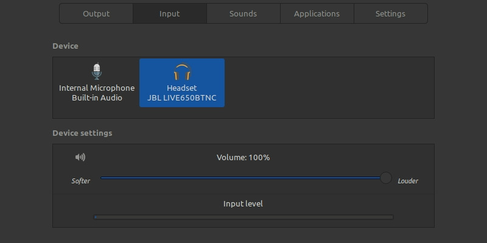

If you use or have just migrated to the linux environment, especially in Ubuntu or Mint distros derived from Debian, you may encounter problems with the microphone of your bluetooth headset.

Especially now during the pandemic, the famous calls (video conferencing) are increasingly part of our daily lives. So you decided to buy that nice bluetooth headset to use and when you connected your microphone it didn't work? Don't worry, there is a way to get your bluetooth headset microphone working on linux.

This tutorial has been tested with JBL headphones and Air Pods, but it should work for most cases.

## Activating the bluetooth headset microphone

In order for the headset to work properly with the microphone, you will need to enable the HSP/HFP audio profile. However, by default, the [pulseaudio](https://wiki.archlinux.org/index.php/PulseAudio_\(Portugu%C3%AAs\)#:~:text=PulseAudio%20%C3%A9%20um%20software%20livre,GNU%20Lesser%20General%20Public%20License.) (sound server embedded in these linux distributions) only supports HSP. To make HSP/HFP work, we need to enable HFP in pulseaudio and for that we will use the service [ofono](https://en.wikipedia.org/wiki/OFono) .

1\. Install the `ofono`

$ sudo apt install ofono

2\. Configure the `pulseaudio` to use the `ofono`  
edit the file `/etc/pulse/default.pa` , find the line `load-module module-bluetooth-discover` and change to `load-module module-bluetooth-discover headset=ofono`

3\. add user `pulse` to the group `bluetooth` so that it has the necessary permissions

$ sudo usermod -aG bluetooth pulse

4\. Edit and add permissions on the file `/etc/dbus-1/system.d/ofono.conf` add the code below right before closing `</busconfig>`

<policy user="pulse">
    <allow send\_destination="org.ofono"/>
</policy>

5\. To make ofono work it is necessary to provide a modem for it. And for that we are going to install a modem emulator called [phonesim](https://packages.debian.org/stretch/devel/ofono-phonesim) that will be implemented by ofono to work. Install the `ofono-phonesim` :

$ sudo add-apt-repository ppa:smoser/bluetooth
$ sudo apt-get update
$ sudo apt-get install ofono-phonesim

6\. Configure the `phonesim` adding the following lines to the file `/etc/ofono/phonesim.conf`

\[phonesim\]
Driver=phonesim
Address=127.0.0.1
Port=12345

Now restart the ofono service:

$ sudo systemctl restart ofono.service

7\. Now we need to define and enable some services to start ofono-phonesim as a service.

To execute `ofono-phonesim -p 12345 /usr/share/phonesim/default.xml` at system startup, create the file as root `/etc/systemd/system/ofono-phonesim.service` with the following content:

\[Unit\]
Description=Run ofono-phonesim in the background

\[Service\]
ExecStart=ofono-phonesim -p 12345 /usr/share/phonesim/default.xml
Type=simple
RemainAfterExit=yes

\[Install\]
WantedBy=multi-user.target

After the `ofono-phonesim` runs, you will also need to enable and bring the phonesim modem online.

For this we will use the code of a [repository](http://git.kernel.org/pub/scm/network/ofono/ofono.git) git:

$ cd /tmp
$ git clone git://git.kernel.org/pub/scm/network/ofono/ofono.git
$ sudo mv ofono /opt/

Now you can enable and make the phonesim modem online by creating another service that depends on the ofono-phonesim service.Again, create a new service file as root the file at `/etc/systemd/system/phonesim-enable-modem.service` and put the following content:

\[Unit\]
Description=Enable and online phonesim modem
Requires=ofono-phonesim.service

\[Service\]
ExecStart=/opt/ofono/test/enable-modem /phonesim
ExecStart=/opt/ofono/test/online-modem /phonesim
Type=oneshot
RemainAfterExit=yes

\[Install\]
WantedBy=multi-user.target

Then run the following commands to enable and run the two daemons:

$ sudo systemctl daemon-reload
$ sudo systemctl enable ofono-phonesim.service
$ sudo systemctl enable phonesim-enable-modem.service
$ sudo service phonesim-enable-modem start

Check that everything went as expected and that the service is running:

$ sudo service phonesim-enable-modem status

8\. Finally, restart the `pulseaudio` :

$ pulseaudio -k.

By now you should be able to see your headset as an input device in the sound setup part. There is a certain instability in this setup, from time to time it may be that your phone is misconfigured or the change of audio profile does not work, when this happens, restart the services as described above and also pulseaudio.
