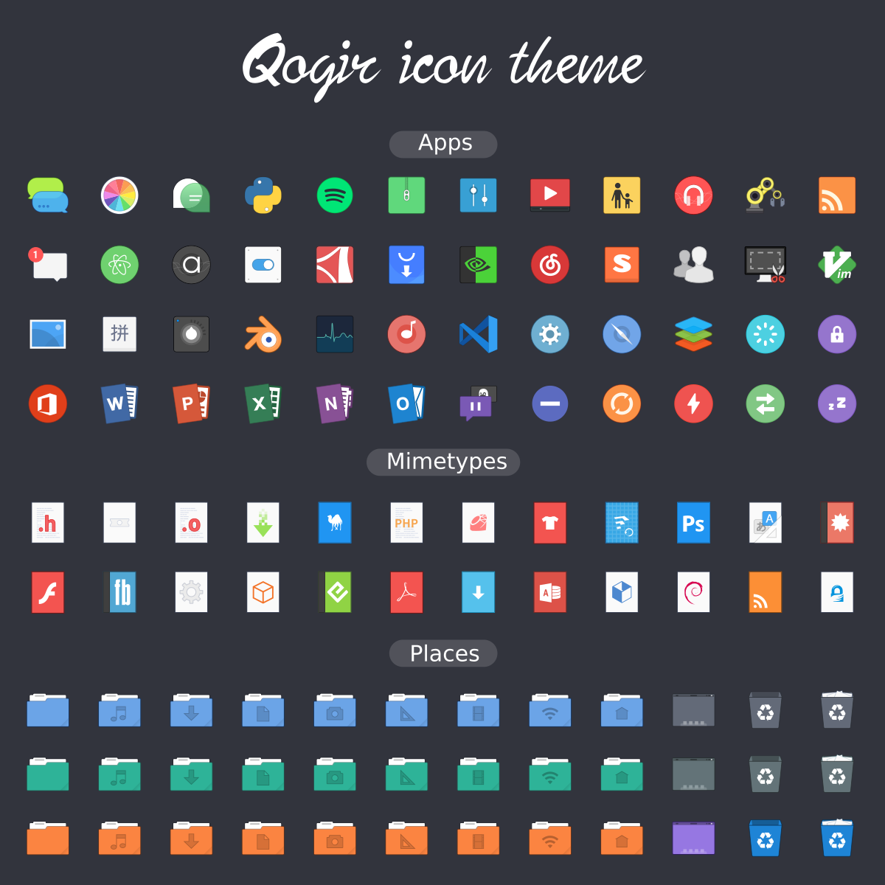
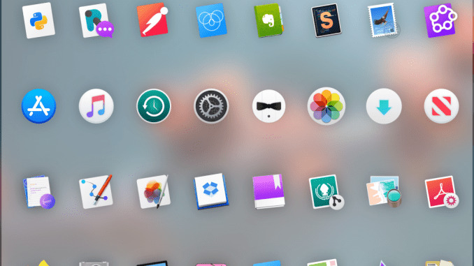
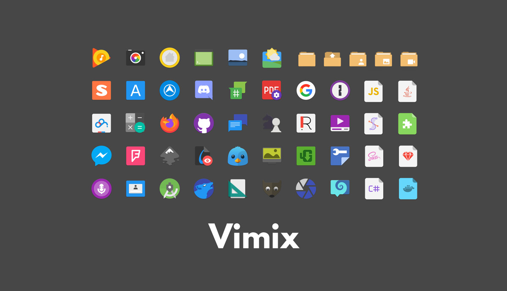

Se você não gosta dos ícones que vieram na sua distro, seja ela Ubuntu ou Linux Mint, ou simplesmente quer dar uma nova cara para o seu desktop, saiba que é possível dar um toque de personalidade a mais usando temas de ícones personalizados!

Existem centenas de temas de ícones por ai, separei os que eu mais gosto e já usei pra facilitar a sua busca. Eles variam de veráios estilos que vão desde glifos sutis, planos e 2D a pacotes que vão de encontro ao brilho, gradiente e detalhes.

## [1\. Papirus Icon Theme](https://github.com/PapirusDevelopmentTeam/papirus-icon-theme)

Papirus é um tema de ícone SVG gratuito e de código aberto para Linux, baseado no Paper Icon Set com muitos novos ícones e alguns extras, como suporte para Hardcode-Tray , suporte para esquema de cores KDE , suporte para Folder Color e outros .

O tema do ícone do Papirus está disponível em quatro variantes:

-   Papirus
-   Papirus Dark
-   Papirus Light
-   ePapirus (para sistema operacional elementar e Pantheon Desktop)

## [2\. Numix Circle](https://github.com/numixproject/numix-icon-theme-circle)

Circle é um tema de ícone para Linux do [projeto Numix](https://numixproject.github.io/). O conjunto de ícones do Círculo Numix agora abrange vários milhares de ícones de aplicativos, desde os favoritos dos velhos tempos até os mais novos, todos eles (sem surpresa) colocados em uma moldura circular.

## [3\. Qogir Icon Theme](https://github.com/vinceliuice/Qogir-theme)

Qogir é um tema de design plano para GTK 3, GTK 2 e Gnome-Shell que suporta ambientes de desktop baseados em GTK 3 e GTK 2 como Gnome, Unity, Budgie, Cinnamon Pantheon, XFCE, Mate, etc.

## [4\. OS Catalina](https://github.com/zayronxio/Os-Catalina-icons/)

Se você deseja fazer o Ubuntu se parecer com um Mac - você pode gostar da aparência do sistema operacional, mas não de suas limitações - um conjunto de ícones como o OS Catalina é uma maneira fácil de fazer isso.

## [5\. Vimix](https://github.com/vinceliuice/vimix-icon-theme)

O tema do ícone Vimix é baseado no [Paper-Icon-Theme](https://github.com/snwh/paper-icon-theme), um tema moderno de ícones freedesktop cujo design é baseado no uso de cores fortes e formas geométricas simples para compor os ícones. Cada ícone foi meticulosamente projetado para uma visualização perfeita de pixels.

Embora se inspire nos ícones do Material Design do Google, alguns aspectos foram ajustados para se adequar melhor a um ambiente de desktop.
