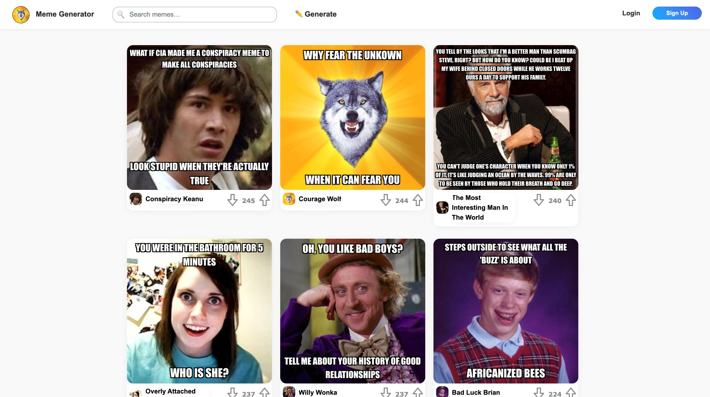
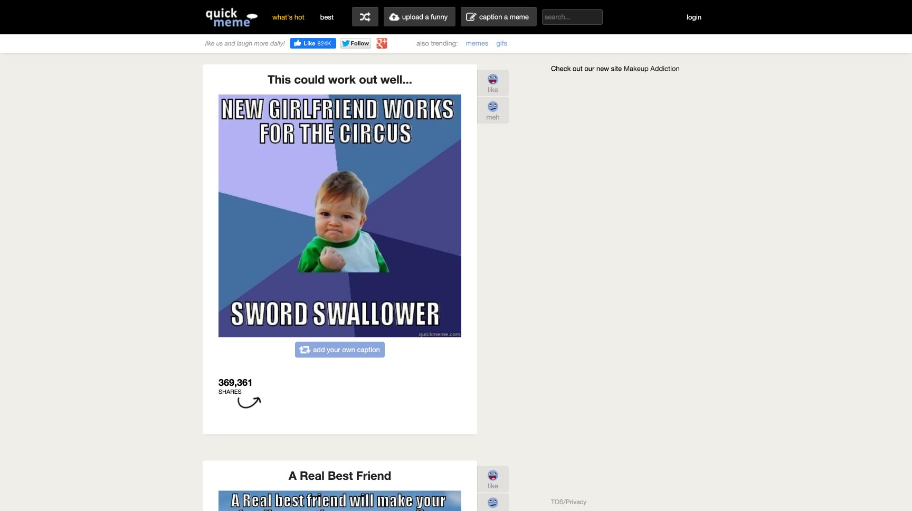
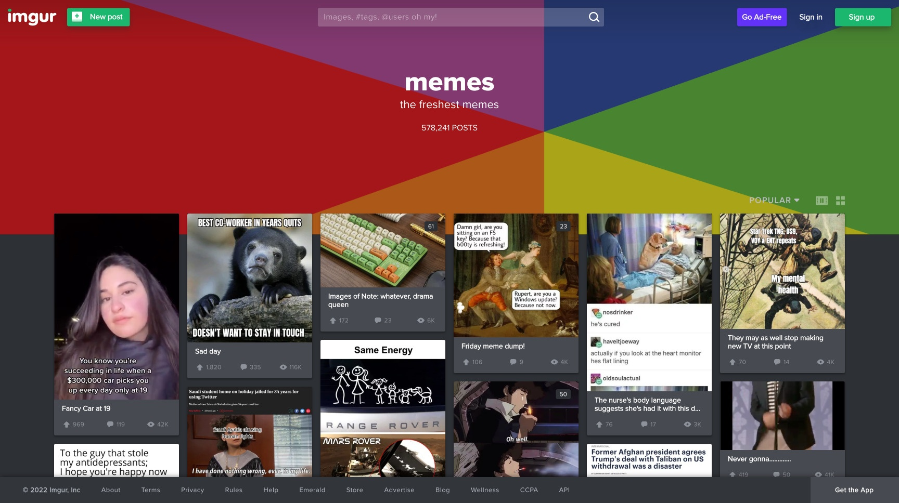
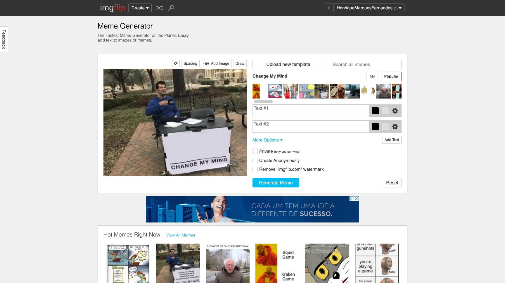
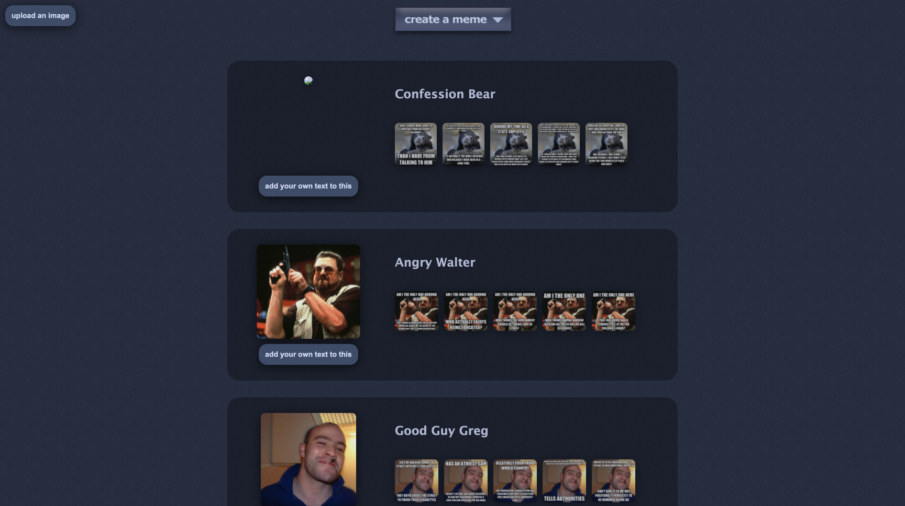

Memes have won over the internet, especially for us Brazilians. Let's be honest, we love a good meme, don't we? Memes are fun and probably get the message across better than we could write it, after all, a picture is worth a thousand words.

Have you ever caught yourself looking for that old meme? Or wanting to create a custom meme to send to some group on WhatsApp? Well, let's make your life easier with a list of the 6 best sites for you to find and create memes online! No need to download Photoshop or any other program for that.

## 1\. [Meme Generator](https://memegenerator.net/)

[memegenerator.net](https://memegenerator.net)

[Meme Generator](https://memegenerator.net/) is possibly one of the best tools available for creating your own memes. Simple and intuitive, it also lets you browse memes created by other people, a meme marketplace!

## 2\. [quickmeme](http://www.quickmeme.com/)

[quickmeme.com](http://www.quickmeme.com/)

[quickmeme](http://www.quickmeme.com/) lets you browse memes and create your own from any combination of images and text. Its layout is very reminiscent of the [9gag](https://9gag.com/) site design, with the ability to vote on and rate memes, as well as generate random memes.

## 3\. [Imgur](https://imgur.com/memegen)

[imgur.com/memegen](https://imgur.com/memegen)

[Imgur](https://imgur.com/memegen) comes with many built-in images that you can use to make your memes instantly. This site is loved by the Reddit communities and has a wide variety not only of memes, but also of images and tools.

## 4\. [Imgflip](https://imgflip.com/memegenerator)

[imgflip.com/memegenerator](https://imgflip.com/memegenerator)

[Imgflip](https://imgflip.com/memegenerator) image generators are designed to be incredibly fast and provide powerful customization while being simple and easy to use. Images created on Imgflip can be "private" if you just want to download the image and save it for yourself, or they can be saved publicly for the community.

## 5\. [livememe](https://livememe.com/)

[livememe.com](https://livememe.com/)

Right on the home page of [LiveMeme](https://livememe.com/) you'll find a huge selection of the most popular recurring viral characters on the web, from Futurama's Fry to Jean-Luc Picard and Batman. From there, just add your caption and you're done!
