Have you ever needed to share some service, database, API or website being developed on your local machine publicly on the internet with someone? There are ways to share your projects without necessarily having to upload it to a server or cloud.

Some time ago I wrote the article [Tunneling/Port Forwarding with SSH – Ubuntu/Debian](http://marquesfernandes.com/desenvolvimento/tunel-encaminhamento-de-portas-com-ssh-ubuntu-debian/) which explains exactly how to do this using only the [SSH](https://pt.wikipedia.org/wiki/Secure_Shell) , however for many this may not be enough or difficult to manage/maintain. There are some paid services like [ngrok](https://ngrok.com/) , but their free package is very limited and the cheapest package ends up being expensive for simple personal projects (something around 20 USD a month), but don't worry, there are open source solutions for that.

Developer Anders Pitman has created a really cool repository of [alternatives to ngrok](https://github.com/anderspitman/awesome-tunneling) , in this tutorial we will focus on a specific service, the [**boringproxy**](https://boringproxy.io/) .

## Use cases

Below are some use cases for this type of tunnel.

-   You are developing a local application and need to expose your API publicly to share with someone or simply use some tool that needs access to a public URL
-   Are you structuring a database and would like to connect it to develop it in a tool like [retool](https://retool.com/)
-   You are creating a frontend application and would like to test with the [Google PageSpeed](https://pagespeed.web.dev/) or some benchmark tool and for that you need them to be able to find your project publicly on the internet

These are some of the countless use cases, and the coolest thing is that with boringproxy we can expose our entire infrastructure at once, database, API, frontend and any other service we want to expose on the internet.

## [boringproxy](https://boringproxy.io/)

[boringproxy](https://boringproxy.io/) it is a combination of a reverse proxy and a tunnel manager.

What this means is that if you have a self-hosted service (API, MySQL, Postgres, Redis, Frontend in React, Vue, Angular, ...) running on a local, private network, boreproxy aims to provide the easiest way to securely expose (i.e. with HTTPS support and even password protection) this server to the internet, so you can access it from anywhere .

## Starting our infrastructure

For this tutorial we will basically need a computer running some local services, a server with a public internet IP and a domain.

### Server with public IP

For the server with a public IP we are going to use Google Cloud Platform because it offers us a machine on the [free tier](https://cloud.google.com/free/docs/free-cloud-features#compute) , that is, we will not need to spend a penny.

First you need to create an account on [GCP](https://cloud.google.com/) . After the account is created, we will create a virtual machine that fits the free level, which in this case would be a *`e2-micro`* in any of the regions: `us-west1; us-central1; us-east1` .

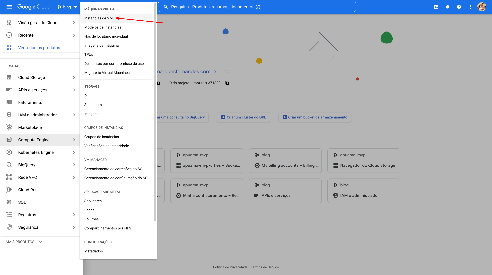

Accessing the Compute Engine menu > VM Instances

First, we need to access Compute Engine > VM Instances from the side menu.

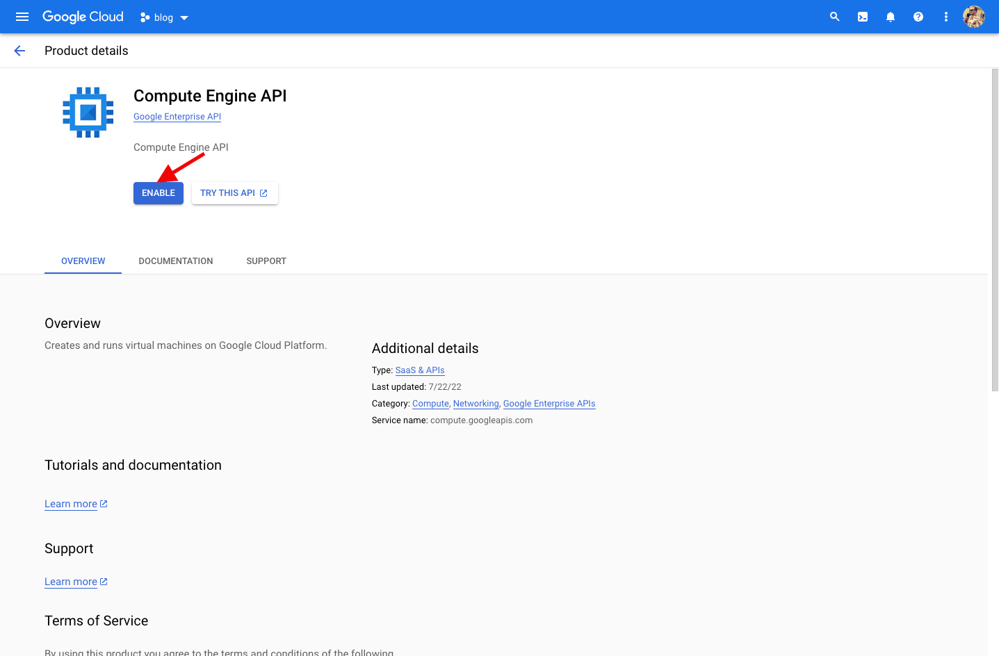

Enabling the Compute Engine API

If this is the first time you are accessing Google's Compute Engine service, you will be prompted to enable the API, just click on `Enable` and wait for the activation to finish.

Create VM instance

Click on the `Create Instance` to begin setting up our new virtual machine on GCP.

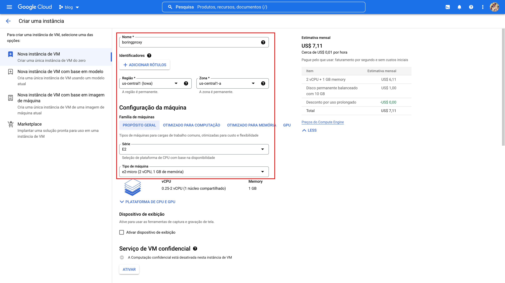

Setting up our new VM

Now let's configure our virtual machine to the settings that apply within the free Google Cloud plan, `e2-micro` and the chosen region was `us-central1 (Iowa)` . Don't worry if a price appears to the right, the free tier discount will be applied at the end of each payment cycle.

By default the machine will be created with the operating system [debian](https://wiki.debian.org/pt_BR/DebianIntroduction) and a 10 GB persistent disk, let's proceed with this default configuration for our tutorial.

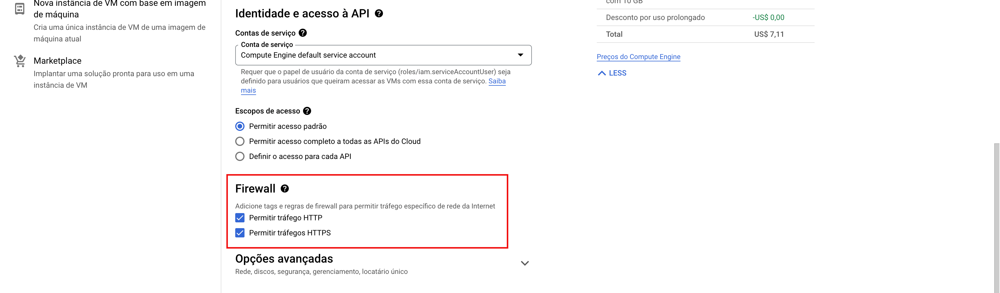

Enabling the HTTP and HTTPS protocols

We need to add one last configuration, going down the page you will find the Firewall section, select to enable HTTP and HTTPS traffic on the server.

Now click Create and wait for the virtual machine to be created.

Copy the machine's public IP

With the creation finished, we now have the public IP of our machine, save this number, we will use it to configure our domain.

## configuring the domain

I always indicate as a DNS resolver the [Cloudflare](https://cloudflare.com/) , because it offers many cool services and the best, it's free. If you use any other service, access it to configure the domains necessary for boringproxy to work.

We will need to configure two domains, the first domain will refer to the boringproxy administrative panel, for example, `boringproxy.marquesfernandes.com` and the second will be a wildcard type domain, it will be responsible for automatically managing the tunnels that we are going to create later, in this case we are going to create a domain `*.boringproxy.marquesfernandes.com` .

Both will point to the same place, the public IP of our server created in the previous step, so our configuration for the first domain will be of the type `THE` and from the second we will use a `CNAME` to the first one, that way if we need to change the setting in the future, we only need to change it in one place.

Creating the first domain

Create the first domain by selecting the type as A, enter the server IP copied in the previous step and don't forget to disable the Cloudflare proxy.

Creating the Wildcard Domain

Now we need to create our Wildcard domain, for that we will use the `*` before the name of the subdomain that we want to use, in this case `*.boringproxy.marquesfernandes.com` , it will be responsible for when we create our tunnels in boringproxy, for example, `api.boringproxy.marquesfernandes.com` the setup works with no more need to create subdomains on Cloudflare.

## Configuring boringproxy on the server

Now that we have our domains configured, we can finally start configuring the boringproxy on our server, for that we will access the SSH of our virtual machine. Go back to the list of virtual machines on Google Cloud and select the machine created, click on the SSH button and a new window with our terminal will open.

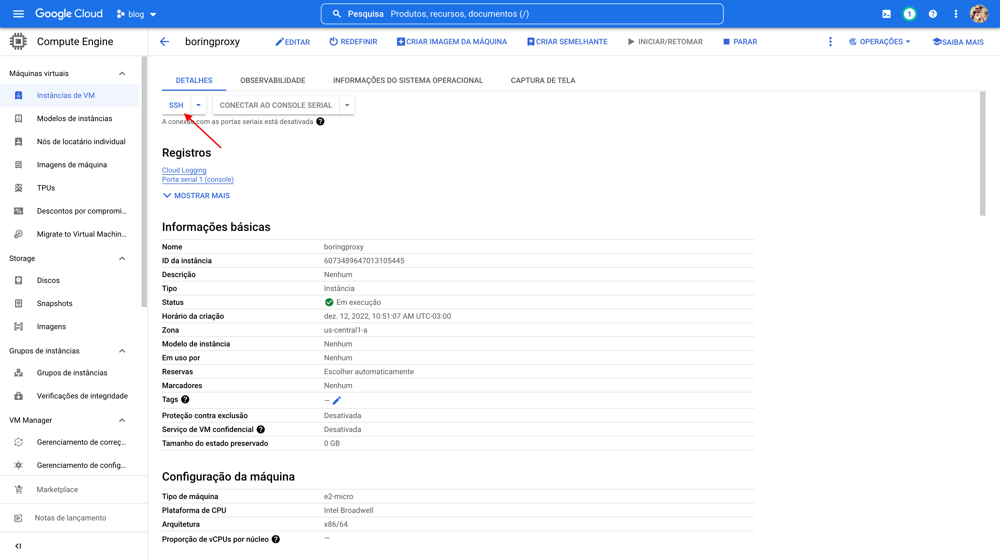

Accessing SSH from the virtual machine

Wait for the SSH keys to transfer and a window similar to this one should load:

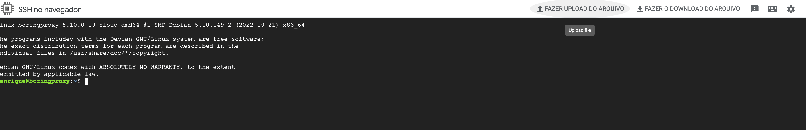

VM SSH Terminal

Ok, now let's create a folder that will house the boringproxy installation, I recommend that the folder be created in `/usr/local/boringproxy` . Because it is a folder in a location that requires root permissions, we need to use the sudo command. Let's use `sudo su` so you don't have to type sudo all the time, but be careful, you will be executing any command with elevated privileges.

$ sudo su mkdir /usr/local/boringproxy

Enter the folder using the command `cd /usr/local/boringproxy` .

We will follow the [installation instructions from boringproxy documentation](https://boringproxy.io/installation/) for Linux x86\_64.

Inside the created folder run:

curl -LO https://github.com/boringproxy/boringproxy/releases/latest/download/boringproxy-linux-x86\_64 chmod +x boringproxy-linux-x86\_64 sudo setcap cap\_net\_bind\_service=+ep boringproxy-linux-x86\_64

If you intend to use tunnels for forwarding services such as a database, which use the TCP protocol and not HTTP, we need to edit the sshd configuration to allow TCP port forwarding.

Let's edit the file `/etc/ssh/sshd_config` and exchange `GatewayPorts no` per `GatewayPorts clientspecified` . You can use your favorite editor, in my case, `nano /etc/ssh/sshd_config` .

### Starting boringproxy on the server

Alright, now we can [start boringproxy](https://boringproxy.io/usage/) on our server, in the command below change `boringproxy.marquesfernandes.com` by the first domain you set up.

./boringproxy-linux-x86\_64 server -admin-domain boringproxy.marquesfernandes.com

Your e-mail will be requested, this information is used to generate the necessary HTTPS certificates using the [Let's Encrypt](https://letsencrypt.org/pt-br/) . If everything is correct, you should see the message `Successfully acquired certificate...`

Use the command `ctrl + c` to cancel the service, now use the command `ls` to list the files in the folder, note that a file called boringproxy\_db.json was created, it is a mini database of boringproxy settings. Use the command `cat boringproxy_db.json` to see the contents of the file and get the access token, save that token somewhere safe.

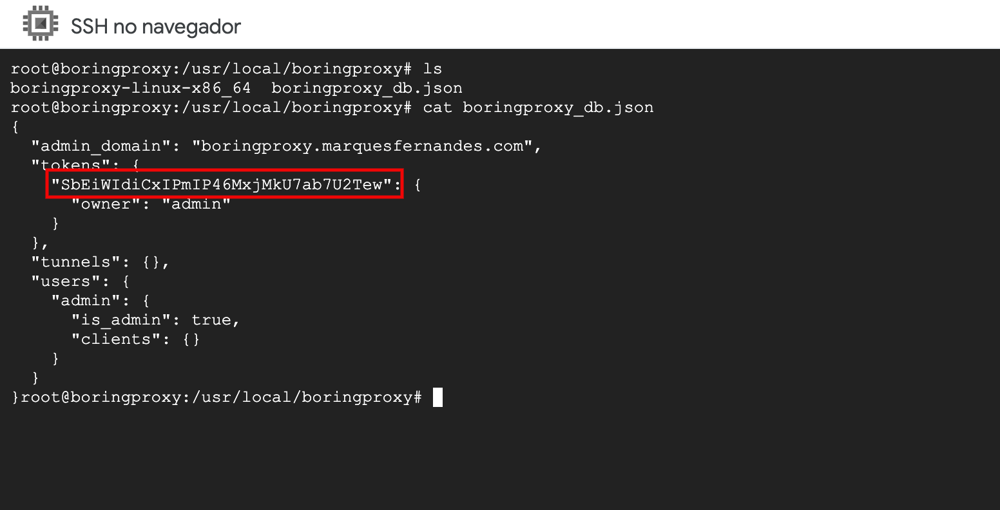

Run the command again `./boringproxy-linux-x86_64 server -admin-domain boringproxy.marquesfernandes.com` to start boringproxy and access the admin domain from your browser, in our case, `boringproxy.marquesfernandes.com` . If everything has been configured correctly, a screen asking for the admin token should appear, insert the token and access the admin panel. Keep the virtual machine's terminal window open and the service running for the next steps.

boringproxy admin panel

## Uploading some local applications

Let's leave some applications running on our local machine to expose them on the internet using the tunnels created. I'll use two simple examples, let's upload a React project and a Postgres database running on [docker](http://marquesfernandes.com/tecnologia/conteineres-e-docker-o-que-e-e-para-que-serve/) to test both an HTTPS and a TCP configuration, remembering that you can use it for any service you want to make available on the internet, be it an API, some other database, etc.

### [React App](https://create-react-app.dev/docs/getting-started)

Let's use the [create-react-app](https://create-react-app.dev/docs/getting-started) to create a simple application on our local machine and expose it publicly on the internet.

npx create-react-app my-app cd my-app npm start

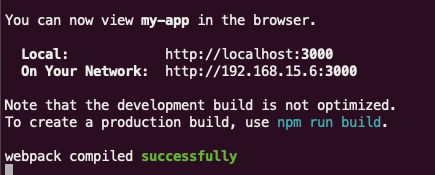

working react app

If all goes well, your application will be running and available on the port. `3000` . Leave that terminal running.

### Postgres on Docker

To upload the database, you need to have Docker installed and [run the following command](https://hub.docker.com/_/postgres) :

docker run --name my-postgres -e POSTGRES\_PASSWORD=123456 -p 5432:5432 postgres

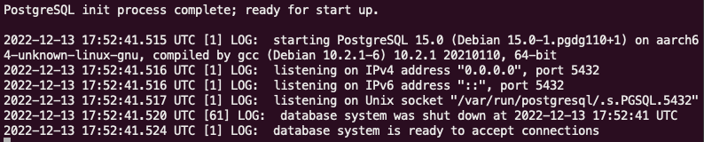

Running Postgres on Docker

Now we have our database available at the door `5432` . Use some bank client, like [DBvear](https://dbeaver.io/download/) , using the user `postgres` and the password `123456` to ensure that the connection was successful.

## creating the tunnels

Now that we already have some applications running, we can create the configuration of our tunnels, for that we will go back to the administrative panel in `boringproxy.marquesfernadnes.com` .

### adding a customer

Creating a client in boringproxy

First we need to create a client, for that navigate to the clients tab and add a client with the name of `admin` .

### creating the tunnels

The tunnels panel lets you create and remove tunnels.It provides a way to specify the settings for a tunnel:

-   **Domain**  
    The FQDN of a domain pointing to the `boringproxy` server.With the DNS wildcard setting, this can be any subdomain of the `admin-domain` .You must enter the **full domain** you want the tunnel to be accessed from, not just the subdomain.For example, if you had a wildcard DNS record `*.boringproxy.marquesfernandes.com` pointing to your boring proxy server and wanted a media server to be accessed at `api.boringproxy.marquesfernandes.com` , you would have to enter `api.boringproxy.marquesfernandes.com` in this field.
-   **Client Name**  
    Choose a Connected Client as a Tunnel Partner
-   **Customer Address**  
    The forwarding destination seen by the client
-   **Client Port**
-   Port forwarding to
-   **Allow External TCP**  
    Enable raw TCP tunneling for protocols other than HTTP
-   **Password Protect**  
    Enable to set username and password for HTTP basic authentication

Adding Tunnel to React Application

Now let's create our first tunnel, it will proxy to our React application. Configure the desired domain in the field of `domain` using the domain standard. wildcard we created.

-   **Domain:** react.boringproxy.marquesfernandes.com
-   **tunnel port** : Random
-   **Client Name** : admin
-   **Client Port** : 3000 (port of our react app)
-   **TLS Termination** : Client HTTPS

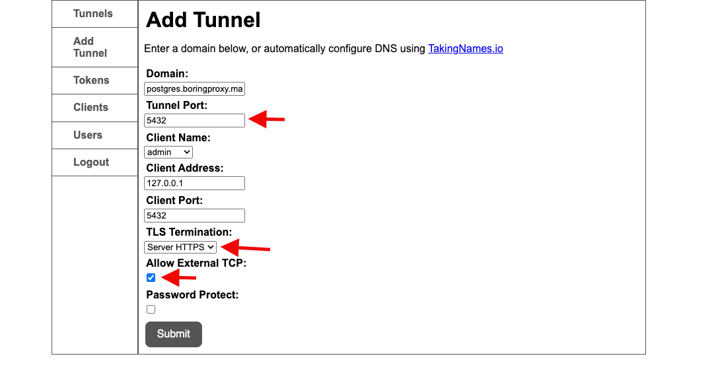

Adding the Tunnel to the Database

Let's also create a tunnel for our database, we will follow the same steps as the tunnel for React, however, changing some settings.

-   **tunnel port** : 5432
-   **TLS Termination** : Server HTTPS
-   **Allow External TCP** : Yea

Boringproxy tunnel listing

You will now see the two tunnels created as in the above listing.

## Configuring boringproxy on local machine

And finally, we need to install boringproxy on our local machine, follow the [official page installation instructions](https://boringproxy.io/installation/) for your respective operating system. Remembering that if you are using MacOS like me, you need to download the version `boringproxy-darwin-x86_64` and run the command `sudo chmod +x boringproxy-dawrin-x86_64` so that it becomes an executable.

Now we need to start the service to connect to our server, for that we will execute the following command:

./boringproxy-dawrin-x86\_64 client  -server boringproxy.marquesfernandes.com -user admin -token <token\_copied\_from\_server> -client-name admin

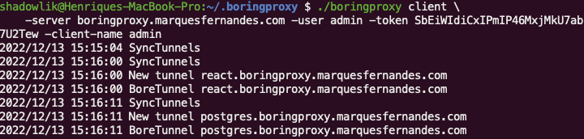

The tunnels will be synchronized, the necessary certificates for the client side will be issued and if everything goes as expected, your applications will now be available on the internet. In a browser access the URL configured for React and see the magic and test it with your database too.

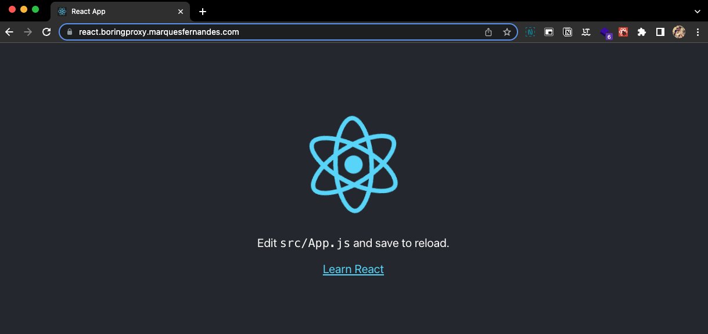

React App accessible via Proxy

## Configuring boringproxy to run as a service

If you want to configure boringproxy on the server side as a service, to avoid having to work every time you want to use it, needing to go to the server's ssh and upload it, follow the tutorial:

http://marquesfernandes.com/desenvolvimento/criando-um-servico-linux-com-systemd/
