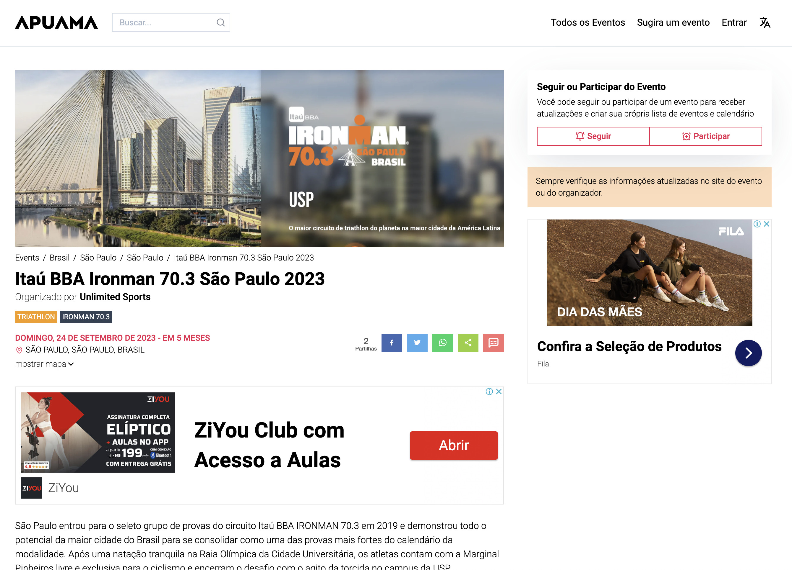

If you are a sports enthusiast, such as running, triathlon or swimming, you know how important it is to take part in events to improve your performance and challenge yourself. However, finding the right events can be difficult. Fortunately, there is a site that can help: [Apuama](https://apuama.app/).

[Apuama](https://apuama.app/) is a free site that lets you easily find running, triathlon and swimming events in your region or anywhere in the world. It provides detailed information about each event, such as distance, location, date and time, and lets you register directly on the site.

[https://apuama.app/](https://apuama.app/)

## What makes [Apuama](https://apuama.app/) so special?

[Apuama](https://apuama.app/) stands out for its ease of use and for the wide variety of sports events available. The site is designed to help athletes of all levels find events that fit their goals and skill level.

In addition, Apuama offers useful features, such as advanced search filters, to help you find exactly what you are looking for. You can filter events by sport type, location, date, distance and much more.

Another feature that makes Apuama so special is its community of athletes. The site lets you connect with other athletes, create groups and share your experiences and tips. You can also follow the progress of other athletes and take part in challenges to stay motivated.

## How to use [Apuama](https://apuama.app/)?

Apuama smart search

Using Apuama is very simple. Just go to the site, create a free account and start searching for running, triathlon and swimming events in your region or anywhere in the world. When you find an event of interest, you can register directly on the site and follow all the relevant information about the event.

## Conclusion

Event page

The [Apuama](https://apuama.app/) site is an indispensable tool for any athlete who wants to easily find running, triathlon and swimming events all over the world. With its wide variety of events, useful features and community of athletes, Apuama makes it easier than ever to find and take part in events. So, start using Apuama today and discover amazing events to improve your performance.
