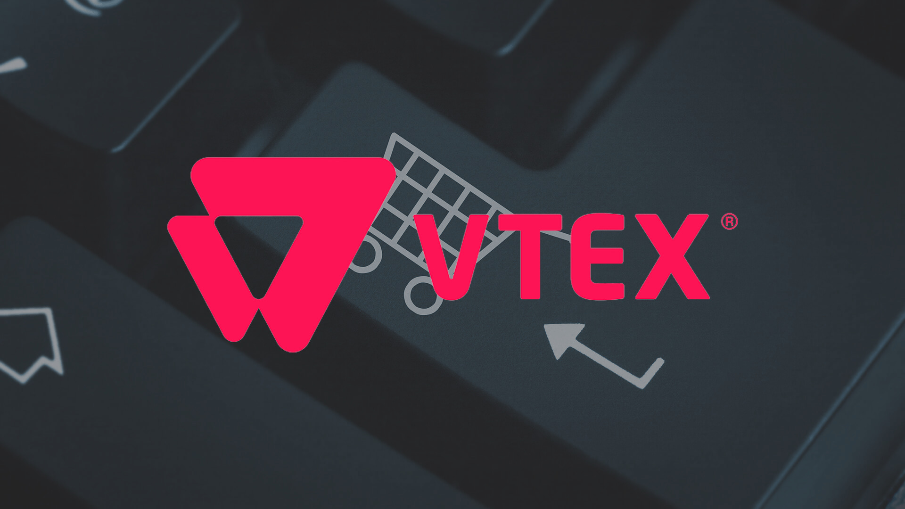

¿Busca ejemplos de documentación REST en línea? Separé 5 DOCUMENTATION DE APIs que recientemente me ayudaron como inspiración.

[Twitter AP](https://dev.twitter.com/overview/api)I

Twitter es una \[ˈtwɪtər\]red social y servidor de microblogging que permite a los usuarios enviar y recibir actualizaciones personales de otros contactos (en textos de hasta 280 caracteres, conocidos como "tweets"), a través del sitio web del servicio, sms, y software de gestión específico.

[Github AP](https://developer.github.com/v3/#parameters)I

GitHub es una plataforma de alojamiento de código fuente controlada por versiones que utiliza Git.

[Google Drive AP](https://developers.google.com/drive/v2/reference/files#resource)I

Google Drive es un servicio de almacenamiento y sincronización de archivos que fue introducido por Google el 24 de abril de 2012.

[Paypal AP](https://developer.paypal.com/docs/api/overview/)I

PayPal es una compañía de pago en línea con sede en San José, California, Estados Unidos. Fundada en 1998 por Peter Thiel y Max Levchin, opera internacionalmente y es una de las más grandes del negocio por poder hacer pagos rápidos y ayudar en los envíos de dinero.

[API de catálogo VT](https://documenter.getpostman.com/view/845/vtex-catalog-api/Hs44?version=latest)EX

VTEX es una tecnología multinacional brasileña enfocada en el desarrollador de comercio en la nube de la plataforma de comercio VTEX Cloud, disponible en el mercado como SaaS con operaciones globales.
