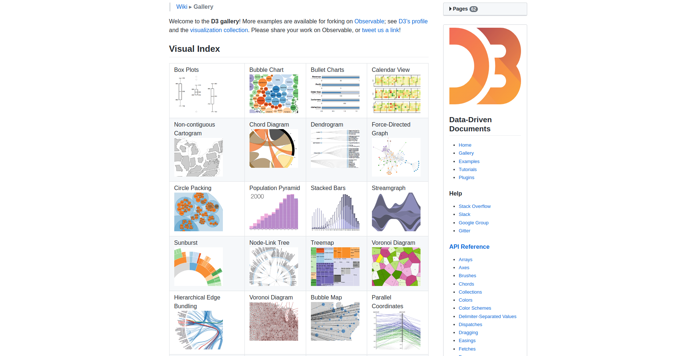
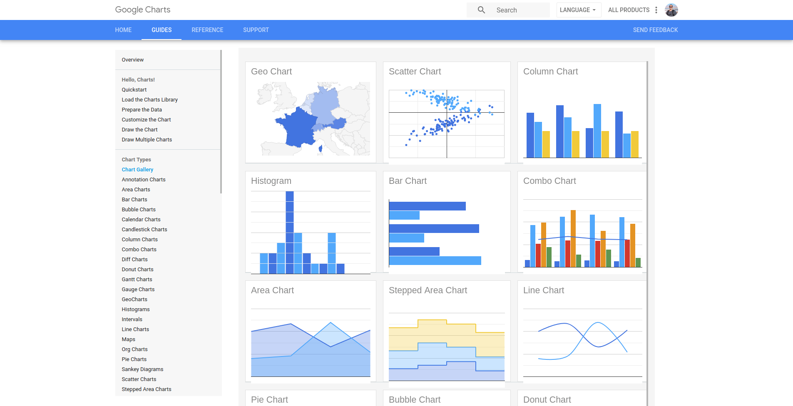
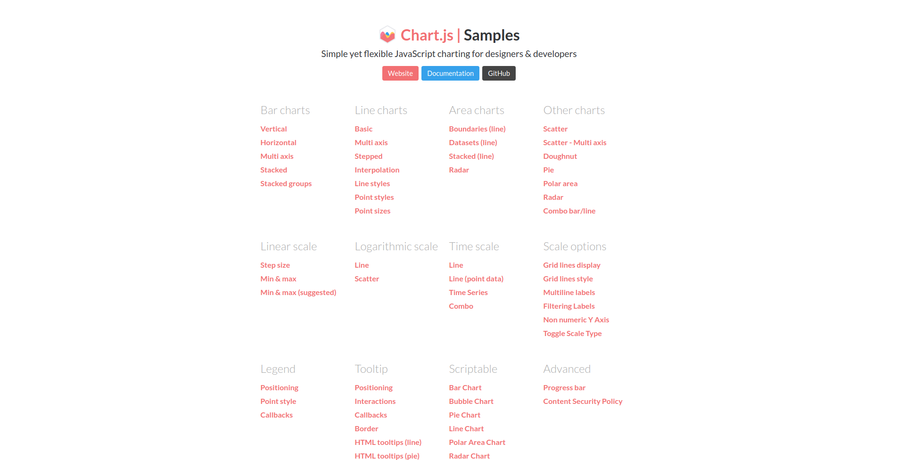
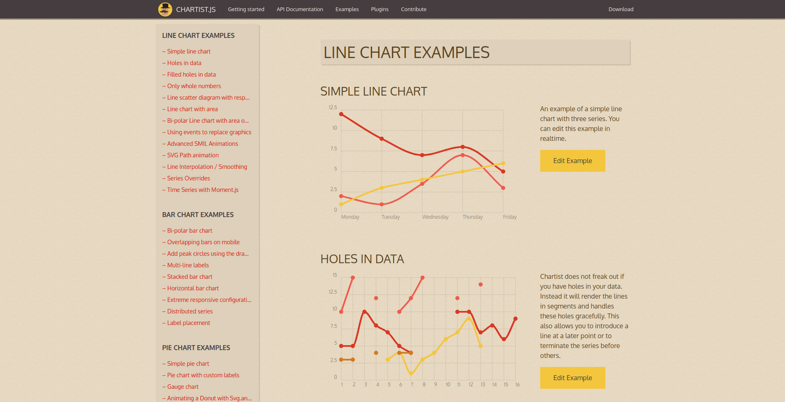
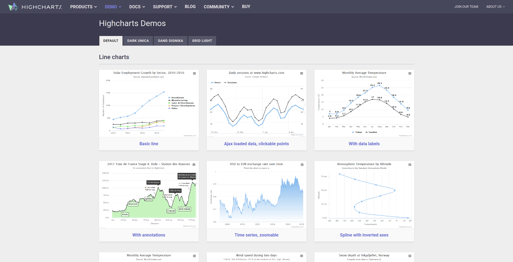
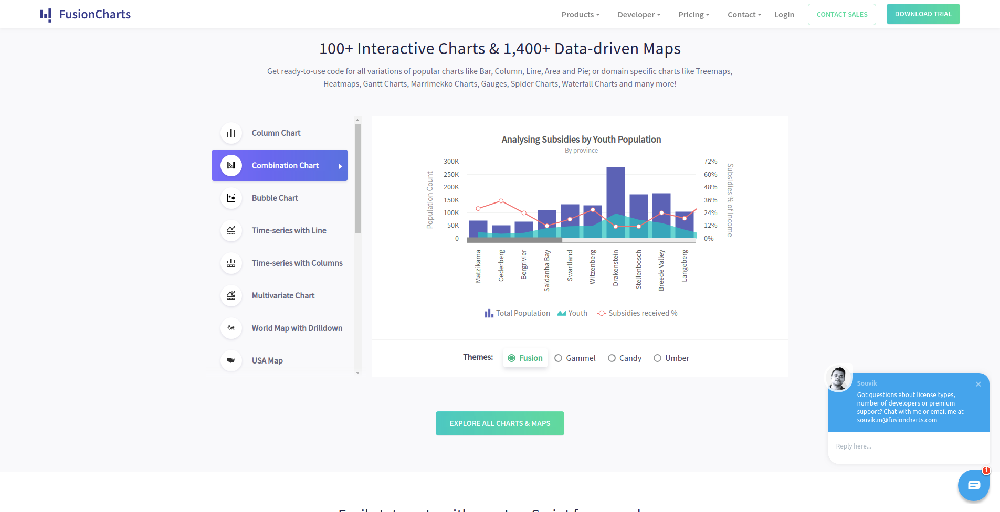

Procurando por bibliotecas para renderizar gráficos e visualizações? Separei 6 bibliotecas que vão te facilitar na criação de gráficos bonitos e interativos.

## **[Data-Driven Documents – D3.js](https://d3js.org/)**

[D3.js](https://d3js.org/)

D3.js é provavelmente uma das bibliotecas mais famosas da atualidade, utilizada em mais de [100k sites](https://www.wappalyzer.com/technologies/d3). Sua linguagem é bem próxima do [jQuery](https://jquery.com/) e possuí uma gama enorme de gráfios e visualizações facilitando a vida de quem deseja criar gráficos usando HTML, CSS e SVG. Um ponto negativo é sua performance em navegadores mais antigos.

### Sites que utilizam [D3.js](https://d3js.org/):

-   NYTimes
-   Uber
-   Weather.com

## **[Google Charts](https://developers.google.com/chart/)**

Google Charts

Google Charts possuí vários gráficos pré-feitos como gráficos de barra, gráficos de calendário, gráficos de área, gráficos geográficos, gráficos de setores circulares e muitos outros [gráficos multifuncionais](https://developers.google.com/chart/interactive/docs/examples), além de permitir a criação de gráfios mais simples.

Altamente customizáveis, os gráficos são representados usando HTML5 ou SVG que oferecem compatibilidade de navegador e portabilidade de plataformas. O Google Charts usa o [VML](https://en.wikipedia.org/wiki/Vector_Markup_Language) para suportar versões mais antigas do navegador do Internet Explorer, utilizado atualmente por mais de [30k sites](https://www.wappalyzer.com/technologies/google-charts).

## **[Chart.js](https://www.chartjs.org/)**

[Chart.js](https://www.chartjs.org/)

Chart.js é amado por sua simplicidade e objetividade, possuí uma ampla seleção de gráficos e exemplos. Compatível com navegadores antigos como IE7 e IE8 pelo uso de [polyfill](https://pt.stackoverflow.com/questions/194857/o-que-%C3%A9-polyfill) e responsivos por padrão. Por sua natureza opensource possuí uma comunidade ativa e muitos tutorias/exemplos disponíveis, usado em mais de [100k sites](https://www.wappalyzer.com/technologies/chart-js) com certeza é uma biblioteca para se ter no seu arsenal.

## **[Chartist.js](https://gionkunz.github.io/chartist-js/)**

[Chartist.js](https://gionkunz.github.io/chartist-js/)

Similar ao Chart.js, oferece belos gráficos responsivos. Renderizados em SVG, podem ser customizados utilizando CSS e contam com uma ampla comunidade auxiliando seu desenvolvimento, funciona bem com navegadores modernos e pesa apenas 10kb.

## **[HighCharts JS](https://www.highcharts.com/)**

Highcharts

Uma das bibliotecas mais famosas para construir gráficos, extremamente flexível e com diversas animações pré-carregadas que levarão seus gráficos para outro patamar. Possuí ampla compatibilidade com navegadores e dispositivos, compatível até com o IE6, é renderizado em SVG e conta com alta performance.

##  **[FusionCharts](https://www.fusioncharts.com/)**

[FusionCharts](https://www.fusioncharts.com/)

Uma das bibliotecas de gráficos mais antigas da internet, está entre nós desde 2002. Ganhou popularidade por ser compatível com navegadores mais antigos (IE6) e por sua facilidade em receber dados (XML, JSON). Seus gráficos podem ser exportados para JPG, PNG e PDF.
