¿Alguna vez ha necesitado compartir algún servicio, base de datos, API o sitio web que se está desarrollando en su máquina local públicamente en Internet con alguien? Hay formas de compartir sus proyectos sin necesariamente tener que subirlos a un servidor o nube.

Hace algún tiempo escribí el artículo [Tunelización/reenvío de puertos con SSH – Ubuntu/Debian](http://marquesfernandes.com/desenvolvimento/tunel-encaminhamento-de-portas-com-ssh-ubuntu-debian/) que explica exactamente cómo hacer esto usando solo el [SSH](https://pt.wikipedia.org/wiki/Secure_Shell) , sin embargo, para muchos esto puede no ser suficiente o difícil de administrar/mantener. Hay algunos servicios pagos como [ngrok](https://ngrok.com/) , pero su paquete gratuito es muy limitado y el paquete más barato termina siendo caro para proyectos personales simples (alrededor de 20 USD al mes), pero no te preocupes, hay soluciones de código abierto para eso.

El desarrollador Anders Pitman ha creado un repositorio realmente genial de [alternativas al ngrok](https://github.com/anderspitman/awesome-tunneling) , en este tutorial nos centraremos en un servicio específico, el [**aburridoproxy**](https://boringproxy.io/) .

## casos de uso

A continuación se presentan algunos casos de uso para este tipo de túnel.

-   Está desarrollando una aplicación local y necesita exponer su API públicamente para compartirla con alguien o simplemente usar alguna herramienta que necesita acceso a una URL pública
-   ¿Estás estructurando una base de datos y te gustaría conectarla para desarrollarla en una herramienta como [rediseñar](https://retool.com/)
-   Está creando una aplicación frontend y le gustaría probar con el [Velocidad de la página de Google](https://pagespeed.web.dev/) o alguna herramienta de benchmark y para eso las necesitas para poder encontrar tu proyecto públicamente en internet

Estos son algunos de los innumerables casos de uso, y lo mejor es que con boredproxy podemos exponer toda nuestra infraestructura a la vez, base de datos, API, interfaz y cualquier otro servicio que queramos exponer en Internet.

## [aburridoproxy](https://boringproxy.io/)

[aburridoproxy](https://boringproxy.io/) es una combinación de un proxy inverso y un administrador de túneles.

Lo que esto significa es que si tiene un servicio autohospedado (API, MySQL, Postgres, Redis, Frontend en React, Vue, Angular, ...) Al ejecutarse en una red privada local, boreproxy tiene como objetivo proporcionar la forma más fácil de exponer de forma segura (es decir, con soporte HTTPS e incluso protección con contraseña) este servidor a Internet, para que pueda acceder a él desde cualquier lugar.

## Puesta en marcha de nuestra infraestructura

Para este tutorial, básicamente necesitaremos una computadora que ejecute algunos servicios locales, un servidor con una IP pública de Internet y un dominio.

### Servidor con IP publica

Para el servidor con IP pública vamos a utilizar Google Cloud Platform porque nos ofrece una máquina en el [nivel libre](https://cloud.google.com/free/docs/free-cloud-features#compute) , es decir, no necesitaremos gastarnos ni un céntimo.

Primero necesitas crear una cuenta en [PCG](https://cloud.google.com/) . Después de crear la cuenta, crearemos una máquina virtual que se ajuste al nivel gratuito, que en este caso sería una *`e2-micro`* en cualquiera de las regiones: `nosotros-oeste1; us-central1; us-east1` .

Acceso al menú Compute Engine > Instancias de VM

Primero, debemos acceder a Compute Engine > Instancias de VM desde el menú lateral.

Habilitación de la API de Compute Engine

Si es la primera vez que accede al servicio Compute Engine de Google, se le pedirá que habilite la API, simplemente haga clic en `Habilitar` y espera a que termine la activación.

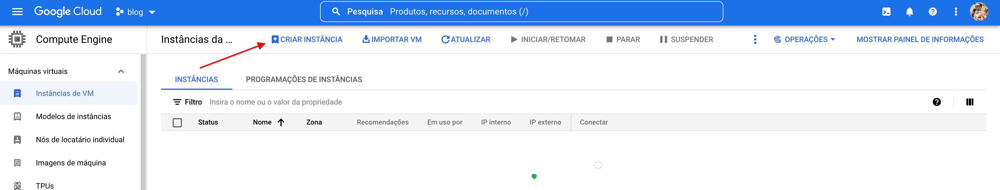

Crear instancia de máquina virtual

Haga clic en el `Crear instancia` para comenzar a configurar nuestra nueva máquina virtual en GCP.

Configurando nuestra nueva VM

Ahora configuremos nuestra máquina virtual con la configuración que se aplica dentro del plan gratuito de Google Cloud, `e2-micro` y la región escogida fue `us-central1 (Iowa)` . No te preocupes si aparece un precio a la derecha, el descuento del nivel gratuito se aplicará al final de cada ciclo de pago.

Por defecto la máquina se creará con el sistema operativo [Debian](https://wiki.debian.org/pt_BR/DebianIntroduction) y un disco persistente de 10 GB, procedamos con esta configuración predeterminada para nuestro tutorial.

Habilitación de los protocolos HTTP y HTTPS

Necesitamos agregar una última configuración, bajando la página encontrarás la sección Firewall, selecciona habilitar el tráfico HTTP y HTTPS en el servidor.

Ahora haga clic en Crear y espere a que se cree la máquina virtual.

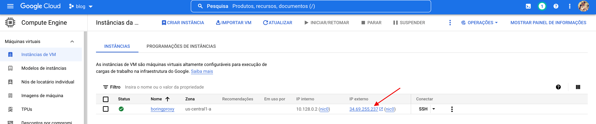

Copie la IP pública de la máquina

Con la creación terminada, ahora tenemos la IP pública de nuestra máquina, guarde este número, lo usaremos para configurar nuestro dominio.

## configurando el dominio

Siempre indico como solucionador de DNS el [Llamarada de la nube](https://cloudflare.com/) , porque ofrece muchos servicios geniales y lo mejor, es gratis. Si usas algún otro servicio, accede a él para configurar los dominios necesarios para que boreproxy funcione.

Necesitaremos configurar dos dominios, el primer dominio se referirá al panel administrativo de aburridoproxy, por ejemplo, `aburridoproxy.marquesfernandes.com` y el segundo sera un dominio tipo wildcard, se encargara de gestionar automaticamente los tuneles que vamos a crear mas adelante, en este caso vamos a crear un dominio `*.boringproxy.marquesfernandes.com` .

Ambos apuntarán al mismo lugar, la IP pública de nuestro servidor creado en el paso anterior, por lo que nuestra configuración para el primer dominio será del tipo `EL` y del segundo usaremos un `CNOMBRE` a la primera, de esa manera si necesitamos cambiar la configuración en el futuro, solo necesitamos cambiarla en un lugar.

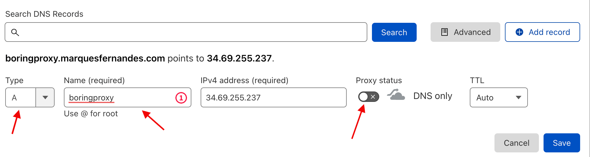

Creando el primer dominio

Cree el primer dominio seleccionando el tipo A, ingrese la IP del servidor copiada en el paso anterior y no olvide deshabilitar el proxy de Cloudflare.

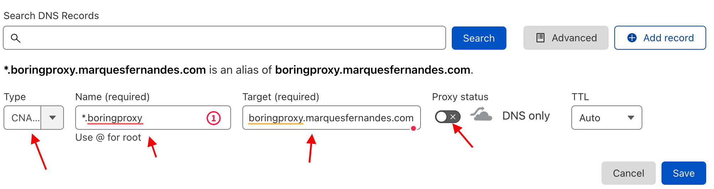

Creación del dominio comodín

Ahora necesitamos crear nuestro dominio comodín, para eso usaremos el `*` antes del nombre del subdominio que queremos usar, en este caso `*.boringproxy.marquesfernandes.com` , se encargará de cuando creamos nuestros túneles en boreproxy, por ejemplo, `api.boringproxy.marquesfernandes.com` la configuración funciona sin necesidad de crear subdominios en Cloudflare.

## Configurando boredproxy en el servidor

Ahora que tenemos nuestros dominios configurados, finalmente podemos comenzar a configurar el aburrido proxy en nuestro servidor, para eso accederemos al SSH de nuestra máquina virtual. Vuelva a la lista de máquinas virtuales en Google Cloud y seleccione la máquina creada, haga clic en el botón SSH y se abrirá una nueva ventana con nuestro terminal.

Acceder a SSH desde la máquina virtual

Espere a que se transfieran las claves SSH y debería cargarse una ventana similar a esta:

Terminal SSH de máquina virtual

Bien, ahora vamos a crear una carpeta que albergará la instalación de boreproxy, recomiendo que la carpeta se cree en `/usr/local/boringproxy` . Debido a que es una carpeta en una ubicación que requiere permisos de root, necesitamos usar el comando sudo. usemos `sudo su` por lo que no tiene que escribir sudo todo el tiempo, pero tenga cuidado, ejecutará cualquier comando con privilegios elevados.

$ sudo su mkdir /usr/local/boringproxy

Ingrese a la carpeta usando el comando `cd /usr/local/boringproxy` .

Seguiremos el [instrucciones de instalación de la documentación de boreproxy](https://boringproxy.io/installation/) para Linux x86\_64.

Dentro de la carpeta creada ejecuta:

curl -LO https://github.com/boringproxy/boringproxy/releases/latest/download/boringproxy-linux-x86\_64 chmod +x boredproxy-linux-x86\_64 sudo setcap cap\_net\_bind\_service=+ep boredproxy-linux-x86\_64

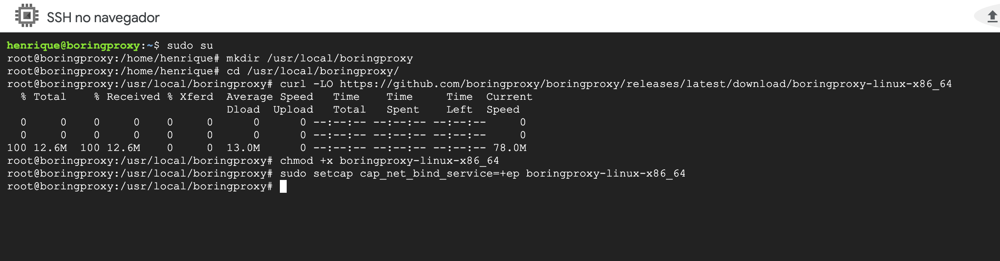

Si tiene la intención de usar túneles para servicios de reenvío, como una base de datos, que usan el protocolo TCP y no HTTP, debemos editar la configuración de sshd para permitir el reenvío de puertos TCP.

Editemos el archivo `/etc/ssh/sshd_config` e intercambiar `GatewayPorts no` por `GatewayPorts especificado por el cliente` . Puedes usar tu editor favorito, en mi caso, `nano /etc/ssh/sshd_config` .

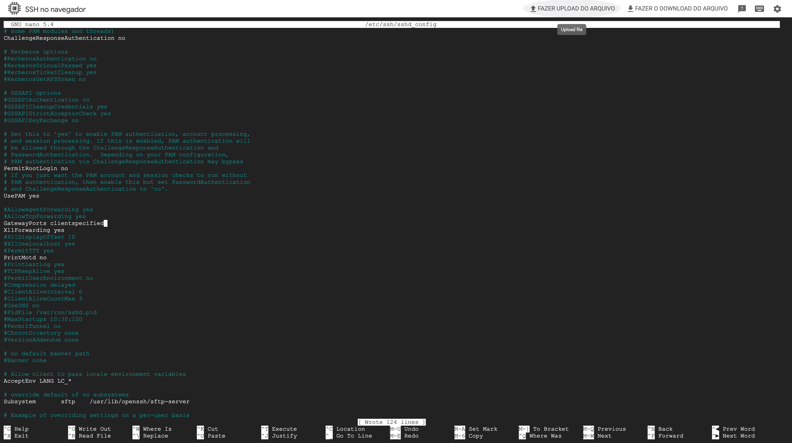

### Iniciando boreproxy en el servidor

Muy bien, ahora podemos [empieza a aburrir al proxy](https://boringproxy.io/usage/) en nuestro servidor, en el siguiente comando cambie `aburridoproxy.marquesfernandes.com` por el primer dominio que configuró.

./boringproxy-linux-x86\_64 servidor -admin-dominio aburridoproxy.marquesfernandes.com

Se solicitará su correo electrónico, esta información se utiliza para generar los certificados HTTPS necesarios utilizando el [Vamos a cifrar](https://letsencrypt.org/pt-br/) . Si todo es correcto, debería ver el mensaje `Certificado obtenido con éxito...`

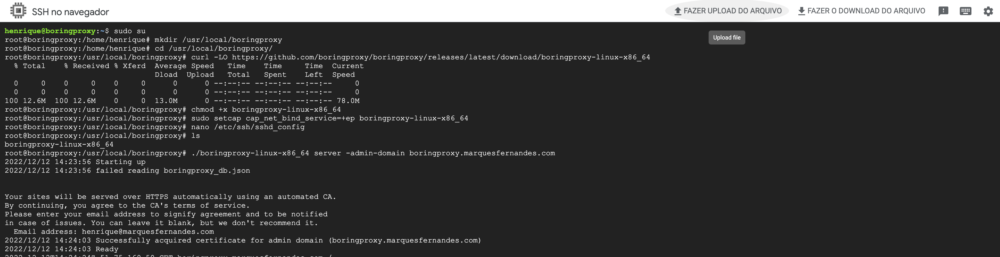

Usa el comando `ctrl + c` para cancelar el servicio, ahora usa el comando `ls` para enumerar los archivos en la carpeta, tenga en cuenta que se creó un archivo llamado boredproxy\_db.json, es una mini base de datos de configuraciones de boredproxy. Usa el comando `gato aburridoproxy_db.json` para ver el contenido del archivo y obtener el token de acceso, guárdelo en un lugar seguro.

Ejecute el comando de nuevo `./boringproxy-linux-x86_64 servidor -admin-dominio aburridoproxy.marquesfernandes.com` para comenzar a aburrirproxy y acceder al dominio de administración desde su navegador, en nuestro caso, `aburridoproxy.marquesfernandes.com` . Si todo se ha configurado correctamente, debería aparecer una pantalla solicitando el token de administrador, inserte el token y acceda al panel de administración. Mantenga abierta la ventana de terminal de la máquina virtual y el servicio en ejecución para los siguientes pasos.

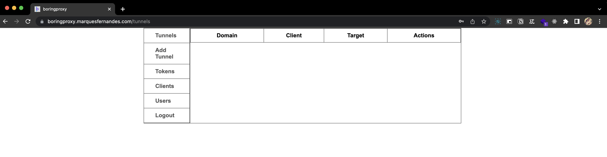

panel de administración de proxy aburrido

## Subiendo algunas aplicaciones locales

Dejemos algunas aplicaciones ejecutándose en nuestra máquina local para exponerlas en Internet usando los túneles creados. Usaré dos ejemplos simples, subamos un proyecto React y una base de datos Postgres ejecutándose en [estibador](http://marquesfernandes.com/tecnologia/conteineres-e-docker-o-que-e-e-para-que-serve/) para probar tanto una configuración HTTPS como TCP, recordando que puedes usarla para cualquier servicio que quieras poner a disposición en internet, ya sea una API, alguna otra base de datos, etc.

### [Reaccionar aplicación](https://create-react-app.dev/docs/getting-started)

usemos el [crear-reaccionar-app](https://create-react-app.dev/docs/getting-started) para crear una aplicación simple en nuestra máquina local y exponerla públicamente en Internet.

npx create-react-app my-app cd my-app npm start

aplicación de reacción de trabajo

Si todo va bien, su aplicación estará ejecutándose y disponible en el puerto. `3000` . Deje esa terminal en ejecución.

### Postgres en Docker

Para cargar la base de datos, debe tener Docker instalado y [ejecuta el siguiente comando](https://hub.docker.com/_/postgres) :

docker run --name my-postgres -e POSTGRES\_PASSWORD=123456 -p 5432:5432 postgres

Ejecutando Postgres en Docker

Ahora tenemos nuestra base de datos disponible en la puerta `5432` . Usa algún cliente bancario, como [DBvear](https://dbeaver.io/download/) , usando el usuario `postgres` y la contraseña `123456` para asegurarse de que la conexión fue exitosa.

## creando los túneles

Ahora que ya tenemos algunas aplicaciones corriendo, podemos crear la configuración de nuestros túneles, para eso volveremos al panel administrativo en `aburridoproxy.marquesfernadnes.com` .

### agregando un cliente

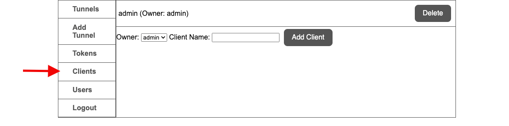

Creando un cliente en boredproxy

Primero necesitamos crear un cliente, para eso navegue a la pestaña de clientes y agregue un cliente con el nombre de `administración` .

### creando los túneles

El panel de túneles le permite crear y eliminar túneles.Proporciona una forma de especificar la configuración de un túnel:

-   **Dominio**  
    El FQDN de un dominio que apunta al `aburridoproxy` servidor.Con la configuración de comodín de DNS, puede ser cualquier subdominio del `admin-dominio` .Debes ingresar al **dominio completo** desde el que desea acceder al túnel, no solo al subdominio.Por ejemplo, si tuviera un registro DNS comodín `*.boringproxy.marquesfernandes.com` apuntando a su aburrido servidor proxy y quería acceder a un servidor de medios en `api.boringproxy.marquesfernandes.com` , tendrías que entrar `api.boringproxy.marquesfernandes.com` en este campo.
-   **nombre del cliente**  
    Elija un cliente conectado como socio de túnel
-   **Dirección del cliente**  
    El destino de reenvío visto por el cliente
-   **Puerto del cliente**
-   Reenvío de puertos a
-   **Permitir TCP externo**  
    Habilite el túnel TCP sin formato para protocolos que no sean HTTP
-   **Proteger con contraseña**  
    Habilite para establecer el nombre de usuario y la contraseña para la autenticación básica HTTP

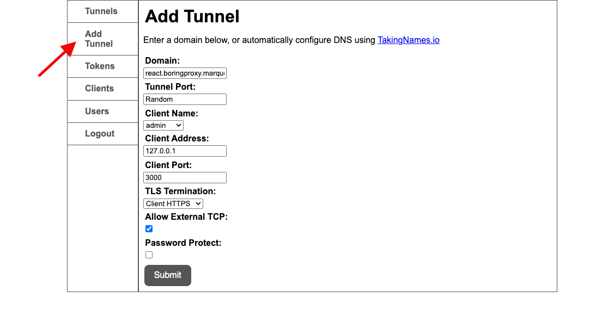

Agregar túnel a la aplicación React

Ahora vamos a crear nuestro primer túnel, se conectará a nuestra aplicación React. Configure el dominio deseado en el campo de `dominio` utilizando el estándar de dominio. comodín que creamos.

-   **Dominio:** react.boringproxy.marquesfernandes.com
-   **puerto de túnel** : Aleatorio
-   **nombre del cliente** : administrador
-   **Puerto del cliente** : 3000 (puerto de nuestra aplicación de reacción)
-   **Terminación TLS** : Cliente HTTPS

Agregar el túnel a la base de datos

También vamos a crear un túnel para nuestra base de datos, seguiremos los mismos pasos que el túnel para React, sin embargo, cambiaremos algunas configuraciones.

-   **puerto de túnel** : 5432
-   **Terminación TLS** : Servidor HTTPS
-   **Permitir TCP externo** : Sí

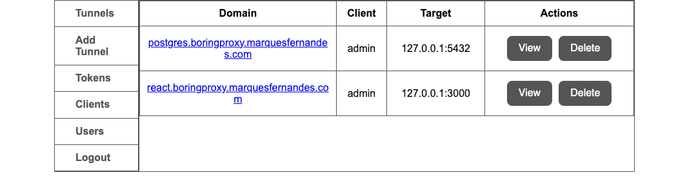

Listado de túneles Boringproxy

Ahora verá los dos túneles creados como en la lista anterior.

## Configuración de boreproxy en la máquina local

Y finalmente, necesitamos instalar boredproxy en nuestra máquina local, siga las [instrucciones de instalación de la página oficial](https://boringproxy.io/installation/) para su respectivo sistema operativo. Recordando que si está usando MacOS como yo, necesita descargar la versión `aburridoproxy-darwin-x86_64` y ejecuta el comando `sudo chmod +x boredproxy-dawrin-x86_64` para que se convierta en un ejecutable.

Ahora necesitamos iniciar el servicio para conectarnos a nuestro servidor, para eso ejecutaremos el siguiente comando:

./boringproxy-dawrin-x86\_64 cliente  -servidor boreproxy.marquesfernandes.com -user admin -token <token\_copied\_from\_server> -client-name admin

Los túneles se sincronizarán, se emitirán los certificados necesarios para el lado del cliente y, si todo sale como se espera, sus aplicaciones ya estarán disponibles en Internet. En un navegador, acceda a la URL configurada para React y vea la magia y pruébela también con su base de datos.

Aplicación React accesible a través de Proxy

## Configurando boredproxy para que se ejecute como un servicio

Si quieres configurar boredproxy del lado del servidor como un servicio, para no tener que trabajar cada vez que quieras usarlo, necesitando ir al ssh del servidor y subirlo, sigue el tutorial:

http://marquesfernandes.com/desenvolvimiento/criando-um-servico-linux-com-systemd/
