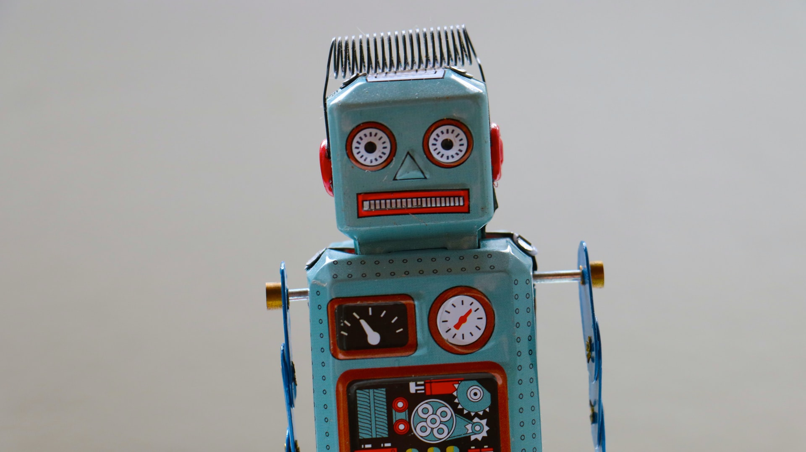

Vivimos un tiempo tenso en nuestra historia, la incertidumbre de un virus desconocido y letal trajo cambios drásticos a nuestro estilo de vida. Creo que después de esta crisis veremos una aceleración en la transformación digital, nunca antes tantas empresas han tenido que adoptar el modelo de "oficina en casa" y buscar soluciones digitales, por forzadas que sean, esto hará que muchas miren con otros ojos nuevos modelos de trabajo.

Varias, tal vez incluso la mayoría, innovaciones llegaron después de momentos de estrés como el que estamos experimentando. La necesidad de pensar fuera de la caja obliga a las personas y a las empresas a buscar soluciones innovadoras. ¡Por eso creo que vamos a salir de este más fuerte y tecnológico que nunca!

Podemos ver cuánta tecnología se ha ayudado en la lucha contra Coronavirus, se han utilizado muchas soluciones, así que separé algunos ejemplos interesantes para compartir con ustedes.

## 1\. [Aplicación Cornavirus SUS](https://www.gov.br/pt-br/apps/coronavirus-sus)

El Ministerio de Salud, en una respuesta muy rápida, lanzó una aplicación llamada [Coronavirus - SUS](https://www.gov.br/pt-br/apps/coronavirus-sus). La aplicación cuenta con todo, desde descripciones de síntomas, consejos de prevención, cuáles son las formas de transmitir y un mapa con las unidades de salud gratuitas disponibles más cercanas a su ubicación.

Pero la función principal de la aplicación es analizar el estado de salud del usuario, funcionando como un cribado digital. Si se siente mal y tiene posibles síntomas del virus, el usuario puede responder a un cuestionario en la aplicación que evalúa e indica el riesgo de infección.

Algo encomiable y sorprendente procedente del sector público, que suele estar muy atrasado tecnológicamente, en menos de un mes la aplicación ya tenía más de 3 millones de descargas. Puedes encontrar los enlaces para descargar en tu móvil [aquí](https://www.gov.br/pt-br/apps/coronavirus-sus).

## 2\. [Universidad Johns Hopkins, Nueva](https://www.arcgis.com/apps/opsdashboard/index.html#/bda7594740fd40299423467b48e9ecf6)

[Panel de Monitoreo del Centro de Sistemas de Ciencia e Ingeniería](https://www.arcgis.com/apps/opsdashboard/index.html#/bda7594740fd40299423467b48e9ecf6)

El [Centro de Sistemas para la Ciencia y la Ingeniería (CSS](https://systems.jhu.edu/)E) de la Universidad Johns Hopkins se ha convertido en el centro de datos de coronavirus del mundo, han proporcionado un panel para monitorear casos en todo el mundo, separados por países y en algunos casos por estado. Además, utilizan un repositorio en Github [para c](https://github.com/CSSEGISandData/COVID-19)ompartir todos los datos reportados y organizados por el mundo de COVID-19, sirviendo como base para que los investigadores analicen y desarrollen proyecciones.

## 3\. Inteligencia Artificial

### 3.1 Monitoreo y detección preventivos

La compañía canadiens[e BlueD](https://bluedot.global/)ot desarrolla un algoritmo de inteligencia artificial que escanea miles de fuentes, documentos, publicaciones médicas e incluso condiciones climáticas, en busca de información sobre posibles enfermedades y su capacidad para proliferar. Fue esta tecnología la que, en diciembre de 2019, advirtió de la aparición de una nueva enfermedad respiratoria en Wuhan, China. Exactamente 9 días antes de la primera comunicación oficial realizada por la Organización Mundial de la Salud (OMS).

### 3.2 Análisis de medicamentos

La carrera por los medicamentos y las vacunas contra el COVID-19 se ha convertido en el objetivo de mucha presión. Una solución viable a corto plazo es el "reposicionamiento de las drogas", en el que tratan de averiguar si los medicamentos existentes y aprobados para el consumo humano son alternativas viables para el combate. Esta investigación comenzó con 2.000 fármacos posibles, y después de un análisis por un algoritmo de inteligencia artificial redujo ese número a 16.

### 3.3 Diagnóstico de Coronavirus

La empresa estadounidense de inteligencia artificial I[nfervision ha](https://www.wired.com/story/chinese-hospitals-deploy-ai-help-diagnose-covid-19/) desarrollado una solución que ayuda a detectar y monitorear la enfermedad de manera efectiva. La solución tiene como objetivo mejorar la velocidad del diagnóstico de las tomografías computarizadas. Otra compañía que entró en la luda contra el coronavirus fue Alibaba de China, desarrolló un si[stema de inteligencia artificial](https://thenextweb.com/neural/2020/03/02/alibabas-new-ai-system-can-detect-coronavirus-in-seconds-with-96-accuracy/) que dicen tener una precisión del 96% en el diagnóstico de COVID-19 en cuestión de segundos.

## 4\. Telemedicina

El Consejo Federal de Medicina (CFM) autorizó el 19 de marzo el [uso de la telemedic](https://pebmed.com.br/tecnologias-que-ampliaram-o-acesso-a-tratamentos-e-diagnosticos-no-brasil-telemedicina/)ina durante **[la pandemia COVID-1](http://marquesfernandes.com/?p=8003&preview=1&_ppp=97c26d0e74)**9.

La telemedicina debe utilizarse en las siguientes formas:

-   **Orientación**: Los profesionales llevan a cabo la orientación y derivación de pacientes de forma aislada a distancia.
-   **Monitoreo: Mo**nitoreo del progreso del paciente.
-   **Interconsulta:** Intercambio de información y opiniones entre médicos, para asistencia diagnóstica o terapéutica.

## 5\. Aplicación para monitorear pacientes con Coronavirus

Corea del Sur ha desarrollado un[a aplicaci](https://www.mois.go.kr/frt/bbs/type002/commonSelectBoardArticle.do;jsessionid=7bA+UtY0JOIXJytznXoyYNHR.node40?bbsId=BBSMSTR_000000000205&nttId=76155)ón para vigilar a los pacientes con casos confirmados y en cuarentena. La aplicación, desarrollada por el Ministerio del Interior y Seguridad, permite a aquellos que necesitan pacientes que necesitan ser puestos en cuarentena y no salir de casa poder estar en contacto con los responsables de su caso e informar de su progreso. También utiliza GPS para rastrear su ubicación y asegurarse de que no están rompiendo la cuarentena.

## 6\. Servicios gratuitos durante la pandemia

Debido a la repentina demanda de servicios y tecnologías para facilitar la oficina en el hogar, varias empresas liberaron el acceso a sus productos y servicios de forma gratuita durante este período turbulento. Una noble acción que fue muy bien vista por la comunidad, sigue una lista de algunas empresas que se unieron a este movimiento:

### 6.1 Adobe Creative Cloud

Adobe ahora ofrece acceso gratuito a las aplicaciones de Adobe Cloud en los ordenadores personales de los alumnos y profesores, pero solo ba[jo petición](https://helpx.adobe.com/enterprise/kb/covid-19-education-labs.html). El acceso estará disponible de forma gratuita hasta el 31 de mayo de 2020.

### 6.2 Asana

Asana ofrece sus servicios premium, Asana Business, a cualquier organización sin fines de lucro que esté actuando directamente en primera línea contra COVID-19.

### 6.3 Cisco (WebEx)

Cisco, una empresa de seguridad de la información, ha ampliado las capacidades de su producto de reunión en línea, WebEx, ofreciéndolo de forma gratuita en todos los países que operan.

-   Uso ilimitado (sin restricciones de tiempo)
-   Hasta 100 participantes

### 6.4 Cloudflare

Cloudflare ha lanzado su servicio gratuito Cloudflare for Teams a pequeñas empresas durante al menos seis meses. El paquete permite a los empleados conectarse desde su casa a los recursos internos de la empresa mediante una VPN.

### 6.5 Google

Google está liberando acceso gratuito a las funciones de videoconferencia de Hangouts Meet para sus clientes de G Suite (Google Apps) y G Suite for Education.

-   Hasta 250 participantes por llamada
-   Transmisión en vivo para hasta 100.000 espectadores

### 6.6 Microsoft

Microsoft lanzó Microsoft Teams de forma gratuita durante los próximos seis meses.

### 6.7 Slack

Sl**ack e**stá poniendo su versión de pago a disposición de las empresas que han estado trabajando directamente para combatir el coronavirus.

## Conclusión

La tecnología y la salud son aliados de larga data, y en situaciones como esta tiende a fortalecer y aportar nuevas soluciones al bien común. **Si ha notado el uso de la tecnología en cualquier otro ámbito que no se enumera aquí, por favor comparta con nosotros y deje su comentario a continuación.**
