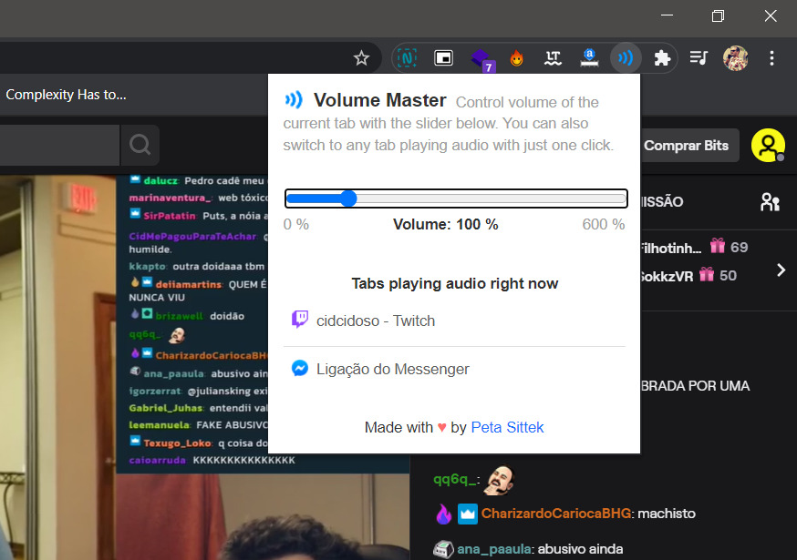

¿Alguna vez ha tenido dos o más pestañas abiertas con sonido? Ya sea escuchando música, viendo un video, una videoconferencia o todo junto, probablemente ya pensaste que sería interesante poder controlar individualmente el volumen de cada pestaña. Si ya te has atrapado en este escenario, no te preocupes, hay una extensión de Google Chrome que te permite controlar el volumen del sonido por pestaña, e*l Volume Maste*r. Esto es útil cuando desea enfocar y escuchar una pestaña a un volumen más alto que la otra. Puede disminuir fácilmente la intensidad de las canciones o los sonidos en diferentes pestañas y también crear algunos otros efectos.

## Maestro de volumen para controlar el volumen de la pestaña en Google Chrome

Puede descargar Volume Master de forma fáci*l y segura de*sde Chrome Web Store. Una vez descargado e instalado, puede acceder y controlar el volumen de cada pestaña simplemente haciendo clic en el icono de la extensión.

Si el icono no está visible, debe hacer clic en el icono del rompecabezas y seleccionar hacerlo visible en los accesos directos de la extensión:

### Ajuste el volumen en las pestañas de Chrome por separado

Para controlar el volumen de una pestaña, haga clic en el í*cono Volume Ma*ster y ajuste la barra de control para controlar individualmente el volumen de esa pestaña. Puedes elegir entre 100% hasta 600%, la extensión incluso es capaz de aumentar el volumen de la música o videos que estás reproduciendo en la pestaña, pero con pérdida de calidad.

Puede cambiar del 10% al 10%, lo que le da un buen control sobre el volumen de cada pestaña, casi 60 niveles de volumen.

Puede ver a continuación la lista de guías que están reproduciendo audio. Al hacer clic en cualquier elemento de la lista, accederá a esa pestaña abierta. ¡Todas las pestañas ahora tienen control de volumen independiente!

Volume Master es completamente gratuito y no muestra anuncios. Tiene unos 20 KB. En general, es una extensión pequeña, segura y muy útil para tu Google Chrome.

[Haga clic aquí para descargar el maestro de volumen](https://chrome.google.com/webstore/detail/volume-master/jghecgabfgfdldnmbfkhmffcabddioke?hl=en)
