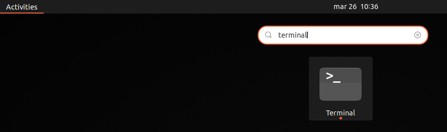
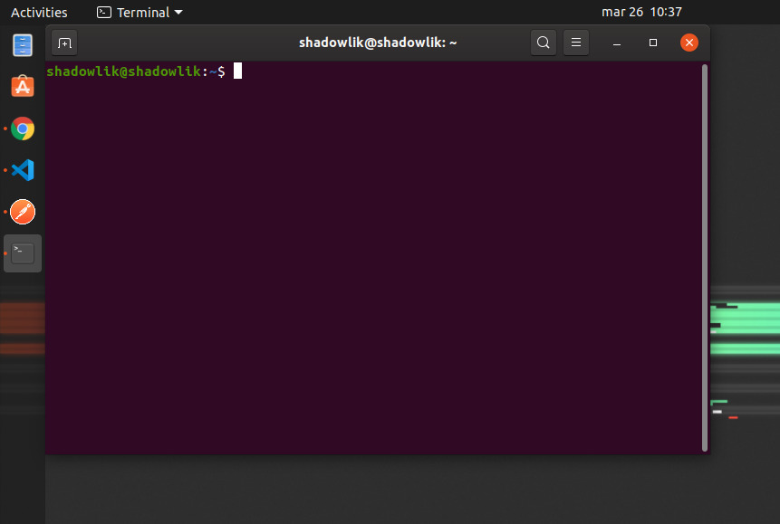
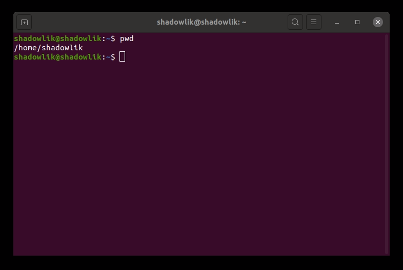
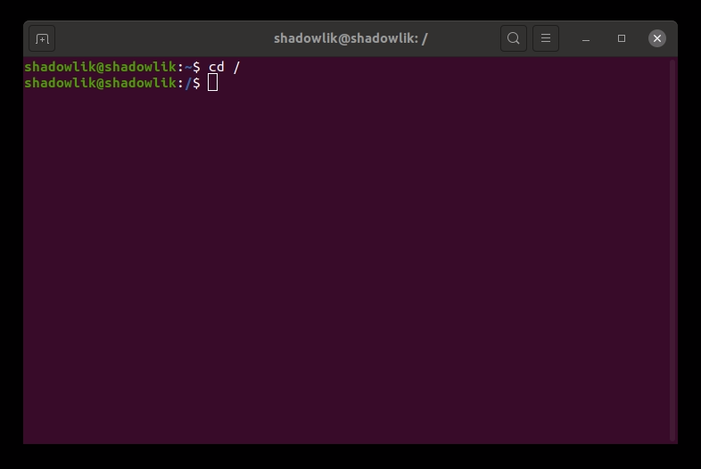
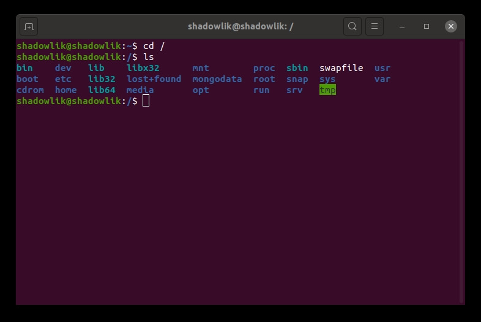
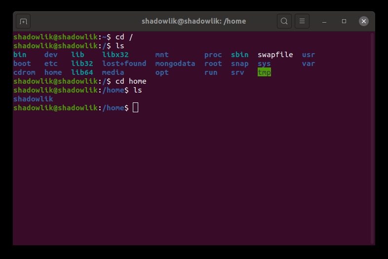
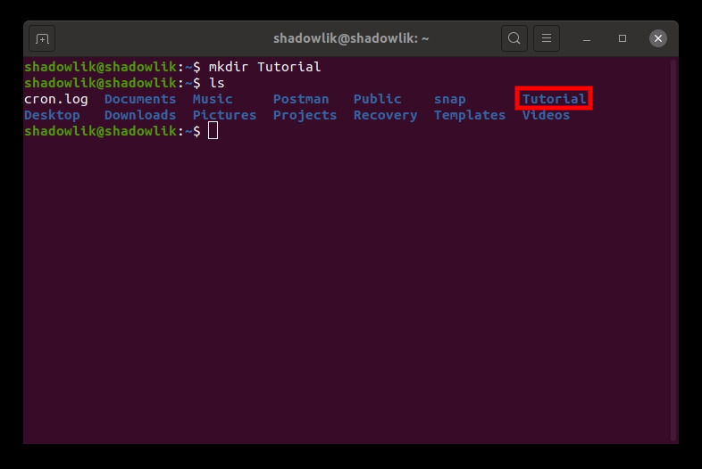
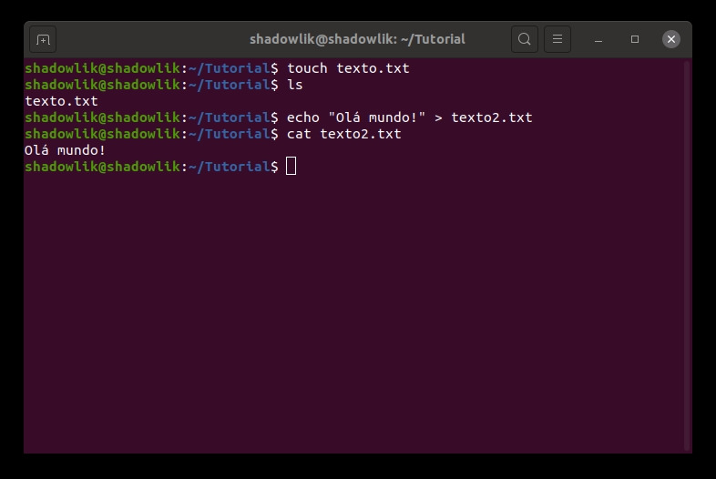
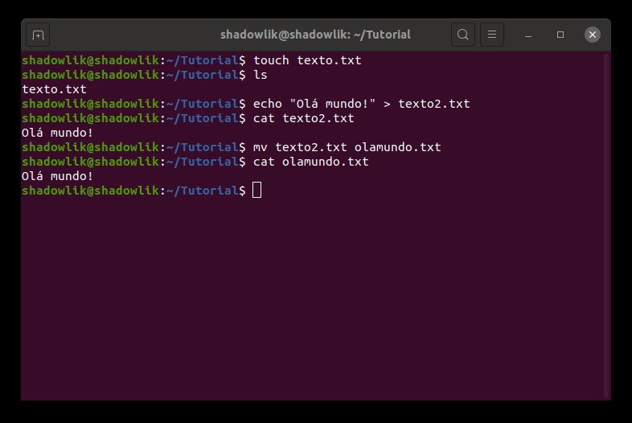
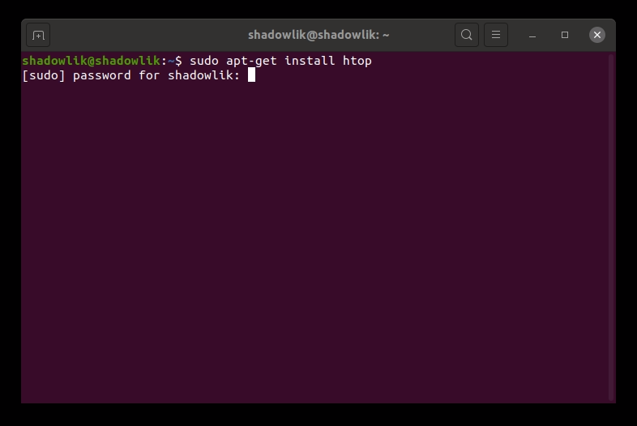

El terminal en Linux es una herramienta muy potente y puede hacer su vida mucho más fácil. Usted no necesita tener miedo de ella, el terminal no está hecho sólo para los piratas informáticos de películas para utilizar, se puede y debe!

## Terminal; Consola; Shell, Año Nuevo., Año Nuevo Pregunta;

La línea de comandos de Linux es una interfaz de texto, todos los comandos se insertan en el formato de texto. Tiene varios nombres, y por lo general se puede llamar s*hell*, *terminal*, *consol*a o *prompt*.

## Lo que aprenderás

1.  Breve historia de la línea de comandos
2.  Cómo acceder a su Terminal
3.  Cómo manipular carpetas y archivos (Comandos básicos)
4.  Otros comandos útiles
5.  Encadenamiento de mandos
6.  Comandos con privilegios

## Lo que necesitarás

En este tutorial vamos a utilizar ejemplos utilizando el sistema op[erativo](https://ubuntu.com/) Ubuntu, pero todas las distribuciones de Linux tienen línea de comandos y se pueden utilizar, algunos comandos pueden necesitar ser adaptados.

## Breve historial de la línea de comandos

Durante los primeros años de la nueva industria informática, uno de los primeros sistemas operativos creados fue Unix. Está diseñado para funcionar como un sistema multiusuario en ordenadores mainframe (ordenadores grandes - para la época), y los usuarios están conectados de forma remota a través de terminales individuales. Estos terminales eran bastante básicos en comparación con lo que conocemos hoy en día: sólo un teclado y una pantalla, incoloro e impotente para ejecutar programas localmente. Su uso se limitó a enviar solo comandos con clave al servidor y mostrar los datos recibidos.

En comparación con las interfaces gráficas, el texto es muy ligero, por lo tanto, más performativo, que requiere menos recursos computacionales. Incluso en máquinas en la década de 1970, ejecutando cientos de terminales en conexiones de red épicamente lentas (en comparación con los estándares actuales), los usuarios todavía eran capaces de interactuar con los programas de forma rápida y eficiente. Los comandos también se han optimizado para reducir en la medida de lo posible el número de personas necesarias para escribir, acelerando aún más el uso del terminal por parte de sus usuarios. La velocidad y la eficiencia son una de las razones por las que la línea de comandos sigue siendo ampliamente utilizada hoy en día y preferida por muchos desarrolladores.

Al conectarse a un mainframe Unix a través de un terminal, los usuarios pudieron realizar prácticamente todo lo que ejecutamos hoy en día con interfaces gráficas. Ya sea creando archivos, cambiando el nombre, moviendo, los usuarios en los años 70 sólo podrían hacer todo esto a través de una interfaz de texto. Si lo has lamentado, no te equivoques, los que dominan la línea de comandos lo encuentran mucho más laborioso y a veces complicado realizar tareas básicas usando pantallas y ratón, y esperamos que al final de este tutorial entiendas por qué.

El programa de shell Unix original se llamó inicialmente sh, pero se ha mejorado y reemplazado a lo largo de los años, por lo que en un sistema Linux actual, es probable que esté utilizan*do un* shell ll*amad*o bash, pero no nos preocupemos por eso ahora.

En resumen, Linux desciende de Unix, su base está diseñada para comportarse de una manera similar.

## Acceso a su Terminal

Hay dos maneras de acceder a su terminal en Ubuntu: Escribir Termin*al en el* campo de búsqueda de la aplicación o por el ctrl + alt + t a`tajo de teclad`o.

Búsqueda de aplicaciones

Aparecerá una ventana similar a la siguiente:

Línea de comandos - Terminal

Comencemos con algunos conceptos básicos del terminal, primero necesitamos entender qué significa los textos que ya aparecen en la pantalla.

Comprender la Terminal

A nuestra izquierda, para todos los comandos que se ejecutan, notaremos la siguiente información:

usuario@computador:local$

-   **usuario**: Identifica con qué usuario estamos navegando y utilizando nuestro terminal.
-   **ordenador**: Identifica a qué ordenador estamos conectados, en este tutorial usaremos nuestro ordenador local, pero esta es información importante cuando estamos conectados a terminales remotos.
-   **ubica**ción: Identifica qué carpeta está navegando el terminal, inicialmente su terminal por defecto debe abrirse con la información, esto significa que usted está en la carpeta raíz del usuario, hablaremos de ello más adelante.
-   **$**: Identifica el nivel de privilegio, $ significa que está ejecutando los comandos como un usuario sin privilegios importantes, y significa que se está ejecutando como un usuario con privilegios, llamamos a esta *raí*z.

Ahora vamos a probar nuestro primer comando, el pwd`, d`esde el inglés 'impr**i**mir di**r**ectorio de trabajo', se mostrará la ruta completa a la que se hace referencia al ejecutar los comandos, escriba el comando en su terminal y pulse *enter*.

Utilizando el comando pwd

A continuación, tenemos e*`l resultado /hom`*e/shadowlik, esta es la ruta de la carpeta raíz de nuestro usuario, por convención cada vez que esté navegando por esa carpeta o en carpetas secundarias a ella, no verá la ruta completa, la ruta de su carpeta raíz se sustituye po**`r`** .

A diferencia de Windows, donde convencionalmente la raíz de todos los programas se encuentra en c`://,` en Linux la raíz de todas las carpetas, incluidos otros discos como memorias USB, es /.

***Continuamos el tutorial en la página siguiente de este artícul***o:

## Navegando por carpetas con Terminal

Ahora vamos a navegar a la raíz de nuestro equipo y volver a nuestra carpeta raíz de usuario, para esto vamos a utilizar el comando cd, desd**e** el inglés 'camb**i**ar dire**c**torio', para cambiar lo suficiente. Introduzca el man`dato` cd/ y pulse Intro.

Utilizando el comando cd

Podemos observar que logramos navegar a /, tenga e**n** cuenta que en la última línea ya podemos ver el /después de los dos puntos. Ahora vamos a enumerar todas las carpetas que tenemos en este directorio con el comando `l`s. Introduzca ls y pulse Intro.

Usando el comando ls

La convención de carpeta puede variar según la distribución de Linux, estamos interesados en l`a car`peta /home, queremos navegar a ella, para esto repetiremos los pasos anteriores, ahora ejecutando el comando `cd home` y luego ls par`a` enumerar el contenido de la carpeta.

Navegar a la carpeta raíz

Aquí notamos que sólo hay una carpeta dentro de la carpeta /home, porque sólo hay un usuario creado en mi equipo, si tiene más de un usuario, sus carpetas raíz estarán allí. Repita de nuevo la secuencia de comandos, cd `shadowlik (en` este caso el nombre de carpeta de su usuario) y `l`s.

Navegar a la carpeta de usuario

Muy bien, aquí volvemos a esta inicial, como se puede ver estamos donde comenzamos cuando se abrió el terminal, en la carpeta raíz de nuestro usuar**i**o .

Ahora, si desea volver a una carpeta en la navegación sin tener que escribir la ruta completa, podemos usar `el` .., cuando escribi`mos c`d .., queremos devolver una carpeta dentro de nuestra navegación, se pueden encadenar también, por ejemplo, el comando c`d .. /..` dos carpetas.

## Limpieza de la Terminal

Antes de seguir vamos a aprender a limpiar nuestro terminal, ya que ya hemos ejecutado algunos comandos nuestra pantalla está un poco contaminada, para ello vamos a utilizar el comand`o clar`o. Escriba y pulse Intro para borrar todo el contenido de su terminal.

## Creación de carpetas con Terminal

Ahora vamos a aprender a crear una carpeta en nuestra casa, para esto vamos a utilizar el co`mando` mkdir, desde e**l** i**ngl**és 'make directory', vamos a crear una carpeta llamada Tutorial, escriba `mkdir Tutorial` y luego usaremos el comando ls para validar si nuestro directorio fue creado.

Creación de la carpeta Tutorial

## Creación de archivos con Terminal

Ahora vamos a crear un archivo de texto simple, vamos a aprender dos maneras de hacer esto, usando el comando `táctil` y el comando `ech`o.

Con el comando touch podemos crear un archivo de texto vacío, así que escribe t`ouch texto.txt` y l`s` para comprobar la creación.

Creación de un archivo con el comando Táctil

Ahora usaremos el comando echo para crear un archivo de texto con contenido, así que escriba `echo "Hello world!" > text2.tx`t. Para validar el contenido de este archivo utilizaremos el `com`ando cat, nos devolverá todo el contenido dentro del archivo, escriba `cat texto2.tx`t.

Creación de un archivo con el comando echo

## Mover/Renombrar archivos y carpetas con Terminal

En Linux no hay manera de cambiar el nombre de los archivos, no voy a entrar en detalles técnicos de por qué, lo que podemos hacer es mover este archivo con un nuevo nombre y lograremos el comportamiento similar deseado. Para ello usaremos el comando m`v,` del inglés 'm**o**v**e**', escriba m`v texto2.txt olamundo.txt y u`saremos el comando `cat olamundo.txt` para validar la ejecución.

Mover archivos

El primer argumento es la ubicación del archivo y el segundo la ubicación final para mover el archivo, esta ubicación puede ser referencial a la carpeta que estamos explorando o completar, por ejemplo, m`v /home/shadowlik/Tutorial/texto2.txt /home/shadowlik/olamundo.txt, en` este comando estamos moviendo nuestro archivo de la carpeta tutorial a la carpeta shadowlik.

## Eliminación de archivos con Terminal

Ahora que hemos aprendido a crear carpetas y archivos, vamos a aprender a eliminarlos. Para eliminar carpetas vacías puede utilizar el comando rmdi`r, des`de el 'directori**o** **d**e eli**m**inación' en inglés, pero este comando sólo es posible si la carpeta está vacía. Para eliminar archivos y carpetas con contenido, usamos el comando r`m,` para eliminar archivos es muy simple, utilice el comando `rm olamundo.txt` y `ls` para validar la ejecución.

Eliminación de archivos

Ahora volvamos a nuestra carpeta raíz de usuario para eliminar la carpeta Tutorial que creamos anteriormente, para este tipo `cd ..` para volver a una carpeta y utilizar el co`mando` rm -r Tutorial, este comando indica que queremos eliminar, de forma forzóctica y recursiva (-r), la carpeta y cualquier contenido dentro.

Eliminación de carpetas

### Tenga mucho cuidado con el comando RM

Tenga mucho cuidado al utilizar el comando rm, puede realizar operaciones irreversibles, especialmente si se realiza con privilegios de administrador. Si por alguna razón eliminaste un archivo que no querías, no te preocupes, tal v[ez aún se puedan recuperar](http://marquesfernandes.com/como-recuperar-arquivos-excluidos-no-linux-ubuntu-debian/).

## Roscado de comados

Hasta ahora hemos ejecutado un comando a la vez, pero es posible encadenar una secuencia de comandos. El terminal linux acepta el uso de operadores, como los utilizados en lenguajes de programación, en este tutorial nos centraremos únicamente en el uso del `o`perador &&&, conoc*ido* como y (e), nos permite encadenar comandos. Desde nuestra carpeta raíz de usuario usaremos subprocesos para crear una carpeta; un archivo de texto con contenido; ver el contenido de este archivo:

cd &&&&&&&&&&a echo "Ola mundo" > Textos/mundo.txt && cat Textos/mundo.txt

Ejecución de comandos encadenados

## Comandos con privilegio de raíz

Linux se basa en privilegios y niveles de acceso, cada carpeta y archivo tiene su propia tabla desde la que el usuario/grupo puede lograr qué, ya sea modificando, creando un archivo en esa carpeta o eliminando algo. Todas las carpetas linux cruciales necesitan acceso root para realizar cualquier operación, esta es una forma de seguridad, en este tutorial vamos a explicar arriba cómo realizar comandos con estos niveles de acceso, pe**ro tenga mucho cuidado, comandos incorrectos pueden terminar con su ordenado**r.

### Cómo utilizar un comando como root

Podemos usar cualquier comando con privilegios de root, por lo que sólo tenemos que escribir `sudo` al principio de cualquier comando, se requerirá la contraseña de usuario raíz, pero esto sólo toma una vez por sesión de terminal.

Vamos a hacer una prueba para ver cómo funcionan los permisos en la práctica, vamos a intentar crear un comando en la raíz de nuestro sistema, que de forma predeterminada requiere privilegios de root para cualquier operación de escritura, el resultado esperado es un error de privilegio.

Ejecución de comandos sin privilegios

### Instalación de una aplicación

La instalación de cualquier aplicación por ubuntu administrador de paquetes requiere privilegios de root, vamos a utilizar este comando como un ejemplo. Vamos a instalar un programa simple, similar al administrador de tareas de Windows, *htop*. Ingrese el comando `sudo apt-get install htop` y presione enter, la contraseña será requerida.

Instalación de la aplicación htop

Por seguridad en Linux, cuando introduces tu contraseña, no aparece nada, ni siquiera el \*\*\*\*\*\*, por lo que es importante que introduzcas tu contraseña con calma y presiones enter. Tres intentos erróneos cancelarán su comando.

Instalación de la aplicación htop - parte 2

Si todo sucede como se esperaba, habremos instalado con éxito el programa h*top,* ahora se puede abrir el administrador de tareas linux, ver recursos como memoria, procesamiento y servicios abiertos con un comando simple, escr`iba` htop y pulse enter.

Uso de la aplicación htop

## Conclusión

Espero que haya logrado aprender algunos comandos básicos y perder el miedo a la línea de comandos. Las aplicaciones de terminales son infinitas y potentes, cuanto más entrenes y aprendas nuevos comandos, más optimizada será tu vida diaria en Linux. Si usted ha tenido alguna pregunta o le gustaría saber algo acerca de comandos más avanzados, dejar en los comentarios!
