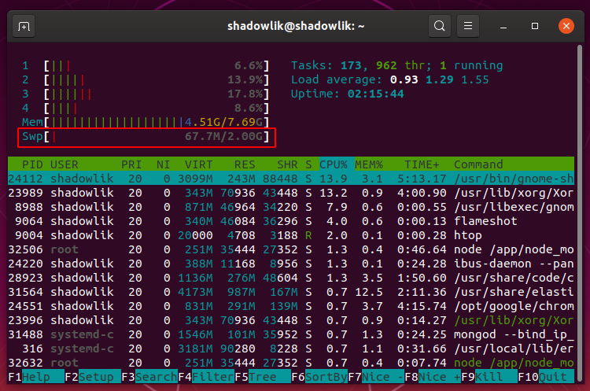

Se você deseja melhorar o desempenho da sua instalação Debian/Ubuntu, a criação de um espaço virtual de troca (Swap Space) pode te ajudar. Quando o sistema precisa de mais recursos de memória do que está disponível, esses recursos podem ser movidos para um espaço virtual evitando erros e interrompimentos inesperados. Como essa memória fica alocada normalmente em discos de acesso mais lento, isso pode comprometer a velocidade de seu sistema, por isso deve ser o último recurso de sua máquina. Tente sempre liberar mais espaço em sua memória, fechando programas não utilizados para conseguir continuar trabalhando na velocidade normal.

## Dica no Ubuntu

Se você já utiliza as versões mais recentes do Ubuntu, é muito provável que esse espaço já tenha sido criado automaticamente durante a instalação do sistema operacional. Podemos conferir com o utilitário **htop** para visualizar facilmente se existe um espaço de troca, quantidade espaço alocado livre e usado:

Em uma busca na internet encontrei a seguinte dica: ***O tamanho de seu espaço virtual deve ser igual ao dobro da memória RAM de seu computador ou 32 MB, o que for maior. Mas não deve ser maior que 2048 MB (ou 2 GB).***

## Antes de começar

Antes vamos descobrir se o nosso sistema já possui um espaço virtual alocado:

$ sudo swapon --show

Se o resultado for vazio, isso significa que seu computador não possui um espaço alocado, caso contrário espere um resultado parecido com:

\# Resultado
NAME      TYPE SIZE  USED PRIO
/swapfile file   2G 67,7M   -2

Embora seja possível, não é muito comum ter mais de um espaço de troca configurado em seu computador.

## Criando o arquivo de Swap

Lembrado que seu usuário precisa ter permissões root, para isso [veja aqui como criar um](http://marquesfernandes.com/2019/04/01/como-criar-um-usuario-sudo-no-linux-debian-ubuntu). Nesse tutorial vamos criar uma espaço virtual com 2G, caso precise de menos ou mais espaço, basta substituir o número 2 pela quantidade em GB desejado.

$ sudo fallocate -l 2G /swapfile

Apenas usuários **sudo** devem ter permissão para alterar o arquivo, para isso vamos alterar suas permissões:

$ sudo chmod 600 /swapfile

Agora vamos utilizar o comando **mkswap** para configurar o espaço reservado como um espaço virtual de troca:

$ sudo mkswap /swapfile

Ativamos o arquivo swap usando o seguinte comando:

$ sudo swapon /swapfile

Precisamos fazer essa alteração permanente, caso contrário na próxima inicialização do sistema o seu espaço de troca será perdido:

$ sudo echo "/swapfile swap swap defaults 0 0" >> /etc/fstab

Verificamos que nosso espaço de troca está ativo com o comando **swapon**:

$ sudo swapon --show

# Resultado esperado
NAME      TYPE SIZE   USED PRIO
/swapfile file   2G 147,4M   -2

## Ajustando a capacidade de troca (Swappiness)

A capacidade de troca, **swappiness** em inglês, é uma propriedade que define o quanto o sistema vai usar o espaço de troca. O swappiness pode ter um valor entre 0 e 100. Quanto menor o valor, o sistema vai tentar evitar o uso do espaço, quanto maior o sistema vai usar esse espaço mais agressivamente.

O valor padrão do swappiness é 60. Você pode checar o valor configurado em seu sistema com o comando:

$ cat /proc/sys/vm/swappiness

# Resultado esperado
60

O valor de 60 é configurado para atender a maioria dos sistemas, mas se você está configurando esse espaço em um máquina usada como servidor, principalmente em ambientes de produção o indicado é utilizar um valor menor, na casa dos 10 por exemplo:

$ sudo sysctl vm.swappiness=10

Agora vamos fazer essa mudança permanente:

$ sudo echo "vm.swappiness=10" >> /etc/sysctl.conf

O valor ideal para o swappiness depende do seu sistema e da carga com que ele vai lidar. Você deve ajustar conforme sua necessidade.

## Removendo o arquivo de Swap

Primeiro desativamos seguramente o arquivo Swap de nosso sistema:

$ sudo swapoff -v /swapfile

Remova a mudança que fizemos no arquivo **/etc/fstab** para evitar alertas e problemas na inicialização, em seguida vamos remover o espaço reservado para não ocupar memória sem necessidade:

$ sudo rm /swapfile

Para mais detalhes técnicos confira: [Archlinux - Swap (Português)](https://wiki.archlinux.org/index.php/Swap_\(Portugu%C3%AAs\))
