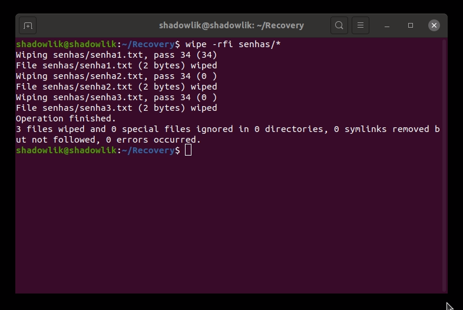

Na maioria dos casos, a maneira que excluimos um arquivo de nossos computadores, seja pela tecla Del, a lixeira ou o comando `rm`, eles de fato não removem o arquivo de forma permanente e segura do disco rígido (ou de qualquer outra mídia de armazenamento).

Se usarmos os métodos acima, supondo que desejamos deletar um arquivo com conteúdo sensível, um arquivo com usuários e senhas por exemplo, ainda é possível que alguém mal intencionado consiga [recuperar esses arquivos](http://marquesfernandes.com/como-recuperar-arquivos-excluidos-no-linux-ubuntu-debian/).

Vamos aprender algumas maneiras de deletar seguramente arquivos de nosso computador no Linux.

## 1\. Shred - Sobrescrever o arquivo para esconder seu conteúdo

O comando `shred` usa o método de sobrescrever o arquivo para esconder seu conteúdo, e conta também com a opção de posteriormente deletar.

Essa ferramenta já vem instalada por padrão na maioria das distribuições linux.

$ shred -zvu -n 5 senhasbancarias.txt

-   `-z`\- adicionar zeros no final para esconder
-   `-v` – habilita a exibição do progresso do comando
-   `-u`– remove os arquivos após sobrescrever
-   `-n` – número de vezes para sobrescrever o arquivo (padrão: 3)

**Dica:** Nunca anote suas senhas em um arquivo de texto. Infelizmente é uma prática bem comum mas totalmente insegura de armazenar informações desse tipo.

## 2\. Wipe - Delete seguramente arquivos no Linux

O comando Wipe deleta seguramente seus arquivos da memória, fazendo impossível a recuperação dos arquivos ou pastas.

Para instalar essa ferramenta, execute o seguinte comando:

$ sudo apt-get install wipe   \[Em distros baseados no Debian\]
$ sudo yum install wipe       \[Em distros baseadas no RedHat\]

Para remover seguramente um arquivo ou até mesmo uma pasta inteira:

$ wipe -rfi senhas/\*

-   `-r` – fala para o comando deletar recursivamente as pastas
-   `-f` – habilita a deleção forçada e desabilita as confirmações
-   `-i` – exibe o progresso

***Nota**: A ferramenta Wipe só funciona seguramente em memória magnética (HDD), use os outros métodos se você vai deletar arquivos ou pastas em um SDD ou USB.*

## 3\. Secure-deletetion Toolkit para o Linux

Secure-deletetion é uma coleção de ferramentas de exclusão segura de arquivos, que contém a ferramenta srm (secure\_deletion), usaremos ela para remover nossos arquivos com segurança.

Para instalar essa ferramenta, execute o seguinte comando:

$ sudo apt-get install wipe   \[Em distros baseados no Debian\]
$ sudo yum install wipe       \[Em distros baseadas no RedHat\]

Para remover seguramente um arquivo ou até mesmo uma pasta inteira:

$ srm -vz senhas/\*

-   `-v` – modo verboso, exibe mais informações do processo
-   `-z` – limpa a última deleção com zeros ao invés de dados aleatórios

