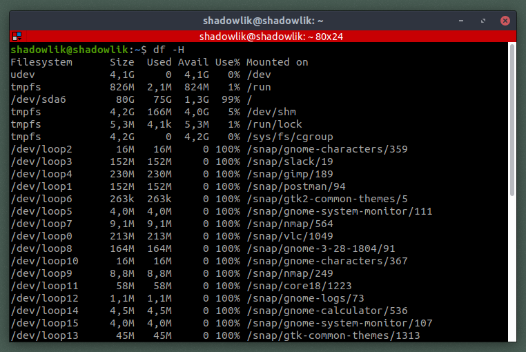
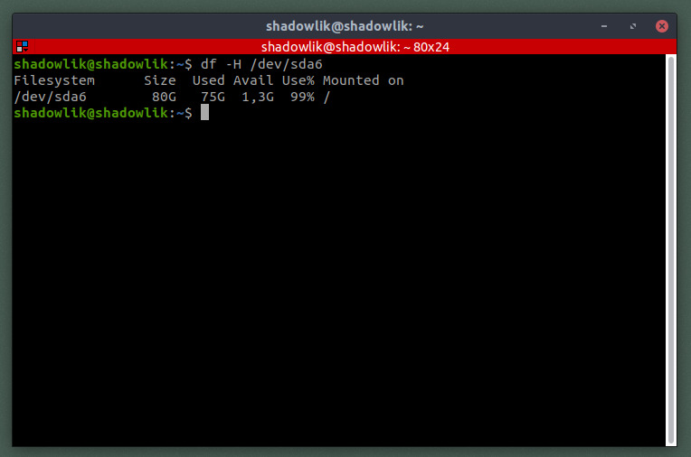
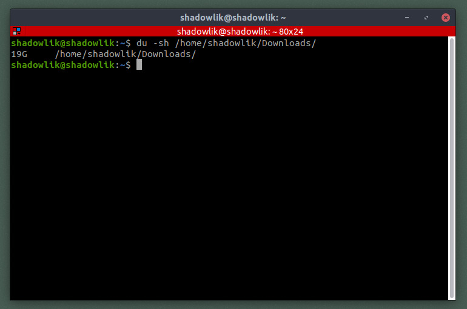
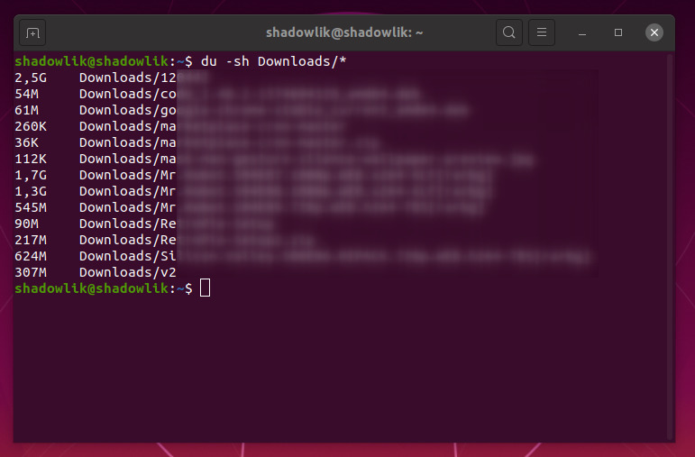

Você quer descobrir quanto espaço tem livre em seu disco? Se você está acostumado com sistemas operacionais com interface gráfica, como Windows, essa tarefa provavelmente é muito simples. Mas e se você se deparar apenas com um simples terminal? Você precisa instalar alguma ferramenta? A resposta é **NÃO**. No linux você consegue com apenas alguns comandos descobrir o quanto de armazenamento está sendo usado em seus discos e até mesmo em pastas sem sair de seu terminal.

## [df](https://linux.die.net/man/1/df)

Esse comando é provavelmente o mais simples e vai servir para a maioria das análises básicas. Ele possui uma ampla variedade de opções mas vamos focar nos relatórios mais simples: **df -H.** A opção *H* significa que você deseja o retorno do comando em uma forma de amigável para leitura. O relatório mostrará agrupado por discos quanto espaço está disponível, usado, livre e a porcentagem de uso.

$ df -H

Mas e se a quantidade de discos for muito grande? Como no caso da imagem acima, temos discos criados pelos aplicativos snaps do Ubuntu (*/dev/loopXY*) e queremos focar apenas na partição principal (*/dev/sda6*):

$ df -H /dev/sda6

O resultado agora estará limitado para aquele disco:

## [du](https://linux.die.net/man/1/du)

Agora que você já sabe identificar quanto espaço livre tem sobrando ou não, é muito provável que queira descobrir quais pastas e/ou arquivos estão lotando a memória de seu computador e é ai que entra outro comando muito útil: O **du** (acrônimo de **"disk usage"**). Com o comando **du** é possível identificar quanto cada pasta e arquivo está utilizando de armazenamento. Vamos imaginar que nosso armazenamento está acabando e queremos saber se o problema está em nossa pasta de downloads:

$ du -sh /home/shadowlik/Downloads

\* *Não precisamos passar o caminho completo para o comando, podemos passar apenas o caminho referente da pasta em que estamos executando, no caso da imagem acima poderíamos executar **du -sh Downloads/**.*

Vimos acima que a pasta *Downloads* está pesando aproximadamente 19 gigabytes, vamos agora descobrir quais arquivos pesados estão nessa pasta e para isso passaremos o wildcard **\*** para o comando:

~$ du -sh Downloads/\*

As capturas de tela estão diferentes porque formatei meu computador enquanto terminava esse artigo.  
\* Os nomes dos arquivos foram borrados por segurança.

Agora você já sabe identificar quanto espaço de armazenamento ainda tem disponível e como encontrar os lugares que podem estar sobrecarregando seu disco. Aprenda também [como descobrir a versão e distribuição linux](http://marquesfernandes.com/2019/06/18/como-descobrir-o-nome-e-versao-da-distribuicao-linux-pela-linha-de-comando) e também a [criar um usuário sudo](http://marquesfernandes.com/2019/04/01/como-criar-um-usuario-sudo-no-linux-debian-ubuntu/)!
