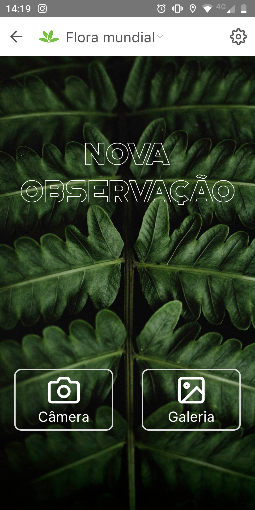
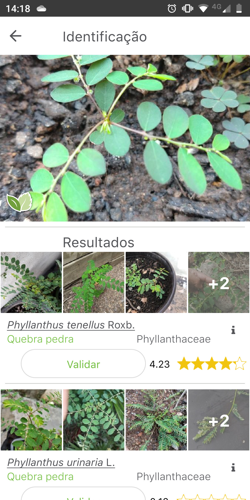
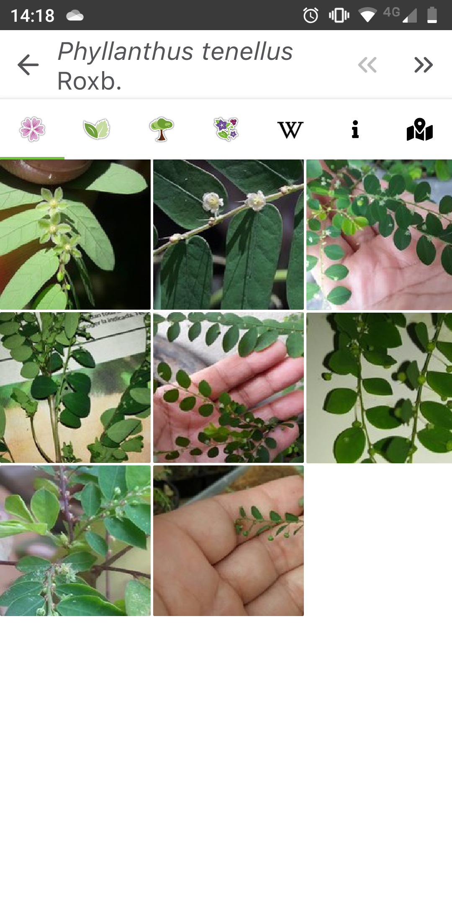
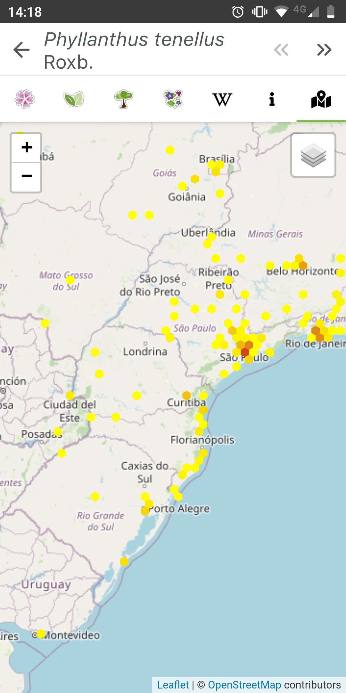

Empezaste a crear un huerto en tu casa, o una planta misteriosa empezó a crecer en una de tus macetas, ¿y ahora qué? ¿Cómo sabes qué tipo de planta es esta?

En el pasado era necesario, aunque puede ser en algunas situaciones, confiar en la sabiduría de un familiar mayor, para apelar a la abuela o al abuelo que maneja todo, desde las plantas. Pero no te preocupes, ahora es posible identificar el tipo, la especie de planta solo como una foto, ¡simple, fácil y rápido! Puedes identificar la planta a través de la imagen de las hojas, flores, frutos e incluso la corteza.

## Identificando las especies de plantas por foto con [PlantNet](https://plantnet.org/)

A medida que avanza la tecnología, ahora es posible cruzar imágenes en cuestión de segundos para identificar y comparar características, ¡y eso es exactamente lo que [hace Plan](https://plantnet.org/)tNet! Es posible enviar imágenes e identificar la especie de la planta en cuestión. El proceso es muy simple.

PlantNet es una aplicación para recopilar, anotar y buscar imágenes para ayudar a identificar plantas. Fue desarrollado por un consorcio que involucró a científicos del CIRAD, INRA, INRIA, IRD y la red Tela Botanica, en un proyecto financiado por Agropolis Fondation.

Integra un sistema de ayuda para la identificación automática de plantas a partir de fotografías en comparación con imágenes de una base de datos botánica. Los resultados le permiten encontrar el nombre científico de una planta.

Tanto el número de especies procesadas y analizadas, como el número de imágenes utilizadas en la comparativa, evolucionan con cada uso y aportación de los usuarios en este proyecto.

### 1\. Toma o envía una foto de la planta en cuestión.

Lo primero que debes hacer es enviar una foto de la planta, flor o fruto que deseas identificar. Puede tomar una foto directamente desde la aplicación o cargar una imagen desde su galería.

## dos. Seleccione a qué parte de la planta corresponde la foto

Ahora necesitas informar qué parte de la foto está en evidencia en la foto, esto ayuda al algoritmo a poder identificar mejor y cruzar con las fotos en su base de datos. Espera, normalmente el proceso de envío es muy rápido.

## 3\. Identificar las posibles especies de plantas

Una vez identificado, se enumerarán todas las posibles coincidencias para su planta, ahora tendremos que evaluar los resultados para identificar qué planta es de hecho.

La aplicación facilita mucho esta tarea, puedes ver en cada posible especie correspondiente, fotos de otros usuarios de la flor, hoja o fruto. En la misma pestaña es posible acceder a la página de la especie en cuestión en Wikipedia, y ver un mapa con ocurrencias de otros usuarios, lo que facilita identificar si se trata de una planta típica de tu región.

-   
    
-   
    
-   
    

## 4\. Validar el resultado encontrado

Ahora tienes la opción de validar el resultado encontrado, si estás seguro de que encuentro la especie de tu planta, simplemente haz clic en el botón validar ¡Esto ayuda a mejorar el algoritmo de la aplicación y a ayudar a otros usuarios!

PlantNet está disponible en la versión web, iOS y Android:

