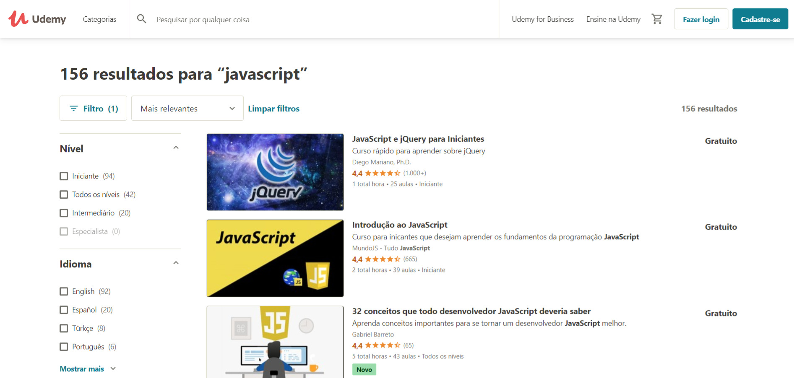
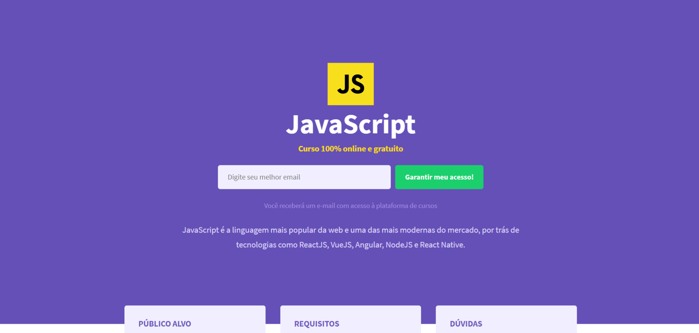
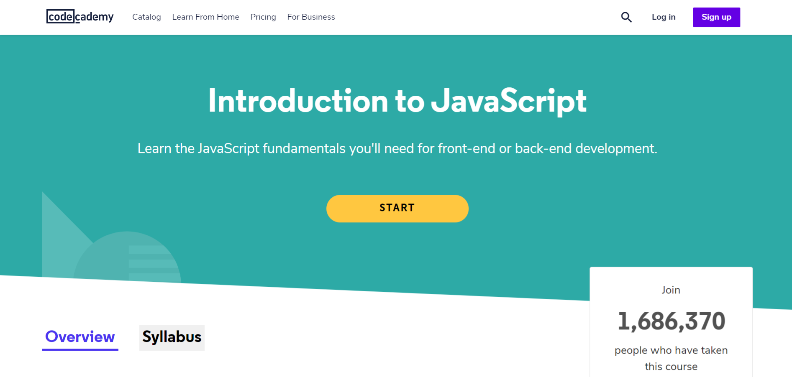
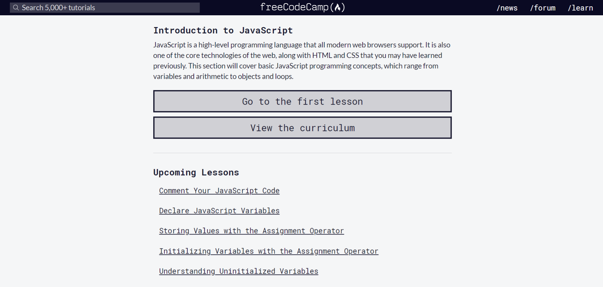
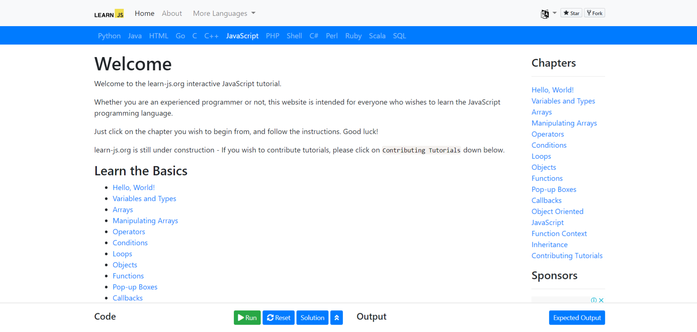

import YouTube from '@/components/YouTube.astro';

Mucha gente me pregunta dónde empiezo a programar y dónde encuentro cursos gratuitos. Creo que todo el mundo debe aprender a programar, de la misma manera que creo que todo el mundo debe tener un blog para compartir conocimientos. Hoy en día Internet está lleno de contenido gratuito para que usted pueda aprender, cursos, tutoriales, videos, lo que no falta son opciones para que usted aprenda nada.

La parte más difícil de aprender a programar es lo mismo que aprender cualquier otra cosa**, ¡empe**zar! Mi consejo es que tienes algún proyecto en mente, tener un objetivo final te ayuda a no desanimarte en el paseo, siempre piensa en: dividir para conquistar. No mires lo que estás aprendiendo pensando que es mucho tiempo antes de convertirte en un buen programador, uno si/else a la vez y en poco tiempo llegarás allí.

Te recomiendo que leas este [artículo](http://marquesfernandes.com/javascript-o-que-e-como-funciona-e-para-que-serve/), explica un poco sobre el lenguaje JavaScript y sus usos.

Por mi propia experiencia, creo que la mejor manera de aprender JavaScript es comenzar con el frontend, y eso implica aprender un poco de HTML y CSS. Digo esto porque con el incentivo visual del navegador, ves que tu programación sucede, esto trae una muy buena sensación de logro y te hará no desmotivo en el viaje. La mayoría de la calidad y el contenido gratuito están en Inglés, así que afina tu inglés y vamos a ponernos a trabajar, ¡separé una lista de cursos y tutoriales para aprender JavaScript!

## 1\. [Udemy, Udemy](https://www.udemy.com/courses/search/?price=price-free&q=javascript&sort=relevance&src=ukw)

Udemy - Cursos gratuitos de JavaScript

[Udemy](https://www.udemy.com/courses/search/?price=price-free&q=javascript&sort=relevance&src=ukw) es una de las plataformas de cursos más populares hoy en día, tiene cursos en varias categorías, de pago y gratis. Lo interesante es que sus cursos son realizados por cualquier persona que tiene disposición, es un mercado de cursos, con excelentes profesores. Puede elegir cualquiera de los cursos de JavaScript gratuitos desde este [enlace](https://www.udemy.com/courses/search/?price=price-free&q=javascript&sort=relevance&src=ukw) y empezar a estudiar hoy mismo.

## 2\. [Curso de vídeo](https://www.youtube.com/watch?v=BXqUH86F-kA&list=PLHz_AreHm4dlsK3Nr9GVvXCbpQyHQl1o1)

<YouTube id="BXqUH86F-kA" />

Para aquellas personas que les gusta aprender del video, el [Curso de Video](https://www.youtube.com/watch?v=BXqUH86F-kA&list=PLHz_AreHm4dlsK3Nr9GVvXCbpQyHQl1o1) ha preparado un material muy fresco. Una serie de más de 30 videos que le enseñan todo lo que necesita para aprender sobre Javascript y ECMAScript, ¡vale la pena echarle un vistazo!

## 3\. [Rocketseat, Nuevo](https://rocketseat.com.br/starter/curso-gratuito-javascript)

Rocketseat - Curso gratuito de Javascript

Rocketseat es una referencia en la comunidad de desarrollo, tienen varias herramientas para enseñar, forman una comunidad extremadamente fuerte y colaborativa, como ellos mismos se llaman a sí mismos: son más que una plataforma de educación tecnológica, somos una increíble comunidad de programadores en busca del siguiente nivel. Proporcionaron un [curso de javascript gratuito](https://rocketseat.com.br/starter/curso-gratuito-javascript) muy interesante.

## 4\. [Codeacademy](https://www.codecademy.com/learn/introduction-to-javascript)

Codeacademy - Curso gratuito de Javascript

El curso de [introducción javascript](https://www.codecademy.com/learn/introduction-to-javascript) de Codeacademy es un excelente material para empezar, muy didáctico y con una certificación muy bien vista por el mercado, nacional e internacional.

## 5\. [freeCodeCamp](https://www.freecodecamp.org/learn/javascript-algorithms-and-data-structures/basic-javascript/)

freeCodeCamp - Curso gratuito de Javascript

freeCodeCamp ha estado con nosotros desde 2014, ofreciendo cursos y contenido de calidad. Si usted es un principiante y está buscando un excelente curso con material interactivo, el [curso freeCodeCamp](https://www.freecodecamp.org/learn/javascript-algorithms-and-data-structures/basic-javascript/) se hace exactamente para usted.

## 6\. [Aprender JavaScript](https://www.learn-js.org/)

Aprender JavaScript

[Tutoriales interactivos](https://www.learn-js.org/) es un proyecto personal diseñado para asegurarse de que todos en el mundo pueden aprender a codificar de forma gratuita. Los servidores utilizados para ejecutar los tutoriales y el tiempo invertido en la creación de tutoriales se financian a través de anuncios. Aunque es un poco básico y no tan didáctico, logran cubrir una buena base que un principiante necesita para aprender Javascript.
