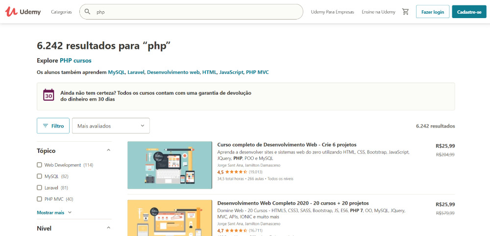
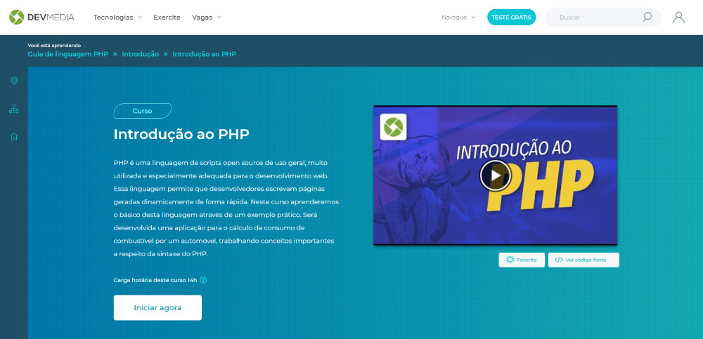
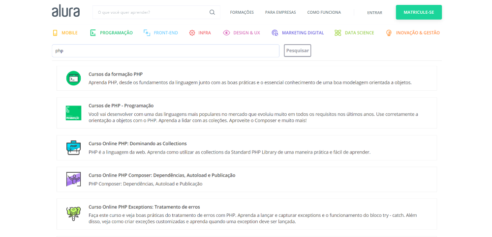

**PHP** (a recursive acronym for *" **P** HP: **H** hypertext **P** reprocessor"* ) is an open-source interpreted language, mainly used in server-side (backend) web application development, learn more about PHP [in this article](http://marquesfernandes.com/o-que-e-php-e-para-que-serve/) .

This is an excellent language for anyone looking to get started in the web development world, there is a lot of material available on the internet and the PHP community is very active.

## 1\. [Udemy](https://click.linksynergy.com/link?id=FPuxaVz3TuY&offerid=507388.969388&type=2&murl=https%3A%2F%2Fwww.udemy.com%2Fcourse%2Fcurso-php-7-online%2F)

THE [Udemy](https://www.udemy.com/courses/search/?price=price-free&q=javascript&sort=relevance&src=ukw) is one of the most popular course platforms today, it has courses in several categories, paid and free. The interesting thing is that their courses are made by anyone who is willing, it is a marketplace of courses, with excellent teachers. You can choose any of the free PHP courses in this [link](https://click.linksynergy.com/link?id=FPuxaVz3TuY&offerid=507388.969388&type=2&murl=https%3A%2F%2Fwww.udemy.com%2Fcourse%2Fcurso-php-7-online%2F) and start studying today. Very good paid courses are also available:

[Complete PHP 7 Course](https://click.linksynergy.com/link?id=FPuxaVz3TuY&offerid=507388.969388&type=2&murl=https%3A%2F%2Fwww.udemy.com%2Fcourse%2Fcurso-php-7-online%2F)

[Complete Web Development Course - Create 6 Projects](https://click.linksynergy.com/link?id=FPuxaVz3TuY&offerid=507388.712010&type=2&murl=https%3A%2F%2Fwww.udemy.com%2Fcourse%2Fcurso-completo-do-desenvolvedor-web%2F)

## two. [Video Course](https://www.youtube.com/watch?list=PLHz_AreHm4dm4beCCCmW4xwpmLf6EHY9k&v=F7KzJ7e6EAc&feature=emb_title)

https://www.youtube.com/watch?list=PLHz\_AreHm4dm4beCCCmW4xwpmLf6EHY9k&v=F7KzJ7e6EAc&feature=emb\_title

For those people who like to learn from video, the [Video Course](https://www.youtube.com/watch?v=F7KzJ7e6EAc&list=PLHz_AreHm4dm4beCCCmW4xwpmLf6EHY9k) prepared a very nice material. A series of 24 videos teaching you everything you need to learn about PHP, it's well worth checking it out!

## 3\. [DEVMEDIA](https://www.devmedia.com.br/curso/introducao-ao-php/2171)

In this course you will learn the basics of this language through a practical example. An application for calculating fuel consumption by an automobile will be developed, working on important concepts regarding PHP syntax.

## 4\. [Alura](https://www.alura.com.br/busca?query=php)

  
THE **Alura** born of [kaelum](https://www.caelum.com.br/) , a renowned school of technology and innovation. The founders, Paulo Silveira and Guilherme Silveira, realized that many students did not have access to our content due to distance and time, and others adapted to different class rhythms. The online platform was created in 2011 and, with the project's success, we created our own brand in June 2013, Alura. Today it has an arsenal of courses, including basic PHP training courses and more.
