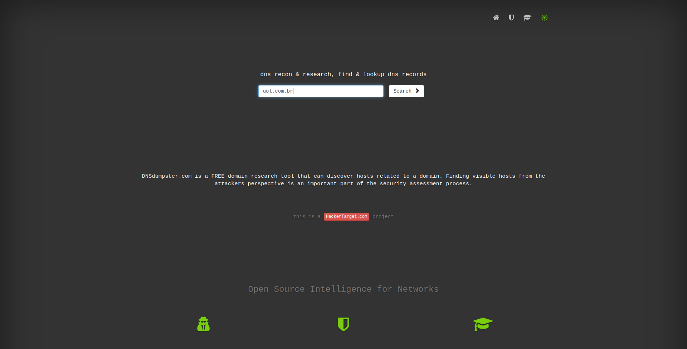
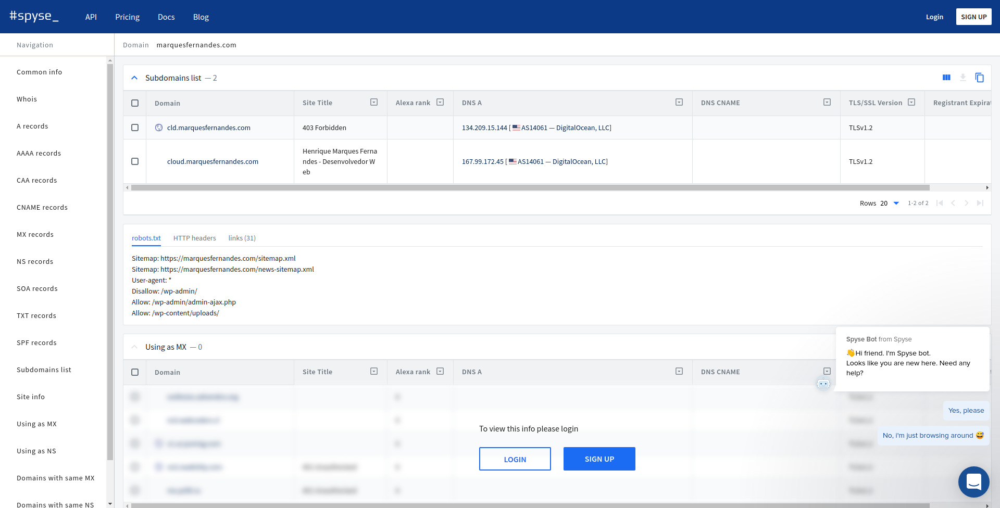
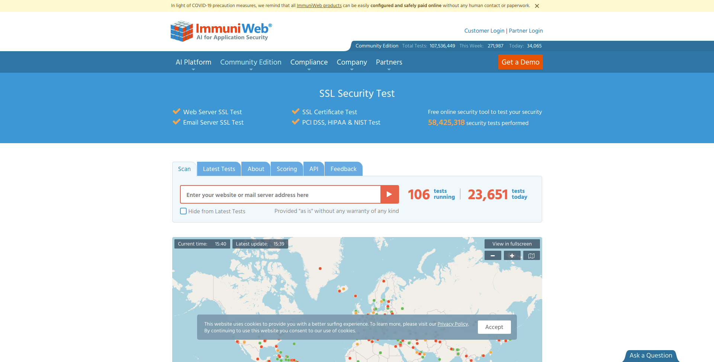

Encontrar todos los subdominios es una tarea importante para verificar la seguridad de sus aplicaciones y servidores, los subdominios mal configurados pueden conducir a la exposición pública de los servicios de su empresa y las direcciones IP críticas, algo que puede generar un riesgo importante para la seguridad.

Gracias a algunas herramientas online el proceso de escaneo de un dominio es muy fácil, en pocos minutos se obtiene un informe de qué subdominios están configurados y a qué IP o registro apuntan.

## Herramientas para analizar tu dominio

1.  [DNS Dumpster](#DNSdumpster)
2.  [NMMAPPER](#NMMAPPER)
3.  [Spyse, Nuevo](#Spyse)
4.  [Pentest-Tools](#Pentest-Tools)
5.  [ImmuniWeb](#ImmuniWeb)

### 1\. [DNSdumpster](https://dnsdumpster.com/)

\-ERR:REF-NOT-FOUND-DNSdumpster

[DNSDumpster](https://dnsdumpster.com/) es una herramienta de análisis de dominio para encontrar información relacionada con el host. Es el proyecto HackerTarget.com.

No solo subdominio, sino que proporciona información sobre el servidor DNS, el registro MX, el registro TXT y una asignación completa de tu dominio.

## 2\. -ERR:REF-NOT-FOUND-[NMMAPPER](https://www.nmmapper.com/sys/tools/subdomainfinder/)

\-ERR:REF-NOT-FOUND-[NMMAPPER](https://www.nmmapper.com/sys/tools/subdomainfinder/)

**[NMMAPPER](https://www.nmmapper.com/sys/tools/subdomainfinder/)** es una herramienta en línea para encontrar subdominios utilizando otros servicios como Anubis, Amass, DNScan, Sublist3r, Lepus, Censys, etc.

## 3\. -ERR:REF-NOT-FOUND-Spyse, Nuevo

[Spyse, Nuevo](https://spyse.com/search/subdomain)

El *"Subdominio Find*er" de Spyse es un motor de búsqueda artesanal que te permite descubrir subdominios de cualquier dominio. Es sólo una de varias herramientas creadas por Spyse y está estrechamente vinculada a todas las demás herramientas que le permiten obtener mucha más información sobre los subdominios.

## 4\. **[Pentest-Tools](https://pentest-tools.com/information-gathering/find-subdomains-of-domain)**

Las herramientas de Pentest buscan subdominios mediante varios métodos, como la transferencia de zona DNS, la enumeración DNS basada en listas de palabras y el motor de búsqueda público. Tiene dos opciones de escaneo, uno más clientes potenciales y uno completo, ambos le dan la posibilidad de exportar un informe pdf.

## 5\. **[ImmuniWeb](https://www.htbridge.com/ssl/)**

**\-ERR:REF-NOT-FOUND-ImmuniWeb**

Encontrar un subdominio es fácil con SSLScan. Proporciona la dirección URL para el análisis y, en pocos segundos, los resultados se muestran con el subdominio descubierto, con otra información SSL.

## Conclusión

Como puede ver, es muy fácil analizar dominios en Internet, en pocos minutos un informe completo de su configuración está disponible. Por lo tanto, tenga mucho cuidado con la información y los servicios que se exponen al configurar un subdominio.
